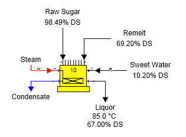
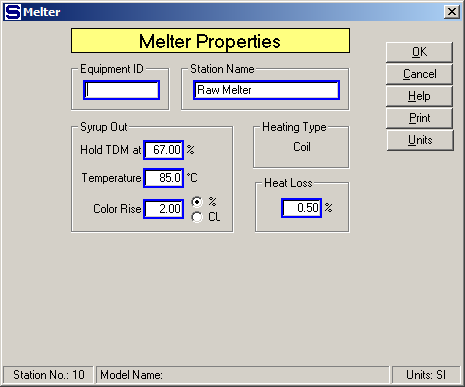
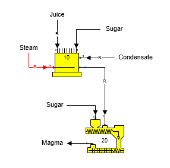
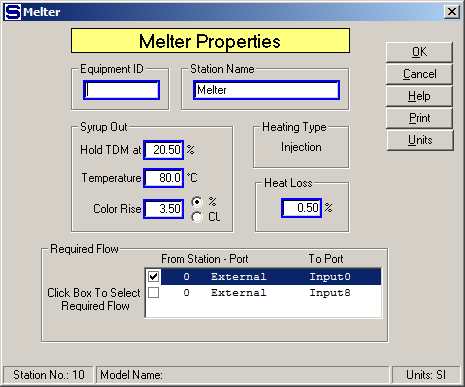

# Melter Examples

 

Output Temperature and %DS The output flow from the melter can be
controlled to a temperature and % dry substance. The figure below shows
a melter with the output liquor flow held to 85°C and 67% DS. The raw
sugar and remelt into the melter are combined and then sweet water is
used to control the liquor out to 67% DS. The sweet water is a required
flow and its quantity is calculated by Sugars ('R' on sweet water flow
line).

 

 

 

 

The Melter Properties window is shown below to illustrate the data that
is entered to give the desired liquor output flow characteristics for
the single station model shown in the figure above. The sweet water into
the melter must originate from either an external flow or a distributor
station so that its quantity can be adjusted by Sugars to give the
specified output flow % DS (entered as "Hold TDM at 67.00 %"). Also, the
steam flow must originate from either an external flow or a distributor
station so that its quantity can be calculated by Sugars to provide the
necessary steam to give the specified output temperature.

 

 

 

Output Flow Required The figure below shows a melter
station with its process flow out required (flow stream going from
station 10 to station
20).  Condensate
flows into port 9 and it is required because the condensate is used to
control the total dry matter (TDM) of the output
flow.  Steam is used
to heat the melter and it is a required flow.

 

 

 

 

The Melter Properties window is shown
below.  Because the
output flow from the melter is required, one of the input flows into
either port 0 or port 8 is
required.  There are
two input flows that can be selected to be required and these two flows
are shown in the Required Flow box on the window
below.  Either one
of the input flows can be selected to satisfy the required output
flow.  The input
flow to port 9 is not listed as one of the input flows that can be
selected because it is used to control the TDM out of the
melter.  A total of
three input flows are required (i.e., steam, juice and condensate) and
Sugars will adjust the quantities of these three flows during a
balance.

 

 

 

[Melter Features](Melter_Features.htm)

[Melter Properties](Melter_Properties.htm)
