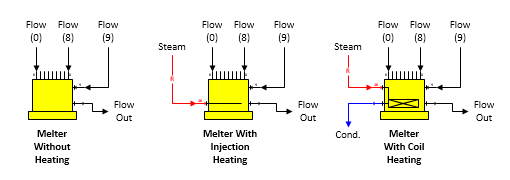

# Melter Features

 

Melter A melter station is used to combine flow streams and melt sucrose
crystals using heat (if necessary). Three different melter shapes are
provided with Sugars as shown below.

 

 

General Features As its name suggests, a melter
station is used to melt sucrose crystals in process flow streams (input
ports 0 thru 9).  It
can be heated by a heating flow (input port
10).  The heating
can be either by injection heating (heating flow is absorbed into the
process flow stream), or by coil heating (heating flow is not absorbed
into the process flow stream, but leaves the melter after giving up heat
to the process
flow).  Sucrose
crystals, if any, are melted until the output flow stream is saturated
(that is, supersaturation coefficient is 1.0); however, crystal growth
is not allowed, even if the input flow is
supersaturated.  Up
to ten process flows can flow into a melter, but only one heating flow
is allowed.  The
pressure of the process flow out of the melter will always be at
atmospheric pressure, despite the pressures of any of the process or
heating input
flows.  If any input
flows are pressure feedback flows, the pressure fed back will be
atmospheric pressure.

 

The
input flow into port 9 will be a required flow if an entry is made for
the dry substance out of the melter (see  [Melter
Properties](Melter_Properties.htm) for "Hold TDM at"
entry
field).  If
a dry substance is not specified, the flow into port 9 will not be
required unless the output flow from the melter is required and the
input flow into port 9 is selected to satisfy the required output
flow.

 

If a heating flow into port 10 is used, it will
always be a required
flow.  If a
temperature value is not entered for the flow out of the melter, the
quantity of the heating flow will be set to 0.0 by Sugars.

 

The output flow from a melter can be required by
another station, and if it is, one of the input flows into the melter
must be made a required flow that can be adjusted by Sugars to satisfy
the required output
flow.  The quantity
of the required input flow will be calculated by Sugars to equal the
required output flow quantity less the quantities of all other flows
into the melter.  A
small box will appear on the Melter Properties window to select which
input flow is to be required when the output flow is
required.  Input
flows into the melter from other stations that cannot be made required
will not be displayed in the box.

 

 

[Melter Properties](Melter_Properties.htm)

[Melter Examples](Melter_Examples.htm)
