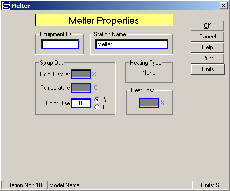
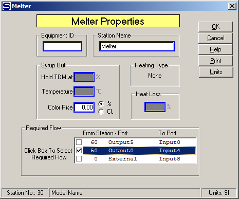

# Melter Properties

 

 

Equipment ID  An equipment ID of up to 11 characters can be used to
identify the station with an actual station in the process. Any
combination of numbers and letters that are used in the factory/refinery
to identify equipment can be entered. For example, Equipment ID =
123.456A. It is not necessary to make an entry in the Equipment ID field
if the station in the model does not have a corresponding station in the
factory/refinery.

 

Station Name  A name of up to 20 characters must be entered for the
station. For example, Station Name = High Melter.

 

Syrup Out  Enter values for the syrup leaving the
melter.  A dry
substance can be specified for the output flow if an input flow goes
into port 9 and a temperature value can be specified for the output flow
if a heating flow goes into port 10. The "Hold TDM at" and "Temperature"
entry fields will be dimmed if input flows do not go to these
ports. 

 

Hold TDM at (%)  The input flow going to port 9 will be adjusted by
Sugars to give an output flow from the melter that has a total dry
matter (total soluble and insoluble solids) content that is equal to the
value entered.  This field is active only if a
flow stream goes to input port 9 (the input flow located on the side of
the melter).  If a value is not entered, the
input flow into port 9 is handled the same as any other flow into port
numbers 0 through 8.  That is, enter **0.00**%
if the flow into port 9 is not being used to control the output flow to
a %TDM, or enter a value \> 0.00 if the flow into port 9 is being used
to control the output flow to a %TDM.  For
example, Hold TDM at = **67.00**%.

 

Temperature  Enter the temperature of the output flow from the melter.
The heating flow into the melter will be required and the quantity of
flow will be adjusted to give the specified output flow temperature. For
example, Output Flow Temperature = 92.0°C.

 

Color Rise  Enter a color rise that occurs in the melter. The color rise
can be specified as either a % increase, or an absolute increase of a
specified amount of color units. For example, Color Rise = 5.0%, or
Color Rise = 150 ICU color units of increase.

 

Heating Type  The heating type will be either injection, or coil. All of
the heating flow is added to the process flow out of the melter when an
injection-heated melter is used. All of the heating flow leaves as
condensate when a coil-heated melter is used. The shape selected from
the stencil determines the type of heating.

 

Heat Loss (%) Enter the Heat Loss in percent (%) for the heat that is
lost in the melter station. The heat loss is the percentage loss of heat
from the total heat that is transferred to the process flow from the
heating flow. For example, Heat Loss (%) = 1.0 (to give 1% heat loss).

 

A box labeled "Required Flow" will appear on the
Melter Properties window if the output flow from the melter is required
(see below).  All of
the flows into the melter that can be made required will be shown in
this box.  In some
cases, there may be input flows from other stations that go into the
melter that cannot be made required and these flows will not be
shown.  The box will
not be shown if there is only one input flow or only one of the input
flows can be made
required.  Select
the input flow that is to be used by Sugars to satisfy the output
flow.  That is,
Sugars will calculate the total quantity of all other input flows and
then adjust the quantity of the input flow that was selected to be
required to satisfy the quantity of the output flow.

 

 

 

 

[Melter Features](Melter_Features.htm)

[Melter Examples](Melter_Examples.htm)
