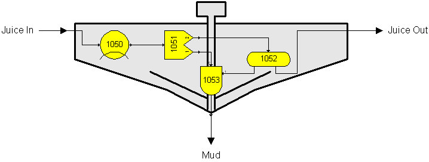

# Flow Diagram

 

Sugars is used to analyze a sugar factory process by constructing a flow
diagram of the process.  The flow diagram
consists of individual stations with interconnecting flows and external
flows that go into the process.  *External*
flows are all flows that go into the flow diagram from outside sources;
e.g., beets, or cane, into the factory, juice from storage, water for
dilution, remelt sugar from storage, sweepings, steam for heating,
etc.  Individual *stations* are computer
models that use mathematical relationships and actual process data to
model the stations used in the process.

 

All of the external flows are processed by the stations in the flow
diagram to provide output flows from each station that are processed by
other stations in the flow diagram until all of the material and heat
entering the flow diagram is accounted for by the flows and losses
leaving the flow diagram.  Interconnecting
flows within flow diagrams that go to and from each station are called
*internal* flows in contrast to external flows that originate from
sources outside the process.

 

Each station in the flow diagram is given a station
number.  All output flows from each station
are identified and either routed to another station, or shown to leave
the flow diagram.  Any arrangement of the
stations is possible.  Therefore, virtually
any process can be evaluated provided the stations in Sugars can be used
to simulate the actual stations used in the process.

 

Often combining several stations to model an actual station is necessary
if the actual station does not conform to a station available in
Sugars.  For example, a juice clarifier (see
figure below) can be modeled using a cooler station (1050) for heat
loss, a separator station (1051) to separate insoluble components (for
example, CaCO3) and impurities from the juice, a blender station (1053)
to maintain a moisture content for the mud underflow and a distributor
station (1052) to feed the blender with sufficient juice to maintain the
moisture content in the mud and send the remaining juice out as the
overflow (see figure below).  Other similar
combinations can be used to provide a model of most stations in an
actual process that do not have corresponding duplicate stations in
Sugars with the same operating characteristics.

 

 

Sugars will accept any station number between 1 and
9999.  When numbering stations, it is best to
start the numbering at a number higher than 1 and allow for gaps between
numbers so that future additions can be accomplished easily without
having to renumber all of the stations in the
model.   Using numbers in a given range for
each page makes it easier to locate a
station.  For example, if milling is on one
page and all of the station numbers on the milling page are between 500
and 999, then searching for station no. 650 is much easier because it
will be located on the milling page.

 

**Keeping the initial model simple is best when building a model of a
process, or factory.  Do not try to model the
intricate details of a process, or factory at the
beginning.  Add complexity to the model after
gaining experience with the simpler model.**

 

The origin and destination station numbers identify flow streams within
a flow diagram.  If a flow stream leaves the
flow diagram, it is given a "0" for the destination station number when
the flow stream is stored in the
database.  And, if a flow stream is an
external flow, then the originating station number will be “0”.

 

A typical 4-effect evaporator station is shown in the
figure below to illustrate how a flow diagram can be constructed using
the different stations available in
Sugars.  As shown,
each station has been assigned a station number and all of the flows
from each station go to another station, or leave the flow diagram; for
example, syrup, condensates and
vapors.  The only
external flows into the flow diagram are steam, juice and cold
water.  Distributor
stations (for example, station numbers 516, 526 and 536) are used to
split a flow stream into several flows and receiver stations (for
example, station numbers 515, 525, 531 and 535) are used to combine
several flow
streams.  Intermingling
of material, steam, vapor, and condensate lines within the flow diagram
allows Sugars to do the complete heat, material and color
balances.  After the
model has been constructed, Sugars can quickly evaluate the effects of
changes made to the process.

 

 

Some stations can have more than one input
flow.  The input ports of the station
determine the type of flow.  For example, a
pan station will have a syrup flow into port number 0 and a vapor flow
into port number 1.  The input ports are
labeled on each station when it has more than one
input.  Receivers can have up to ten input
flows, and tanks and melters can have up to ten input flows and one
heating flow.  Blenders and thermocompressors
have two input flows.   Centrifugals have
massecuite and wash input flows.

 

In all cases, stations that use heat (for example, pans, evaporators,
melters, tanks and heat exchangers) are limited to a quantity of one
input flow into the heating port.

 

Heater, melter and tank stations can have either coil, or injection,
heating.  Coil heating is used to transfer
heat from the heating flow to the material flow without the two flow
streams being mixed (that is, both a material flow and heating flow go
into and leave the station); whereas, with injection heating, the
heating flow is injected into the material flow stream (that is, only a
material flow stream leaves the
station).  Sugars gives full consideration to
changes that occur in the material flow stream due to injected heating
flows.

 

A distributor can have up to ten output flows, a centrifugal has either
two (or three) outputs, and a separator has two output flows - all other
stations are limited to only one output material flow
stream.  Vapor and condensate output flows
from a station depend on the station and its input values; for example,
injection, or coil heating for heat exchangers, tanks and melters;
whereas, pans, dryers and evaporators always have material, vapor and
condensate output flows.

 

Stations that have both material and heating input flow streams process
the flows based on the input port used for the input
flow.  The station will identify, by input
port number, which flow stream is the material and which is the heating
flow.

 

 Phase changes that occur in the process are
considered in the appropriate stations.  For
example, crystallizers and pans can have a phase change for sucrose
going from dissolved to crystalline, and a cooler station can cause
vapor condensation due to heat loss in the
station.  The stations in Sugars have been
designed to give considerable control over changes in flow stream
characteris­tics.

 

Normally, a receiver station is used to accept
multiple inputs for any station that needs to have more than one input
flow; for example, in the previous flow diagram example, two condensate
flows go to the receiver (station no. 531) that feeds the flash tank
(station no.
532).  Since
a flash tank can accept only one input flow, a receiver station is
placed in front of the flash tank to accept the two input flows
(see [Station Modules](../Station_Modules/About_Station_Modules.htm)
section for further information about each station).
