# Program Overview

 

Sugars™ for Windows® uses Visio® diagramming software
to provide a full graphical interface for building models of sugar
factories and
refineries.  Models
are built using drag-and-drop techniques to draw the flow
diagram.  Stencils
containing shapes of stations are used to draw the flow diagram of the
process.  Connections
are made between shapes using a connector tool with automatic line
routing and
crossovers.  Data
for each station and flow stream in the model is entered on windows that
are displayed by double clicking on the station shape, or flow
stream.  Changing a
model, after it is built, is done by simply revising the flow diagram
and/or modifying the performance data for any
station.  All of the
data for a model is stored in a Microsoft® Access® database that can be
addressed by other
programs.  Heat,
material and color balances are quickly obtained from simulations to
predict process
performance.  A
revenues window shows the net process revenues to assist with financial
decisions.

 

[Model Building](#Model_Building)

[Simulation](#Simulation)

[Results](#Results)

[Data Import/Export](#Data_Import_Export)

 

User Interface

 

The graphical interface for Sugars makes model
building a simple matter of dragging pre-drawn shapes from the Shapes
Stencils to the drawing
surface.   The
shapes are designed to represent actual stations in the
process.  Connections
between shapes are drawn using a connection tool that automatically
routes connections between associated
stations.  Data
entry windows for controlling the performance of each station are
displayed by double clicking on the station
shape.  Flow stream
properties are entered and displayed in a window by double clicking on
the flow stream.

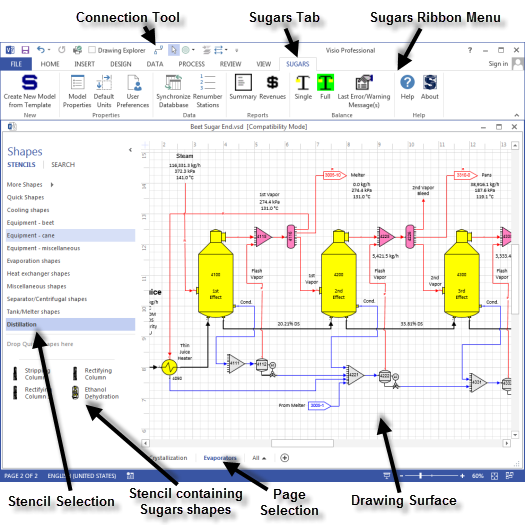

 

The interface is shown in the figure above when using
Visio 2013.  Other
versions of Visio may appear
different.  Stencils
on the left contain shapes of stations that are used to build a
model.  Additional
stencils may be selected using the “More Shapes”
bar.  Shapes on a
stencil are dragged from the stencil to the drawing surface and dropped
in place.  Drawing
tools are available to design shapes of factory equipment and add them
to the stencils as
needed.  Connections
between stations are drawn using a connection tool that features auto
routing around shapes and crossovers (line jumps) for crossing
connection
lines.  Drawings can
be composed of different layers and
pages.  Full
zoom-in, zoom-out and panning features are provided in the
interface.

 

The selections in the Sugars ribbon menu provided by the SUGARS tab
contain icons for:

 

<table style="width:100%;" data-cellspacing="0" width="675"
data-align="center">
<colgroup>
<col style="width: 34%" />
<col style="width: 64%" />
</colgroup>
<tbody>
<tr class="odd hcp10">
<td class="hcp11" style="width: 34.83%">
Create New Model From
Template
</td>
<td class="hcp11" style="width: 64.67%">
- Close the current model
then open a blank drawing to start a new model.
</td>
</tr>
<tr class="even hcp10">
<td class="hcp11" style="width: 34.83%">
Model Properties
</td>
<td class="hcp11" style="width: 64.67%">
- Overall properties of
the model such as molecular weights for flow stream components,
iteration accuracy, maximum number of iterations, color values,
atmospheric pressure and default solubility coefficients are set using
this window.
</td>
</tr>
<tr class="odd hcp10">
<td class="hcp11" style="width: 34.83%">
Default Units
</td>
<td class="hcp11" style="width: 64.67%">
- Units used for all entries
and when a model is saved.
</td>
</tr>
<tr class="even hcp10">
<td class="hcp11" style="width: 34.83%">
User Preferences
</td>
<td class="hcp11" style="width: 64.67%">
- Set the
increment between station numbers when adding new stations, renumbering
stations and adding a group of stations.  Select external flow default
pressure, and select whether to update all values or only the changed
values on the drawing.
</td>
</tr>
<tr class="odd hcp10">
<td class="hcp11" style="width: 34.83%">
Synchronize Database
</td>
<td class="hcp11" style="width: 64.67%">
- Check the drawing and
database for consistency and make any necessary corrections.
</td>
</tr>
<tr class="even hcp10">
<td class="hcp11" style="width: 34.83%">
Renumber Stations
</td>
<td class="hcp11" style="width: 64.67%">
- Change the station number
of one, or more, stations.
</td>
</tr>
<tr class="odd hcp10">
<td class="hcp11" style="width: 34.83%">
Summary
</td>
<td class="hcp11" style="width: 64.67%">
- Provide a report listing
every flow stream in the model.
</td>
</tr>
<tr class="even hcp10">
<td class="hcp11" style="width: 34.83%">
Revenues
</td>
<td class="hcp11" style="width: 64.67%">
- Provide a report giving the
net process revenues.
</td>
</tr>
<tr class="odd hcp10">
<td class="hcp11" style="width: 34.83%">
Single
</td>
<td class="hcp11" style="width: 64.67%">
- Balance calculations for a
single pass through the model.  Used to see how the model changes
between balance iterations.
</td>
</tr>
<tr class="even hcp10">
<td class="hcp11" style="width: 34.83%">
Full
</td>
<td class="hcp11" style="width: 64.67%">
- Balance calculations for a
full balance of the model.  Icon is:

  Green = model is balanced, Red = model is
unbalanced
</td>
</tr>
<tr class="odd hcp10">
<td class="hcp11" style="width: 34.83%">
Last Error/Warning
Message(s)
</td>
<td class="hcp11" style="width: 64.67%">
- Display error or warning
messages from the last balance calculation.
</td>
</tr>
<tr class="even hcp10">
<td class="hcp11" style="width: 34.83%">
Help
</td>
<td class="hcp11" style="width: 64.67%">
- Open the Sugars help
system.
</td>
</tr>
<tr class="odd hcp10">
<td class="hcp11" style="width: 34.83%">
About
</td>
<td class="hcp11" style="width: 64.67%">
- Display the about Sugars
screen.
</td>
</tr>
</tbody>
</table>

…  

Clicking the **Full** icon will give a full iteration balance of the
model.  If any errors occur during the balance
calculations, they will be displayed on an error, or warning, message
window.  Sometimes revisions to the design of
the model, or data controlling the performance of stations in the model,
may be needed to bring the model into
balance.  The **Last Error/Warning
Message(s)** icon will give the message window that can be referenced as
corrections are made to the model.  Clicking
the **Single** icon will give a single iteration for the model so that
changes between iterations can be
observed.  This can be very helpful to see
where a model may be having problems to do a full balance.

 

The figure below shows the Model Properties
window when it is selected from the Sugars ribbon menu.

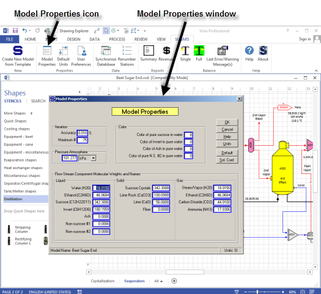

 

 

The **Model Properties** window has entries for
molecular weights for most flow stream components, iteration accuracy
and maximum number of iterations, atmospheric pressure, color values for
pure sucrose in water, invert in water, ash in water and non-sucrose \#2
in water.  A button
on the bottom of the row of buttons is for setting the default
solubility coefficients.

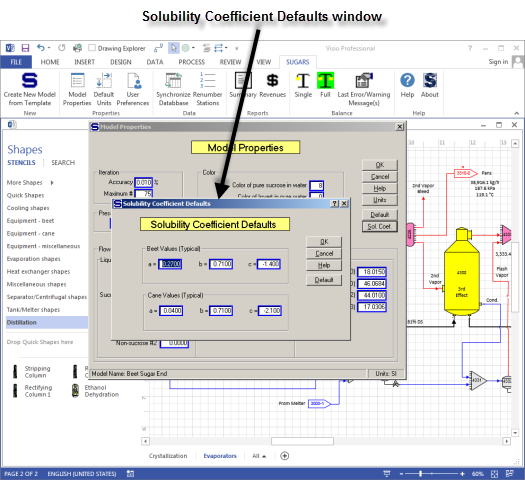

 

The above figure shows the **Solubility Coefficients
Defaults** window that is used to enter the solubility coefficients that
will be displayed on all windows that require solubility coefficients to
be entered.  Using
this window, the default values for solubility coefficients can be set
individually for each model; that is, different models can have
different default solubility coefficients that are used for entering
solubility coefficients on windows that require solubility coefficients
to be entered.

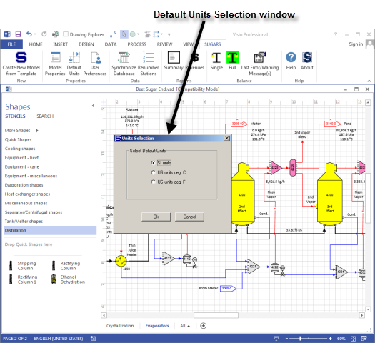

 

 

The above figure shows the **Defaults Units**
selection window for selecting the system of units to be used with
Sugars for entering data and displaying results from the balance
calculations.  The
default system of units is used when a model is saved, even if the
displayed units are
different.  Units
are available for systems in SI, US with temperature in °C and US with
temperature in °F.

 

Also shown on the figure above, the stencils on the
left contain shapes of stations that can be used to build a
model.  Each of
the station types in Sugars is represented on the stencils and many of
the stations have more than one shape that can be used to represent the
same type of
station.  Other
unique shapes can be drawn and added to the stencils, if
needed.  There is
no limit to the number of different shapes that can be used to represent
the Sugars station types.  See
[Designing Your Own
Shapes](../Station_Modules/Designing_Your_Own_Shapes.htm) for further
information.

 

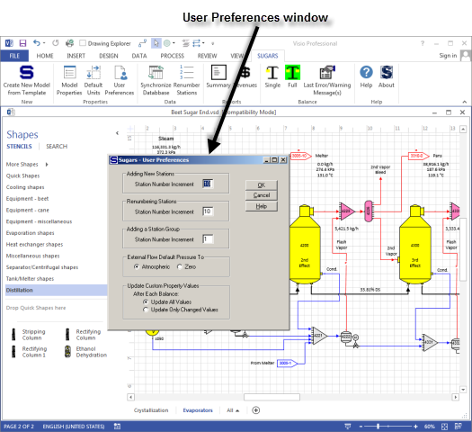

 

 

The above figure shows the **User Preferences**
window.  Entries on
this window will change the station number increment as new stations are
added to a model, the station increment when stations are renumbered and
the station increment for stations in a
group.  Also, it
controls whether the atmospheric pressure or 0.0 is used when new
external flows are added to a
model.  User
Preferences are set for the computer being used; hence, the preferences
will apply to all models that are built and modified on the same
computer.

 

Consistency between the drawing and the Sugars database that contains
all of the data for a model can be checked at any time by using the
**Synchronize Database** option.  When this
option is selected, Sugars will examine each object on the drawing
(stations and connecting flow streams) and verify that the database has
corresponding entries.  If it finds any errors
or differences it will try to fix them and display a message that says
errors were found.  The drawing always
controls the entries in the database.  That
is, if a station or flow is in the database but not on the drawing, then
the entry in the database will be
deleted.  And, if the drawing has a station or
flow that is not in the database, then a corresponding entry will be
made in the database.

 

Stations can be renumbered at any time by selecting either one
individual station or a group of stations and then selecting the
Renumber Stations option. The increment
between each station that is renumbered (if more than one is being
renumbered) is controlled by the User Preferences window shown above.

 

The **Summary** icon gives the Summary report that can be displayed and
printed out.  The figure below shows the
Summary report which lists every flow stream in the
model.  External flows are listed first with
internal flows between stations listed
next.  The **Revenues** icon gives the Net
Process Revenues report shown below where a value can be entered for
every flow stream that leaves the model and a cost can be entered for
every external flow into the model.  The
difference between the revenues and the costs give the net process
revenues for the model.

 

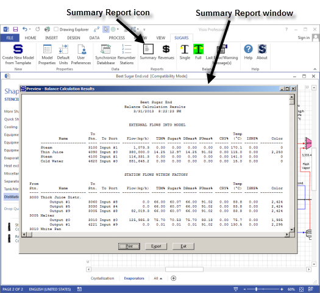

 

 

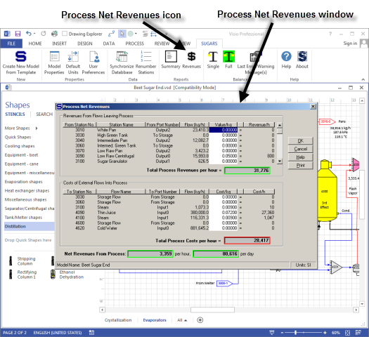

 

Complete help systems are available from the main
menu for both Visio and Sugars (see figure
below).  **Visio
Help** describes all of the drawing features available in Visio and
**Sugars Help** describes each of the stations, input properties,
examples and features of each
station.  Also,
the Sugars help system describes how to design shapes so that they will
work with Sugars  (see [Designing Your
Own Shapes](../Station_Modules/Designing_Your_Own_Shapes.htm)) and other
features of the program.

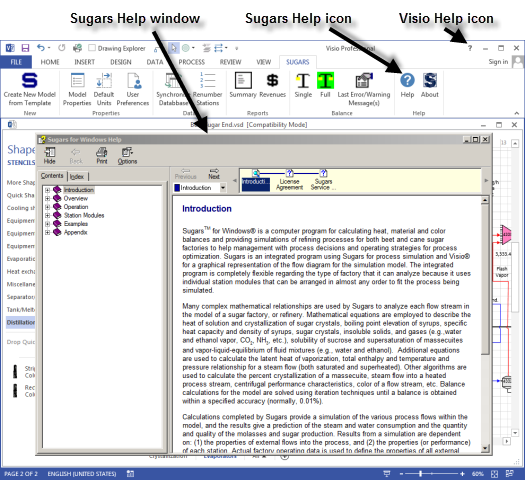

 

Input and output connections for shapes stay glued to the shapes even
when the shapes are moved, or the flow streams are rerouted. Stations
can be copied from one part of the flow diagram and pasted into another
part with the data for the station repeated in the copied station. Also,
groups of stations may be combined and placed on the drawing as a group
instead of having to add each station individually (station numbers for
each station are entered when the group is dropped on the drawing). See
[Grouping Shapes](../Station_Modules/Grouping_Shapes.htm) for further
information.

 

Model Building

 

Every model of a factory, refinery, or portion of a
process is built by selecting stations from the available station
modules in Sugars and connecting the stations together using flow
streams.  Flow
streams between stations, and flow streams that leave a model, are
called *internal
flows*.  Flow
streams that go into the model from outside sources (e.g., beets, steam,
water, CaO, etc.) are called *external flows*. All external flows must
be fully specified before a balance can be
done.  Internal
flows are calculated by Sugars during the balance
calculations.  When
a shape is dragged from a stencil to the drawing surface, a window
appears to assign a number to the station (see figure below).

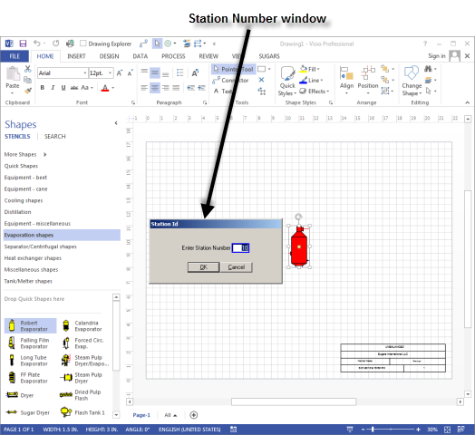

 

The Station Number for each station in a model must be
unique.  Sugars will automatically index the
station numbers by 10 (or as set in User Preferences) as each new one is
added to the flow diagram; however, the number may be changed on the
window to any unused number in the model.

 

Each Sugars station type has a data input window that
is associated with the shapes for that type of
station.  The data
input window defines the properties of each station (or object) in a
model.  Drawing the
process flow diagram defines the
model.  The output
flows emitted from a station are a result of the properties of the
station.  Changing
the properties of a station will control how the station processes flows
coming into the
station.  For
example, an evaporator station, with juice and steam inputs, will
process the juice flow to evaporate water while using steam, or vapor,
to boil the juice. Thus, the properties of the stations in a model and
the characteristics of the external flows into the model control all of
the internal flows between stations, and the flows leaving the
model.  Each station
type has a properties window for entering the appropriate data, and a
window is provided for entering the data to define external flows into
the model.

 

Shapes on the stencils are associated with their respective Sugars
station modules by naming the shape in Visio with a Sugars station name
and identifying the input and output ports for the station. See
[Designing Your Own
Shapes](../Station_Modules/Designing_Your_Own_Shapes.htm) for further
information.

 

The shape color turns to blue after the station
number is
entered.  Double
click the shape with the left mouse button to get the data entry window
for the station (see the Evaporator Properties window in the figure
below).

 

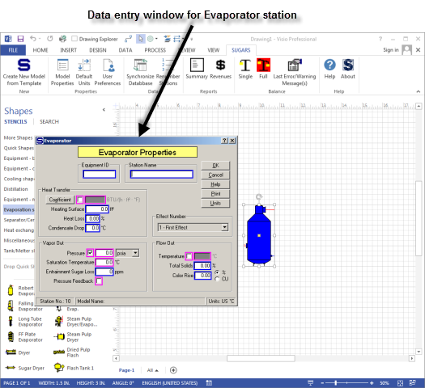

 

All of the necessary data to describe the performance of the station is
entered on the Properties window. The station turns yellow to indicate
that data for the station was entered after clicking on the
OK button to close the Evaporator Properties
window. Shapes are added to the drawing until all of the stations for
the model are on the drawing and data is entered for each station until
all of the stations in the model have turned to yellow.

 

Connections are made between input and output ports
on each station using the connection tool until all of the ports on the
stations have connecting
flows.  Some
stations, such as melters, tanks and receivers, do not need to have all
of their ports connected (extra ports are provided), but these stations
must have at least one input and one output flow.

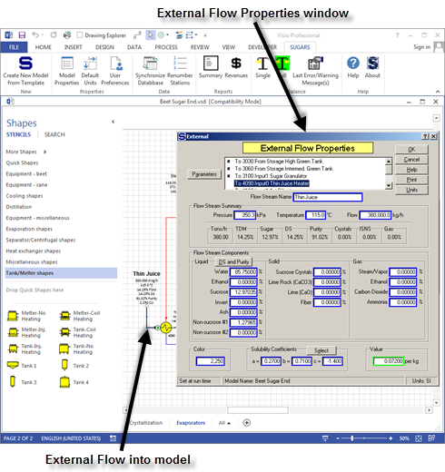

Data for external flows into the model is entered on
the External Flow Properties window (see
above).  Double
clicking on the external flow or right clicking and selecting
"S<u>u</u>gars properties" from the drop-down menu gives the External
Flows Properties window (see figure
above).  **Every
external flow stream going into the model must be specified with
pressure, temperature and flow stream
components.**  If
the flow stream contains dissolved non-sucrose components, the
solubility coefficients must be
defined.  And, if
the flow is not a required flow, the quantity of the flow stream must be
specified.  *Required*
flows are flows that have their quantity determined by the properties of
a station.  For
example, the vapor flow into a pan is a required flow because the
quantity of the vapor needed by the pan is determined by the properties
of the pan and the syrup flow into the
pan.  A flow stream
color entry must be made for the external flow if the color balance is
being done.  And, a
currency value for the flow stream can be entered if the net process
revenues are being calculated for the
model.  Successful
model building with Sugars requires organization and careful layout of
the factory’s stations and flow
streams.  Poorly
designed models do not balance well and they are unstable when changes
or revisions are made at a later
time.  Also, good
drawing methods can make it much easier to follow the process
flows.

 

Simulation

 

The model is ready for balancing once the data for every station and
every external flow stream is entered. The balance calculations give a
simulation of the process and provide all of the details of the internal
flow streams in the model.

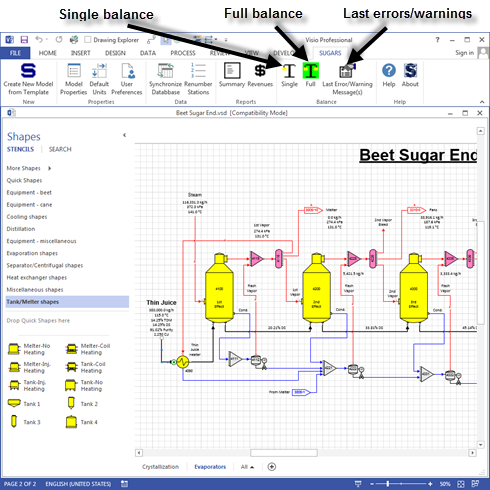

 

Clicking on the **Full** balance icon will initiate
the balance calculations and give a small window showing the progress of
the
iterations.  Clicking
on the **Single** balance icon will give one-balance iteration to
observe the progress of the
balance.  An error
message window will appear if any errors are detected during the
iterations.  Fatal
errors have to be corrected before the calculations can be
completed.  Sometimes
warning or informative messages appear giving information about the
calculations, or observations about the
model.  Many of
these messages do not require any action by the user, but are merely
displayed as information that might be important, or helpful to the
user.  The
error/warning message window may be recalled at any time after the
balance calculations are done so that it can be referred to as
corrections are made to remove any errors that occurred during the
balance
calculations.  Clicking
on the **Last Error/Warning Message(s)** icon will recall the display of
the last error messages that occurred during a
balance. 

 

Results

 

The results of the calculations can be displayed after the balance
calculations are completed. Sugars provides several different
presentations of the results.

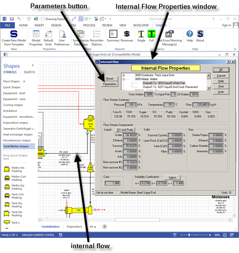

The figure above shows the display of the Internal
Flow Properties window after a
balance.  This
window shows all of the details of the internal flow, such as pressure,
temperature, flow quantity, components, color and solubility
coefficients.  In
addition, the % total dry matter (TDM), % sugar, % dry substance (DS), %
purity, % crystals, % insoluble solid non-sugars (ISNS) and % gas are
given in the middle of the window with the quantity of flow in tons per
hour.  Clicking the
**DS and Purity** button, under the Flow Stream Components in the Liquid
phase section, will give the % dry substance and purity for the liquid
portion of the
flow.  For a
massecuite, this would be the mother liquor %DS and % Purity.

 

Clicking the **Parameters** button on the Internal
Flow Properties window gives additional characteristics of the flow,
such as: volume flow, specific weight, enthalpy, specific heat capacity,
supersaturation and boiling point elevation (see figure
below).  Place the
cursor on the “Volume flow” “Liquid” displayed value to see the liquid
portion of the flow displayed as liters per minute (lpm) or gallons per
minute (gpm) depending on the units (SI or US) being
used.  The Flow
Stream Parameters feature is also available for external flows.

# 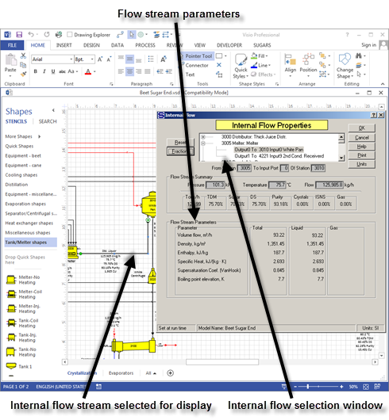

 

Every internal flow in the model can be displayed using the Properties
window. Also, flow streams that are required and/or pressure feedback
(flow streams that need a pressure value from another station) are
identified on the flow diagram by a small 'R' for required and a small
'P' for pressure feedback. Sugars will place these indicators on the
flow streams after the balance calculations are completed.

 

The Internal Flow Properties window has a small internal flow scroll
able selection window that shows every internal flow stream in the
model. Using this window, individual flow streams can be displayed
quickly without having to close the Internal Flow Properties window and
double click on another flow stream to display its properties. The
External Flow Properties window also has a similar external flow
selection window for viewing external flows. The internal and external
flow properties windows provide valuable information about the process
that can be used for engineering design and/or data reconciliation.

 

Some external and internal flow data and parameters can be displayed on
the drawing obviating the need to open the properties windows. Right
click the flow stream and from the drop-down menu that appears, select
"Add Flow Legend..." (see figure below).

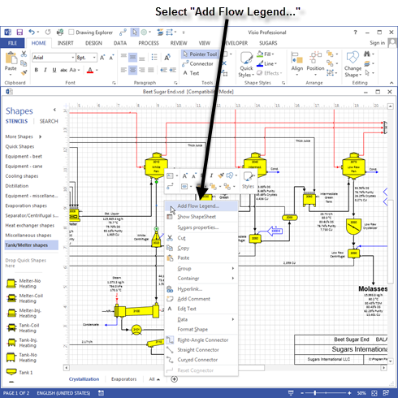

 

 

Select the data to be displayed when the flow legend menu appears (see
figure below).

 

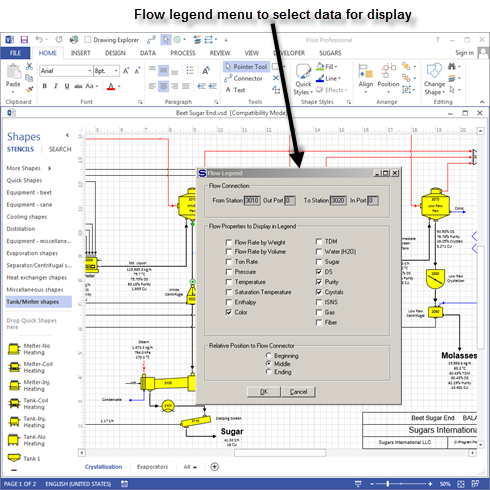

 

 

The displayed data can be positioned and formatted using the normal
Visio methods and it will be updated by Sugars after each balance (see
figure below).

 

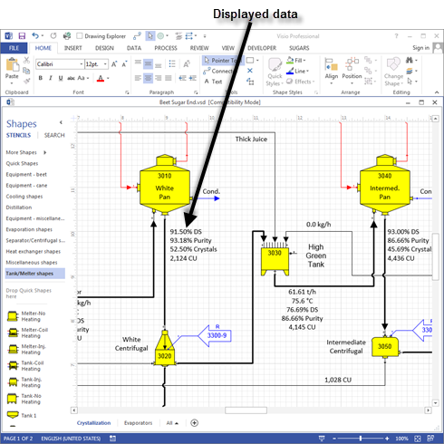

 

 

Data can also be displayed on the drawing using Visio Shape
Data.  Every station and flow stream has Shape

 

 

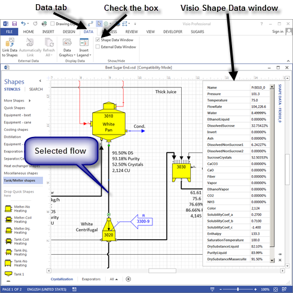

 

 

Data associated with it.  The Shape Data is stored in the Visio
ShapeSheet and it can be displayed in the Visio Shape Data
window.
 Click the **DATA** tab and then check the
“Shape Data Windows” check box to have Visio display the Shape Data in a
collapsible window (see figure
above).  The Shape
Data can be displayed on the drawing and/or used in calculations using
the Visio **INSERT** \> **Field** feature (see [Shape Data
Display](../Program_Operation/Shape_Data_Display.htm)).

 

In addition, Shape Data can be exported to either an embedded or
external Microsoft Excel spreadsheet.  Visual
Basic for Applications (VBA) is used to make the connection between the
Shape Data and Excel (see [Exporting Data to
Excel](../Program_Operation/Exporting_Data_to_Excel.htm)).

 

Printouts are available for the Summary and Revenues
reports.  These reports provide an overview of
the balance calculations. The Summary report (see figure below) shows
every flow stream in the model with the characteristics of each flow
listed along with the station the flow originates from and the station
to which it goes.  The flow quantity, TDM%
(total dry matter percent), Sugar% (sugar percent), DSmas% (percent dry
substance including sucrose crystals – if any), PUmas% (percent purity
including sucrose crystal - if any), CRY% (percent sucrose crystals),
Temp (temperature in °C or °F), ISNS% (percent insoluble solids
non-sucrose), and color is printed for each flow stream. The Summary
report is a listing of the same summary information that is on the
Internal Flow Properties and External Flow Properties windows for each
flow.

 

# 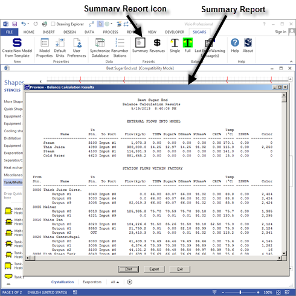

 

The Revenues report (see figure below) is a report of the process net
revenues that are generated by the model. The process net revenues are
calculated from the revenue values for all flows leaving the model
(internal flow) minus the cost of all flows into the model (external
flows).  As changes are made to the process,
the net revenues will either increase, or decrease.
 New process equipment with new station
properties, or changes in the process routing, can be evaluated quickly
to see now the revenues will change.  This
information is very useful for making investment decisions. Also, it is
the most convenient way to show how changes to the model will affect the
financial operating performance of the process.

 

# 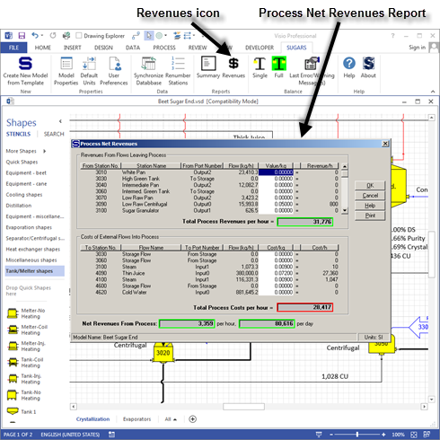

 

The revenues and costs value entries for all external flows into the
model and internal flows that leave the model are entered on the
External Flow Properties and Internal Flow Properties windows. These
values are used to calculate the process net revenues. The entered
values also can be changed on the Process Net Revenues window as shown
in the figure above.

 

**Data Import/Export**

 

Data Import/Export is an optional feature of Sugars that can be added to
the Sugars license.  It allows importing data
directly into an opened model from an external e**X**tensible **M**arkup
**L**anguage (XML) file.  Also, data can be
exported from the model to an XML file that can then be read by other
programs.  This allows changes to be made to
the model that can then be exported to other software that can process
the file for either reports or to use as set points for the factory.

 

Every station in a model has an Equipment ID entry
field and a unique ID must be entered for every station that is
importing or exporting
data.  A schema
file is used to define the format for the XML file and data is keyed to
the Equipment ID’s for each
station.    The
data import/export feature uses these Equipment ID’s to place the data
from the XML file into the proper
station.  Station
and external and internal flow data can be imported as defined in the
“AMS Import PropertiesRev\_.pdf” document in the **…Sugars\AMS**
subdirectory.  External
flow data in an XML file is aligned with the station that it goes to by
the Equipment ID and the input port number for the
station.  Internal
flow data is aligned with the flow that leaves a station and port
number. 

 

The figure above shows the data Import/Export icon as it appears if this
feature is licensed for the copy of Sugars being
used.  Clicking the left mouse button on the
**Import/Export** icon will give the Data Import/Export window shown
below.

 

 

 

 

[User Interface](Program_Overview.htm)

[Model Building](#Model_Building)

[Simulation](Program_Overview.htm)

[Results](Program_Overview.htm)

[Data Import/Export](#Data_Import_Export)
