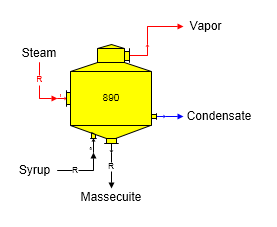
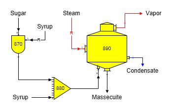
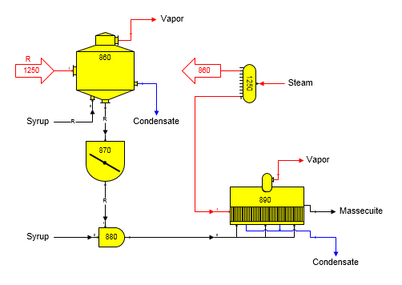

# Pan Examples

 

Massecuite Out Required The syrup flow in and massecuite flow out can
become required in a model when a flow downstream from the pan is
required by another station in the model. For example, if a certain
quantity of sugar were needed from a centrifugal station, this would
require that the massecuite flow into the centrifugal becomes a required
flow. Hence, the syrup flow to the pan would be required. Required flows
will work their way back to a place in the model where they can be
satisfied; such as, in a distributor station, or by an external flow
into the model. The figure below shows a pan with both syrup and
massecuite flows required (see the small "R" on the syrup and massecuite
flow streams).

 

 

Entries are made on the Pan Properties window to control the crystal
content and temperature of the massecuite leaving the pan (see [Pan
Properties](Pan_Properties.htm) section for a description of each
property).

 

Magma Footing Magma can be used to seed a pan. The magma is usually
prepared in a Blender and fed to the pan with syrup. The figure below
shows a pan with a receiver to receive both the syrup and magma and a
blender station using sugar and syrup to prepare the magma.

 

 

Continuous Pan A continuous pan installation is modeled using a seed
pan. The seed crystal for the pan is prepared in a separate seed pan and
fed to the continuous pan with syrup. The figure below shows a
continuous pan with a blender (station no. 880) to control the amount of
seed as a ratio to the syrup going to the continuous pan. A receiver
station could be used instead of the blender station and the quantity of
seed to the continuous pan would be controlled by the quantity of syrup
to the seed pan.

 

 

 

[Pan Features](Pan_Features.htm)

[Pan Properties](Pan_Properties.htm)
