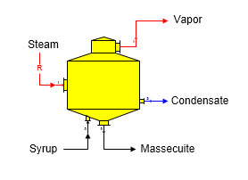
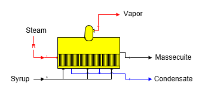
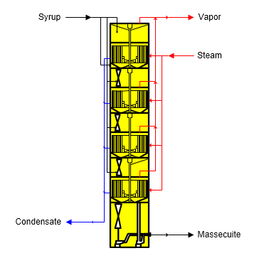

# Pan Features

 

Sugars can simulate the operation of both batch and continuous pans. The
calculations are the same for both types - only the shapes shown on the
flow diagram are different.

 

Batch Pan  The shape for a batch pan is shown in the
figure below.  Syrup
goes into input port 0 and steam goes into input port 1 (zoom in on the
shape to see the port identifiers - input port 1 is
red).  Steam/vapor
flow into the pan is always a required flow.
 Massecuite leaves in
output port 0 (black), vapor goes out port 1(red) and condensate goes
out port 2 (blue).

 

 

Continuous Pan  The shape for a horizontal continuous
pan is shown in the figure
below.  Syrup goes
into input port 0 and steam goes into input port 1 (zoom in on the shape
to see the port identifiers - input port 1 is
red).  Steam/vapor
flow into the pan is always a required flow.

 

 

VKT Continuous Crystallizer  Continuous
crystallization with a VKT system is shown in the figure
below.  Syrup goes
into the top port and steam goes into the side port while condensate and
massecuite leave at the bottom and vapor at the
top.  Data for
individual cells is not considered; instead, only the condition of the
massecuite leaving is needed for the model.

 

 

General Features  Batch or continuous pan stations
are used to grow sucrose crystals by using steam/vapor (heating flow) to
evaporate water from a process flow
stream.  Only one
process flow (syrup going to input port 0) and one heating flow (steam
going to input port 1) is allowed to flow into a pan
station.  The
heating flow must contain water vapor for the steam consumption
calculation and all of the steam in is assumed to
condense.  Sugars
will give an error message during the balance calculations if the
heating flow does not contain a water vapor component. The heating flow
into the pan is always a required flow (see the small ‘R’ on the steam
flow line); that is, Sugars will calculate the quantity of steam flowing
into the pan.

 

The crystal content of the massecuite leaving the pan is calculated from
the supersaturation, percent dry substance (%DS) and temperature values
entered on the Pan Properties window.  The
percent dry substance (%DS) of the massecuite is specified, or it can be
calculated using the target mother liquor purity
option.  A color rise can occur in the pan for
an increase in color of the syrup as it is converted to a
massecuite.  The temperature of the massecuite
leaving the pan is controlled by either the value entered for the
temperature of the massecuite out, or by the value entered for the
saturation temperature of the vapor out.

 

Sucrose entrainment loss can occur in the pan from
small droplets of syrup that are entrained in the vapor leaving the
boiling
syrup.  Droplets
that are not captured in an entrainment separator located inside the pan
will leave with the vapor flowing out of the
pan.  These droplets
contain sucrose that is lost unless the vapor is condensed in another
station and returned to the process.

 

Sucrose solubility coefficients can be entered to
control the crystallization that occurs in the pan if it is desired to
use solubility coefficients that are different than the coefficients
carried with the
syrup.  **Normally,
it is not necessary to enter values for the solubility coefficients on
the Pan Properties window because the syrup coefficients are usually
correct.**

 

Heat loss can be entered for any heat loss that
occurs due to convection, venting, steam-out, con­duction, or radiation
of heat from the pan to the
surroundings.  The %
heat loss is for the amount of heat that is lost from the steam, or
vapor, as heat is transferred to the syrup.

 

Vapor and condensate flows out of the pan cannot be
made required flows (i.e., quantity of flow calculated by
Sugars).  Sugars
will give a warning message if it detects that either the vapor and/or
condensate flows out of the pan are required because a balance may not
be possible if they are required by another
station.  Constructing
a model that makes the vapor, and/or condensate flow required would
result in an over specified model that has more conditions to be
satisfied than is
possible.  The model
would be over specified because the properties for the pan would
conflict with the station that is requiring a quantity of vapor, or
condensate, from the pan.

 

The vapor flow out of the pan can be a pressure feedback
flow.  For example, vapor flow from a pan
going to a condenser can have the vapor pressure set by the internal
pressure of the condenser and the pressure will be fed back to the pan.

 

The massecuite flow out of a pan can be a required
flow.  If it is
required, the syrup flow into the pan also will be
required.  The
quantity of syrup flow into the pan is not dependent on the properties
of the pan; so, making the massecuite flow out a required flow does not
cause a warning message.

 

 

[Pan Properties](Pan_Properties.htm)

[Pan Examples](Pan_Examples.htm)
