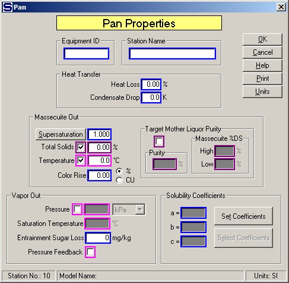

# Pan Properties

 

 

Equipment ID An equipment ID of up to 11 characters can be used to
identify the station with an actual station in the process. Any
combination of numbers and letters that are used in the factory/refinery
to identify equipment can be entered. For example, Equipment ID =
123.456A. It is not necessary to make an entry in the Equipment ID field
if the station in the model does not have a corresponding station in the
factory/refinery.

 

Station Name A name of up to 20 characters must be entered for the
station. For example, Station Name = Low Raw Pan.

 

Magenta colored borders on the entry fields are used to indicate that
only one of the entries can be selected; that is, when one is selected
the others are not accessible.  For example,
if Massecuite Out Temperature is chosen, then Vapor Out Pressure (and
Saturation Temperature), and Pressure Feedback cannot be
selected.  And, if any of the others are
selected, then Massecuite Out Temperature cannot be used in addition to
the other entry with magenta borders that was not selected.

 

Maroon colored borders on the Total Solids and Target Mother Liquor
Purity entry fields indicate that one of these may be
selected.  For example, Target Mother Liquor
Purity cannot be selected if Total Solids is selected.

 

Heat Transfer Heating loss and a lower condensate temperature than the
saturation temperature can be specified.

 

Heat Loss %  Enter the Heat Loss in percent for heat
lost in the pan
station.  The Heat
Loss is the loss of heat from the total heat that is transferred to the
syrup/massecuite from the heating
vapor.  For batch
pans, an allowance is normally made for "steam-out" and a total loss of
8 to 12 percent is
common.  For
example, Heat Loss =
**8.50**%.  Heat
loss for continuous pans is usually less than it is for batch
pans.

 

Condensate Drop  Enter a temperature drop for the condensate if it
leaves the pan with a temperature that is lower than the vapor
saturation temperature of the vapor heating flow into the
pan.  For example, if the vapor saturation
temperature for the vapor flow into the pan is 119°C and condensate
leaves the pan at 115°C, then Condensate Drop = **4.0** K.

 

Massecuite Out  Massecuite leaves the pan with
characteristics as defined by the Super­saturation, Total Solids (%),
Temperature and Color
rise.  The Target
Mother Liquor Purity can be selected instead of the Total Solids, and
Vapor Out Pressure or Pressure Feedback can be selected instead of
Temperature.

 

Supersaturation  Enter the supersaturation coefficient of the massecuite
leaving the pan; that is, its supersaturation as it is dropped from the
pan. For example, Supersaturation Coefficient = 1.200.

 

Supersaturation is defined by ICUMSA as the ratio of sucrose/water of
the mother liquor in the massecuite to the ratio of sucrose/water of the
mother liquor when it is saturated.

 

 

Supersaturation can be calculated from a massecuite with a known mother
liquor %DS and purity by clicking the left mouse button on the
**<u>S</u>upersaturation** button.  Clicking
on this button will give a small window for entering data and
calculating the supersaturation.  If the
solubility coefficients for the massecuite with known %DS, Purity and
Temperature are different from the massecuite leaving the pan in the
Sugars model, then enter the ‘a’, ‘b’ and ‘c’ values for the known
massecuite along with the %DS, Purity and Temperature
values.  Click on the **<u>O</u>K** button and
Sugars will calculate the supersaturation coeffi­cient and place it in
the Supersaturation field on the Pan Properties
window.  Different values can be entered for
the mother liquor %DS, Purity and Temperature and the Super­saturation
Coefficient value for each entry will be displayed in the box near the
bottom of the small window for entering the
data.  The mother liquor %DS and purity will
be adjusted to correspond to the entry made for the %DS of the
massecuite leaving the pan that was entered on the Pan Properties
window.

 

Total Solids  Left click on the check box next to the Total Solids entry
field to enter the Total Solids (%) of the massecuite leaving the
pan.  For example, Total Solids = **91.20**%.
Or, instead left click on the check box for the Target Mother Liquor
Purity to enter target mother liquor purity for the massecuite leaving
the pan.  Total Solids (%) includes dis­solved
solids, insoluble solids (if any) and sucrose crystals.

 

Temperature Left click the check box next to the massecuite out
Temperature field to enter the Temperature (in °C, or °F units) of the
massecuite leaving the pan; i.e., the tempera­ture of the massecuite as
it is dropped from the pan.  For example,
Temperature = **81.7°C**. 

 

Or, instead, left click on the check box for the
Saturation Pressure to enter a Saturation Pressure, or Saturation
Temperature for the vapor flow
out.  Sugars will
use the Satura­tion Pressure to calculate the Temperature and this
temperature will be used to calculate the temperature of the massecuite
leaving the
pan.  The difference
between the two tempera­tures is the boiling point elevation for the
mother liquor in the massecuite.

 

Color Rise  Enter the increase (rise) in color for
massecuite leaving the
pan.   The color of
the syrup will increase from both time and temperature effects during
boiling.  The
increase in color is accounted for by entering a value in percent (%),
or in actual color units
(CU).   For example,
Color Rise = **4.25**% (color of flow through the pan will increase by
4.25%), or Color Rise = **326**CU (color of flow through the pan will
increase by 326
units).  Color units
can be any system of color measurement, but it must be consistent for
the entire model.

 

Target Mother Liquor Purity  Left click on the check
box in the Target Mother Liquor Purity frame to enter a purity value to
control crystallization in the pan to give a specified value for the
purity of the mother liquor in the massecuite leaving the
pan.  This is an
alternate entry selection to the Total Solids entry.

 

Purity  Enter a percent (%) value for the mother liquor purity of the
massecuite leaving the pan. Sugars will calculate a %DS for the
massecuite leaving the pan to be within the Dry Substance (%) High and
Low limit entries. If the mother liquor purity cannot be reached within
the High and Low limit values, Sugars will make the massecuite %DS value
equal to either the High, or Low limit that gives a mother liquor purity
that is closest to the purity value entered. For example, Purity =
82.4%.

 

Massecuite %DS  Enter high and low %DS limits for the massecuite to
obtain the mother liquor purity.

 

High  Enter a percent (%) value for the maximum %DS allowed for the
massecuite out of the pan. Sugars will calculate the %DS for the
massecuite leaving the pan to have a mother liquor purity that is equal
to the purity entry. For example, High = 94.00%.

 

Low  Enter a percent (%) value for the minimum %DS allowed for the
massecuite out of the pan. Sugars will calculate the %DS for the
massecuite leaving the pan to have a mother liquor purity that is equal
to the Purity entry. For example, Low = 88.00%.

 

Vapor Out
 Vapor
leaving the pan can have the Pressure defined (or Saturation
Temperature) or use Pressure Feedback and an Entrainment Sugar
Loss.

 

Pressure  Left click the check box next to the Pressure field to select
the vapor pressure and Saturation Temperature instead of the juice out
Temperature.  Vapor Saturation Temperature may
be entered instead of Pressure when the check box next to the Pressure
field is selected. The drop-down box next to the Pressure field can be
used to select the pressure units for
entry.  The Saturation Temperature will be
calculated and displayed by Sugars when an entry is made for the
Pressure.  For example, Pressure = **0.5** bar
gives 81.3°C.  If "mm Hg" or "in Hg" units are
used for the Pressure, the entered value should be \< 0.0 if the
pressure is below standard atmospheric pressure.

 

Saturation Temperature  Left click the check box next to the Pressure
field to select the vapor saturation pressure and temperature instead of
the massecuite out Temperature.  Saturation
Temperature of the vapor leaving the pan will result in a temperature of
the massecuite leaving the pan that is equal to the Saturation
Temperature value plus the boiling point elevation of the mother liquor
in the massecuite.  The Saturation Tempera­ture
may be entered as either a temperature value or as a Pressure value (see
below) and once a value is entered for either one, the other value will
be calculated and displayed by Sugars.  For
example, Saturation Temperature = **85.00**°C.

 

Entrainment Sugar Loss  Enter the entrainment loss of sugar that is
carried over by the vapor during pan boiling. The loss is expressed as
milligrams per kilogram, or parts per million (ppm) of sugar in the
total vapor flow. For example, Entrainment Sugar Loss = 80 mg/kg.

 

Entrainment Sugar Loss allows for entrainment of
sucrose and non-sucrose components in the vapor flow leaving the
pan.  The input
parameter is for sugar loss; however, Sugars will consider the droplets
entrained with the vapor to have the same %DS and purity as the mother
liquor in the massecuite dropped from the
pan.  Normally, the
measurement of entrainment loss in a pan is determined from a
measurement of sugar in the vapor flow line (or, leg water line from the
condenser).  Because
Sugars considers the entrained droplets to have both sucrose and
non-sucrose, entering a value for the Entrainment Sugar Loss will also
gives a non-sucrose
loss.  Also, the
sugar loss is in mg/kg, or ppm of the condensable components in the
vapor flow leaving the pan; that is, non-condensable components (for
example, CO2 or
NH3) are not
considered.

 

Pressure Feedback Left click the check box to use pressure feedback to
define the pressure of the vapor leaving the pan. For example, if the
vapor out goes to a condenser that has an entry for the internal
pressure, the internal pressure value will be passed back to the pan as
the vapor out pressure.

 

Solubility Coefficients  The Solubility Coefficients
are the coefficients for the Vavrinecz equation:

 

 

Enter values for 'a', 'b' and 'c' only if massecuite leaving the pan has
a different sucrose solubility than the incoming syrup flow. The
Wagnerowski equation will be used if 'a' and 'b' values are entered with
'c' = 0. If new 'a', 'b' and 'c' coefficients are entered,
crystallization in the pan will be calculated using the new
coefficients, and all massecuite leaving the pan will have these
coefficients for subsequent station calculations. Examples,

 

Beet values (Grut): a = .178, b = .82, c = -2.1

Beet values (Polish): a = .27, b = .71, c = -1.4

Cane sugar (typical): a = .04, b = .71, c = -2.1

 

 

[Pan Features](Pan_Features.htm)

[Pan Examples](Pan_Examples.htm)
