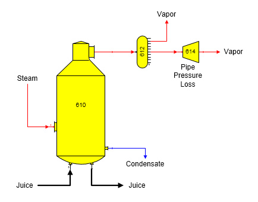
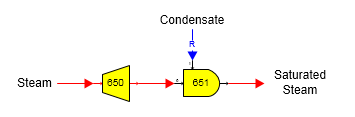

# Pressure Reducer Examples

 

A pressure reducing station is used in the flow diagram below to allow
for pipeline pressure loss in the vapor from an evaporator station.
Simply specify a pressure drop for the vapor flow going through the
pressure reducer station (no. 614). Sugars will calculate the
corresponding change in temperature for the vapor and any change in
water/vapor flow stream components if the vapor had any entrained liquid
in the vapor.

 

 

 

The model of a pressure reducer with desuperheating station can be built
using a pressure reducer and a blender station (see flow diagram below).
The steam flow pressure is reduced in the pressure reducing station no.
650 and the blender station no. 651 is used to mix condensate with the
superheated steam until the temperature of the steam is a saturation
temperature for the new reduced pressure. The output saturation
temperature is specified in the blender station and the quantity of the
condensate is calculated by Sugars (condensate is a required flow).

 

 

 

[Pressure Reducer Features](Pressure_Reducer_Features.htm)

[Pressure Reducer Properties](Pressure_Reducer_Properties.htm)
