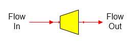

# Pressure Reducer Features

 

Pressure Reducer As its name implies, a pressure reducer station is used
to reduce the pressure of a vapor flow stream.

 

 

 

 

General Features  Pressure reducing stations are used
to allow for pressure drop in a pipeline, valve, orifice, or process
equipment.  The
discharge pressure from the pressure reducer can be specified, or a
value can be entered for pressure
drop.  Flow through
the pressure reducer is adiabatic and the change in pressure will result
in a change in the discharge temperature if the flow contains
vapor.  Also, if
there is water and vapor in the flow stream, Sugars will calculate the
change in the water/vapor fractions as a result of the pressure
drop.  No change in
sucrose crystallization is
considered.  A
pressure feedback flow can pass through a pressure reducer if the
Pressure Drop is specified for the reducer instead of the Pressure
Out.  For example, a
pressure reducer with Pressure Drop can be used in the vapor flow line
from a flash tank when the flash tank is using pressure feedback to
determine its flashing
pressure.  The
pressure fed back to the flash tank will increase by the amount of the
drop in pressure specified for the pressure reducer as it passes through
the reducer.

 

 

[Pressure Reducer Properties](Pressure_Reducer_Properties.htm)

[Pressure Reducer Examples](Pressure_Reducer_Examples.htm)
