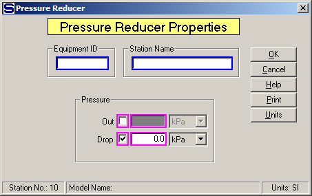

# Pressure Reducer Properties

 

 

Equipment ID An equipment ID of up to 11 characters can be used to
identify the station with an actual station in the process. Any
combination of numbers and letters that are used in the factory/refinery
to identify equipment can be entered. For example, Equipment ID =
123.456A. It is not necessary to make an entry in the Equipment ID field
if the station in the model does not have a corresponding station in the
factory/refinery.

 

Station Name A name of up to 20 characters must be entered for the
station. For example, Station Name = Pipe Pressure Drop.

 

Pressure Discharge pressure is controlled by either specifying the
pressure out or specifying a drop in the input flow pressure. Magenta
colored borders on the entry fields are used to indicate that only one
of the entries can be selected; that is, when one is selected the other
one is not accessible.

 

Out  Enter a pressure for the flow out of the pressure reducer. For
example, Pressure Out = 320 kPa.

 

Drop Enter a Pressure Drop for the vapor leaving the pressure reducer.
For example, Pressure Drop = 12.0 kPa.

 

 

[Pressure Reducer Features](Pressure_Reducer_Features.htm)

[Pressure Reducer Examples](Pressure_Reducer_Examples.htm)
