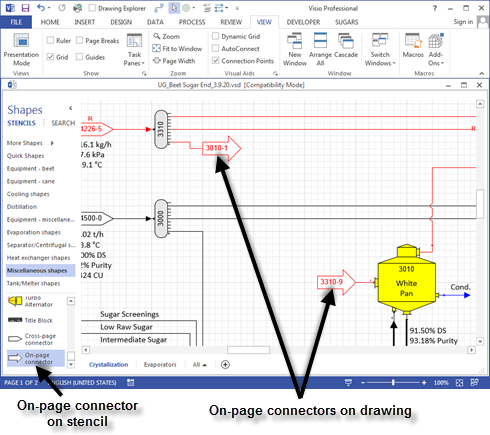
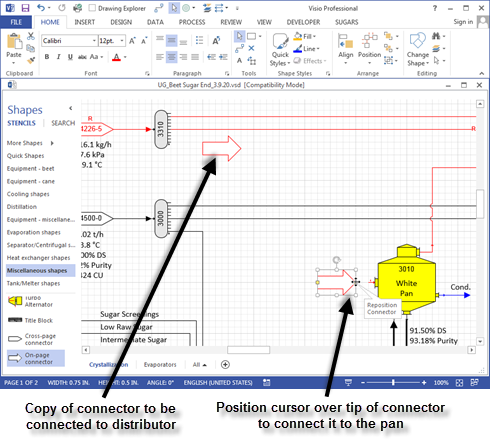
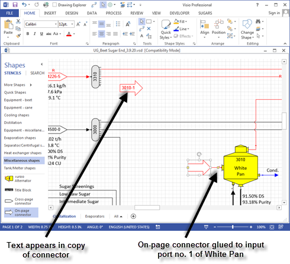
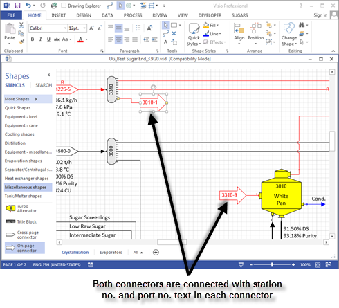

# Cross-Page and On-Page Connectors

 

The cross-page and on-page connectors are special
shapes that are used to make connections between stations that are on
the same page (on-page connector), or on different pages (cross-page
connector).  Connections
between stations are made with cross-page and on-page connectors so that
actual connecting lines do not have to be
used.  Confusion is
often caused when all flow streams on a diagram are drawn using the
connector tool.  The
number of flow streamlines can make it difficult to read the
diagram.  Using
on-page connectors, the number of connecting lines can be reduced to
give a clearer and cleaner flow
diagram.  In the
diagram shown below, on-page connectors are used to represent one of the
outputs from a vapor distributor station to the vapor input line of a
pan.  In this case,
the pan and distributor are on the same page; however, the stations can
be on different
pages.    Double
clicking on either of the on-page connector shapes will give an Internal
Flow Properties window with the same information (that is, pressure,
temperature, quantity, components, color, etc. all will be the
same).  Thus, both
on-page connectors for a flow stream represent the same connecting
line.

 

The text inside the on-page and cross-page connectors
represents the station no. and port no. on the destination and
origination station for each respective
connector.  For
example, in the window above, the on-page connector from distributor
station no. 3310 goes to White Pan station no. 3010, port 1; hence, the
text in the on-page connector attached to the distributor is
"3010-1".  Conversely,
the on-page connector into the White Pan station no. 3010 is from
distributor station no. 3310 port 9; hence, the text in the on-page
connector is "3310-9".

 

On-page and cross-page connectors behave in exactly
the same
manner.  They are
different shapes only to make it easier to locate the corresponding mate
when searching for the
connections.  That
is, when looking for the mate to an on-page connector, only the active
page is searched; whereas, for a cross-page connector, other pages have
to be
searched.  This
makes it easier to locate connections when working with a multi-page
model; hence, when designing models, always use on-page connectors for
connections on the same page, and cross-page connectors for connections
between pages.

 

To use either connector, drag it from the stencil to the point on the
drawing where it is to be connected to either the originating station or
the destination station. Then make a copy of the connector by holding
down the control key and dragging the copy to the other station (or copy
the connector to the Windows clipboard using the copy icon and then
paste it from the clipboard on to the drawing near the connecting
station). Next, at each connector, place the cursor over the tail, or
tip, of the arrow until your cursor changes to four arrows in a cross
pattern with the "Reposition connector" tool tip as shown below.

 

 

Now hold the left mouse button down and drag the connector from the tip
of the arrow and connect it to a connection point on the station. The
connection from the on-page connector should glue to the port on the
station (see window below for red square at connecting point).

 

Now, connect the tail of the copied connector to the distributor station
no. 3310 using the same method as used for connecting the connector to
the White Pan (see window below).

 

When the connection is completed, text should appear in each arrow that
shows the station no. and port no. of the corresponding station. The
connection is completed if text appears in the connectors; otherwise,
the connection was not made correctly and it should be redone.
