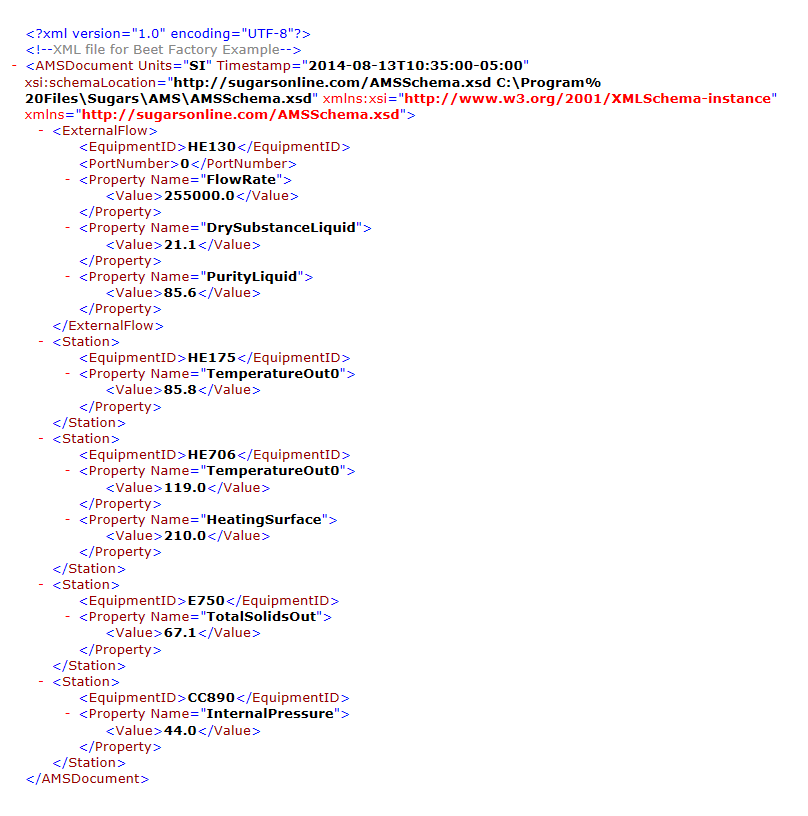
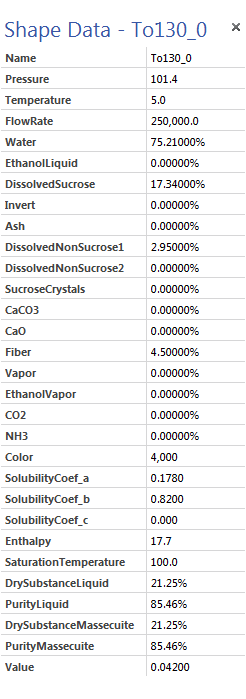
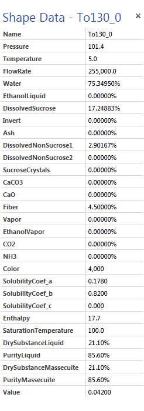
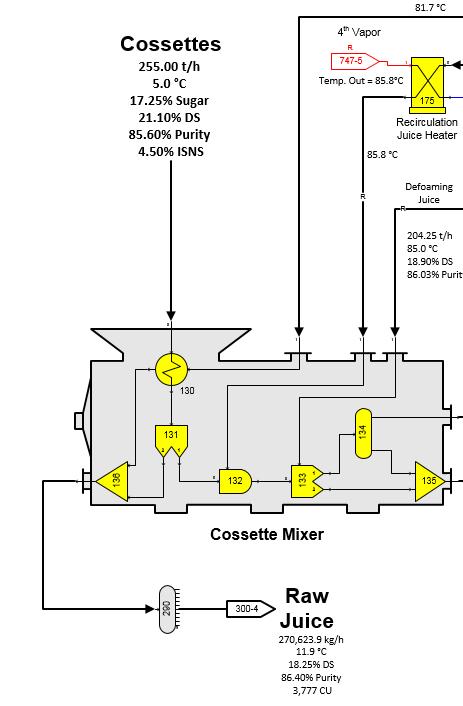
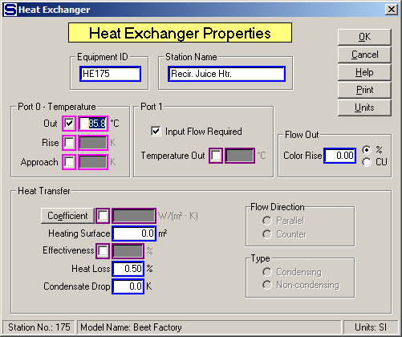
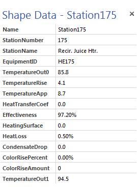
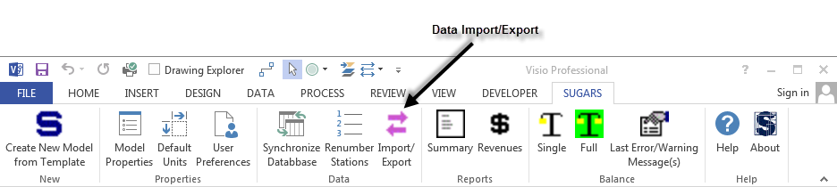
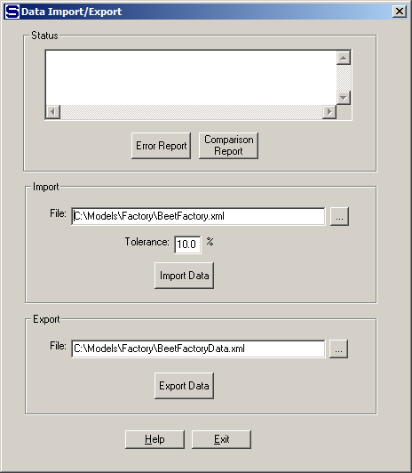
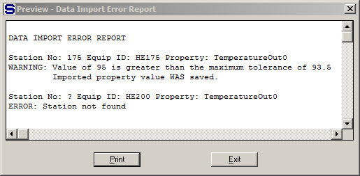
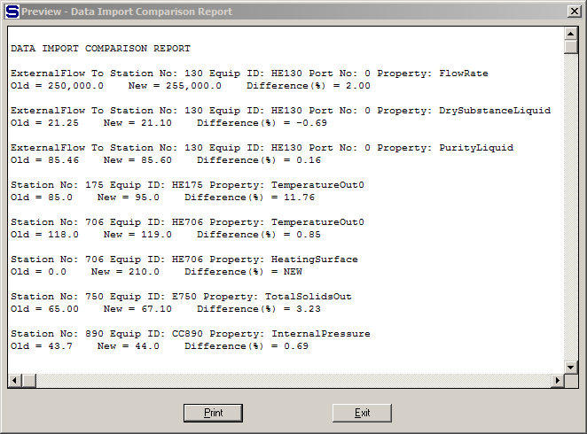

# Data Import/Export

 

Importing data from and/or exporting data to an e**X**tensible
**M**arkup **L**anguage (XML) file is an optional feature of
Sugars.  With this feature, data for stations
and external flows can be imported directly into the model and the model
rebalanced to reflect the new conditions.  An
XML file with the new data is created manually or by another program;
for example, the data acquisition software used by a
factory.  An example of an XML file for import
into a model is shown in the figure below as displayed by Microsoft
Internet Explorer.

All of the lines above the “\<ExternalFlow\>” line are the header for
the file that identifies the schema (used to define the format of the
XML file data), the date and time and the units used for data in the
file.  In this example, data is being imported
to only one external flow.  The new data is a
flow rate of 255,000 kg/h, liquid dry substance (%DS) and liquid %
Purity.  When this data is imported, Sugars
will convert the %DS and % Purity to new components for the flow; that
is, it will determine the water, dissolved sucrose and non-sucrose
components in the flow. 

 

“xmlNotepad.exe” in the “C:\Program Files\Sugars\AMS”
sub-directory or another xml editor can be used to modify the XML
file.  The values that can be imported are given in the “AMS Import
PropertiesRev\_.pdf” document located in the **…\Sugars\AMS**
subdirectory which is the same as the Visio Shape Data for the flow
except for the **Name** which cannot be imported.  The figure below
shows the Visio Shape Data for the external flow that goes to port 0 of
the station with Equipment ID “HE130” (station no. 130 input port 0)
before the XML data is imported into the model.

After the XML data is imported and the model is balanced, the new data
is shown in the figure below.  As shown, the
new flow rate = 255,000, DrySubstanceLiquid = 21.10% and PurityLiquid =
85.60%.  Also, new components were calculated
for Water, DissolvedSucrose and
DissolvedNonSucrose1.  Pressure, Temperature,
Fiber, Solubility Coefficients (a, b and c), Enthalpy and
SaturationTemperature all remain the same.

The Cossettes flow to Station no. 130 input port 0 is shown in the
figure below.  The new values are displayed on
the diagram for the Cossettes that flow into heat exchanger station
130.  Only external flows that go to a station
with an Equipment ID can have data imported or
exported.  Flows to or from stations that do
not have an Equipment ID will not be able to import or export
data.  The same is true for stations; that is,
stations must have an Equipment ID or data cannot be imported to the
station and when data is exported from the model, stations without an
Equipment ID will not have their data exported.

After the external flow in the XML file, there are four stations that
have data being imported.  These stations have
Equipment ID’s: HE175, HE706, E750 and CC890.

 

Property data for the heat exchanger station no. 175 (Equipment ID:
HE175) is shown in the figure below.

 

 

And, the Shape Data for this station is shown in the figure below.

Any of the Heat Exchanger Properties shown in the Shape Data can be
defined in an XML file and then imported into the model; however, only
the active fields will have an effect on the
balance.   For
example, in station no. 175 above, data imported into the Port 0 -
Temperature Out field will affect the balance, but data imported into
the Rise or Approach fields will not.     The
same is true for all other stations available in Sugars.

 

Importing data into the model after the XML file is created is done by
left clicking on the **Import/Export** icon on the **SUGARS** tab in
Visio as shown in the figure below.

 

Left clicking on the **Import/Export** icon brings up the Data
Import/Export screen as shown below.

 

 

Enter the path and file name of the XML file in the “File:” field and
then left click the **Import Data** button to import the XML file data
into the model.

 

Any errors encountered during the import will result in an error message
in the “Status” window.  Clicking on the
**Error Report** button will display a report listing all of the errors
and messages that occurred during the
import.  An example of an error report is
shown below.

 

 

A comparison report can be shown by left clicking the **Comparison
Report** button.  This report lists all of the
data that was imported and compares it to the data that was in the model
before the import occurred.  The percent
change is listed for any data that
changed.  An example of the report is shown
below.

 

 

Imported values that are outside of the minimum or maximum range as
defined by the Tolerance % are noted on the Error Report and on the
Comparison Report.  These values will be used in the model unless the
model is closed without saving it.  However, large variations in the
data may cause problems with rebalancing the model.
