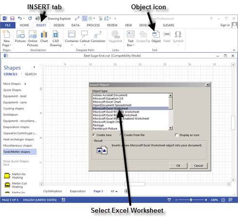
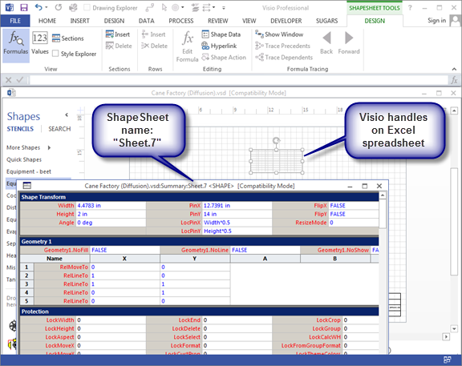
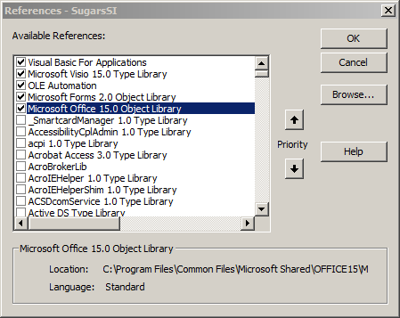
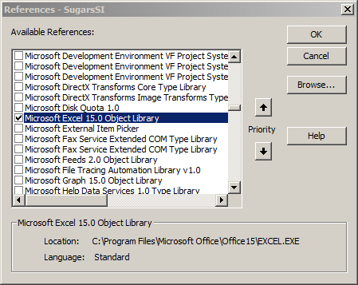
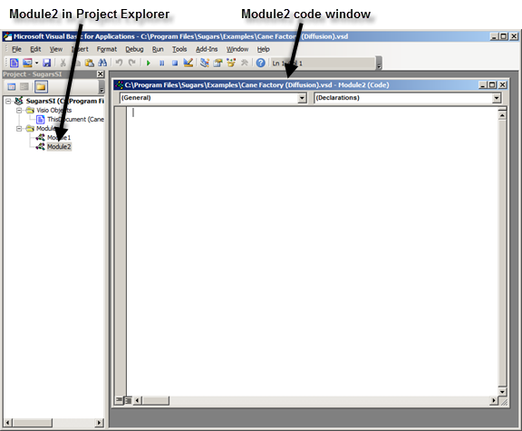
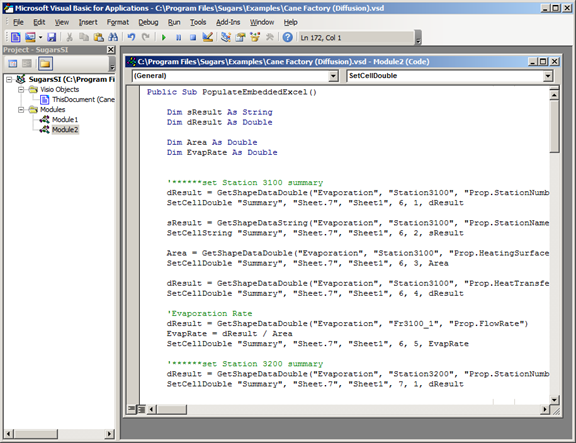
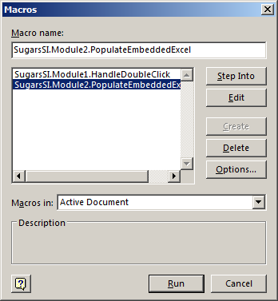

# Exporting Data to Excel

 

The Cane Factory (Milling) example model provided with Sugars has an
embedded Excel spread­sheet as an example.  You
can copy the Visual Basic (VB) code from this example into your own
model and then revise the code to select the Sugars data that you want
exported from your model into the Excel
spreadsheet.  There is code for both an
embedded spreadsheet and an external spreadsheet running in Excel
separate from Visio/Sugars.

 

To create the embedded spreadsheet in your model, open your model and
select the **INSERT** tab and then click on the **Object** icon in the
Text group on the Visio ribbon menu (see below).

 

 

Scroll down to find Microsoft Excel Worksheet. Select the "Create new"
radio button option and then click the
**O**K button.

 

Position the spreadsheet where you would like to see it on the page.
Click outside of the newly inserted spreadsheet to go back to Visio and
then click on the spreadsheet object again to get the normal Visio
handles around it.  From Visio, click
**DEVELOPER** \> **Show ShapeSheet** and in the title bar of the
ShapeSheet for the spreadsheet object, look for the Sheet number and
write it down (see below).  The sheet number
will be used in the VB code to send Shape Data to the spreadsheet
object.

 

 

Next, click **DEVELOPER** \> **Visual Basic** to open the VB
editor.  In the VB editor, click **Tools** \>
**References** and check the box for “Microsoft Office 15.0 Object
Library” (see below).

 

 

And, find the “Microsoft Excel 15.0 Object Library” and check its box
(see below).

 

 

Click the **OK** button to return to the VB editor and then click
**Insert** \> **Module** to open a new module2 (see below).

 

Start another instance of Visio by double clicking on the Visio icon on
the desktop.  Once the 2nd instance
of Visio is running, open the Cane Factory (Milling) example that is
provided with Sugars in the “C:\Program Files\Sugars\Examples”
directory.  Once the Cane Factory (Milling)
module is loaded, click **DEVELOPER** \> **Visual Basic** in the “Code”
grouping and in the Module2 code window copy all of the code to the
clipboard starting with “Public Sub PopulateEmbeddedExcel()”
 up to “Public Sub
PopulateExternalExcel()”.  Module2 will be
shown in the Project Explorer window.  Just
click on the Module2 entry in Project Explorer to see all of the code
for this module.  “Module1” and “ThisDocument
(Cane Factory (Milling))” contains code used by Sugars to communicate
with Visio and it is the same for every Sugars model and does not need
to be copied.

 

Next, return to the 1st instance of Visio that contains your
model with the newly inserted spread­sheet, and paste the code copied
from the Cane Factory (Milling) example into the Module2 code
window.  The result should look the same as
shown in the figure below.

 

 

Review the code to see how data is imported into the spreadsheet. The
code is fairly self-explanatory.  Modify this
code to get data from the Sugars objects (that is, stations and flow
streams - see the title block of the Shape Data window in the model to
get the name of a station or flow
stream).  Note that there are several VB
subroutines in the Cane Factory (Milling) example code to make it
easier.  A description of the subroutines is
given below.

 

**<u>Example Functions to Shape Data Values</u>**

                

*GetShapeDataString* – gets a string value from a Shape Data value

Parameters:

PageName – the name of the page where the Sugars shape is located

ShapeName – the name of the shape with the Shape Data

ShapeData – the name of the Shape Data (prefixed with “Prop.”)

Returns a variable of type string

 

*GetShapeDataDouble* – gets a double
value from a Shape Data value

Parameters:

PageName – the name of the page the Sugars shape is on

ShapeName – the name of the shape with the Shape Data

ShapeData – the name of the Shape Data (prefixed with “Prop.”)

Returns a variable of type double

 

**<u>Example Functions to Set a Cell in an Embedded Excel
Spreadsheet</u>**

 

*SetCellString* – Sets a string value into an embedded Excel spreadsheet

Parameters:

PageName – name of the page where the Excel spreadsheet is embedded

ShapeName – name of the shape which is the embedded Excel spreadsheet

SheetName – the name of the Excel worksheet

Row – the row of the cell to insert the value

Column – the column of the cell to insert the value

Value – the string value to insert into the spreadsheet cell

 

*SetCellDouble* – Sets a double value into an embedded Excel spreadsheet

Parameters:

PageName – name of the page where the Excel spreadsheet is embedded

ShapeName – name of the shape which is the embedded Excel spreadsheet

SheetName – the name of the Excel worksheet

Row – the row of the cell to insert the value

Column – the column of the cell to insert the value

Value – the double value to insert into the spreadsheet cell

 

PopulateEmbeddedExcel – Example
of getting Shape Data and setting cells in an embedded spreadsheet

 

**<u>Example Functions to Set a Cell in an External Excel
Spreadsheet</u>**

 

*SetExtCellString* – Sets a string value into an external Excel
spreadsheet

Parameters:

ExcelSheet – object which is the Excel spreadsheet

Row – the row of the cell to insert the value

Column – the column of the cell to insert the value

Value – the string value to insert into the spreadsheet cell

 

*SetExtCellDouble* – Sets a string value into an external Excel
spreadsheet

Parameters:

ExcelSheet – object which is the Excel spreadsheet

Row – the row of the cell to insert the value

Column – the column of the cell to insert the value

Value – the double value to insert into the spreadsheet cell

 

*GetExternalExcelSheet* – Opens Excel and creates a spreadsheet

Returns an object which is of type Excel.Worksheet

 

*PopulateExternalExcel* – Example of getting Shape Data and setting
cells in external spreadsheet

 

To run a macro in Visio, click **DEVELOPER** \> **Macros** and select
the module to be run (see below). The “SugarsSI.Module2…” macro must be
run to transfer data from Sugars (i.e., Shape Data in each shape) to the
embedded spreadsheet.

 

 

Finally, to make it easy to run the VB code, click on the spreadsheet
object, then click on the **Options…** button to make a shortcut key
(e.g., ‘e’) and then add descriptive
text.  The latest data from a Sugars balance
can now be transferred to the Excel spreadsheet by simply clicking on
the embedded spreadsheet and then pressing the **Ctrl** \> **e** keys to
update the spreadsheet.
