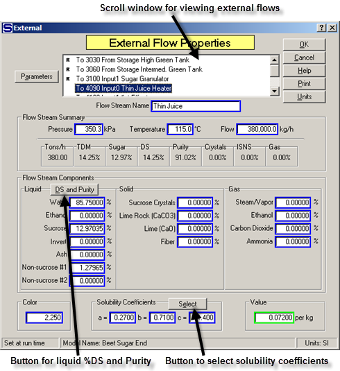
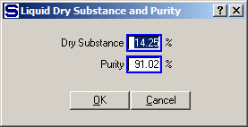
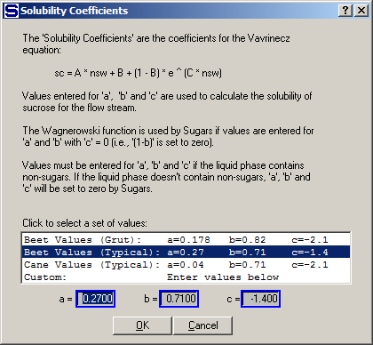
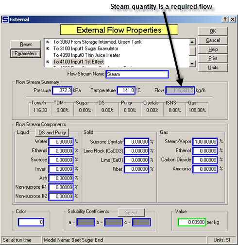
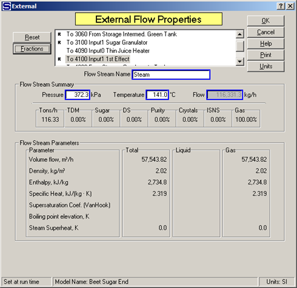

# External Flows

 

External flows are flows that come from outside
sources such as: cane or beets, cold water, chemicals, lime,
etc.  They are
created by dragging the connector tool from an open area in the drawing
and then connecting the flow to an input port of a station, or copying a
flow stream and pasting it on to the drawing in an open area and then
dragging the arrow end of the connection to an input port on a station.
 All external flows
into a model must be defined using the External Flow Properties
window.  Double
click on any external flow in the model to get the External Flow
Properties window as shown
below.  All of the
external flows into a model can be viewed using the scroll window and
the data for each one can be entered or reviewed by simply highlighting
the flow in the scroll window. 

 

 

Enter the Flow Stream Name, Pressure, Temperature and rate of
Flow.  The units can be changed at any time by
clicking on the <u>U</u>nits button and changing to a different units
system.  Next, enter the flow stream
components.  Fifteen (15) components define
the composition of a flow stream.  The
components are divided into three phases: liquid, solid and
gas.  Component fractions for the liquid phase
can be entered by using the **<u>D</u>S and Purity** button next to the
Liquid label.  Left clicking the mouse on this
button will cause a small window to appear for entering the % Dry
Substance and Purity of the liquid portion of the flow (see below).

 

 

After the % Dry Substance and Purity of the liquid
are entered, left clicking the **<u>O</u>K** button will cause Sugars to
calculate the component fractions for the liquid
phase.  Non-sucrose
\#1 will contain all of the non-sucrose components in the liquid
phase.  If the flow
stream contains ash and/or invert, they can be removed from the
non-sucrose \#1and entered into their corresponding component
fields.  If the flow
stream contains any solid or gas phases, then enter the component
fractions for each solid or gas component before using the <u>D</u>S and
Purity button
feature.  For
example, if a massecuite is being entered, enter the % of sucrose
crystals in the flow before determining the liquid component fractions
using the Dry Substance and Purity feature for the liquid phase (mother
liquor).

 

Once the flow stream components are entered, values
for the column above the Flow Stream Components block will be
displayed.  Values
for the flow are: TDM = % total dry matter of the flow, Sugar = % sugar
(both dissolved and crystalline), DS = % dry substance (includes sucrose
crystals, if any), Purity = purity including both dissolved and sucrose
crystals (if any), Crystals = massecuite % sucrose crystals, ISNS = %
insoluble solid non-sugars and Gas = % gas.

 

Solubility coefficients must be entered for any flow
stream that has an entry in either the non-sucrose \#1 or non-sucrose
\#2 component fraction
fields.  The
**S<u>e</u>lect** button next to the Solubility Coefficients label will
cause Sugars to display a window for selecting solubility coefficients
as shown in the figure below.

 

 

The typical values displayed on this window can be
changed by entering typical solubility coefficients for the process or
factory being modeled by clicking the Sugars ribbon menu **Model
Properties** icon and then clicking on the **<u>S</u>ol. Coef.** button
to display the Solubility Coefficient Defaults
window.  Using
this feature, the solubility coefficients can be entered easily without
having to make numerical entries in the ‘a’, ‘b’ and ‘c’ fields for
every flow stream that needs the solubility
defined.  Sucrose
solubility is calculated using the ‘a’, ‘b’ and ‘c’ values in the
Vavrinecz equation unless ‘c’ = 0; in which case, the Wagnerowski
equation is used (see [Theory -
Sucrose Solubility](../Theory/Theory.htm#Sucrose_Solubility)).

 

Color balances for the model can be obtained by entering a color value
for each external flow. The color units for the color entry can be any
system as long as it is consistent for the entire model.

 

A value entry is made for each flow stream if the net process revenues
are to be calculated for the model. If all external flows into the model
and all internal flows leaving the model have value entries, Sugars will
calculate the net process revenues.

 

Sugars will calculate the steam temperature or steam pressure when
saturated steam is entered for an external flow. For example, in the
figure below, exhaust steam into the model is saturated and the
temperature of the steam is 135.1°C, which gives a pressure of 313.7kPa.

 

 

Conversely, if a pressure value is entered and the
temperature value is set to a value that is less than the saturation
temperature, then Sugars will calculate the saturated steam temperature
and change the temperature value to the saturation
temperature.  Sugars
will make the pressure steam calculation if there is any fraction of
steam/vapor in the flow
stream.  Superheated
steam is entered by specifying both the pressure and temperature of the
steam.  The amount
of superheat will be calculated by Sugars and displayed in the Flow
Stream Parameters list from the **Parameters** button.

 

The flow stream quantity will be dimmed and an entry
cannot be made if the external flow is a required flow as shown in the
above window.  The
quantity of the flow will be calculated by Sugars when the flow is
required and a quantity value cannot be
entered.  Required
flows result from stations that need the quantity to satisfy the
performance of the station as defined by the input data for the
station.  For
example, the quantity of the steam flow into an evaporator station will
be required if a % dry substance is specified for the syrup leaving the
evaporator.

 

 

Clicking the left mouse button on the
**P<u>a</u>rameters** button will cause Sugars to display other
characteristics of the flow stream as shown in the figure
above.  Volume,
density, enthalpy, specific heat, sucrose supersaturation, boiling point
elevation and steam superheat can be display for any flow
stream.  Place the
cursor on the "Volume flow" "Liquid" displayed value to see the liquid
portion of the flow displayed as liters per minute (lpm) or gallons per
minute (gpm) depending on the units (SI or US) being
used.  Clicking the
left mouse button on the **<u>F</u>ractions** button will return the
display to the component fractions.
