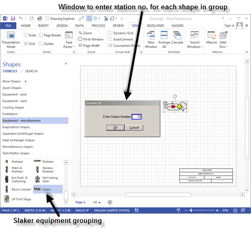
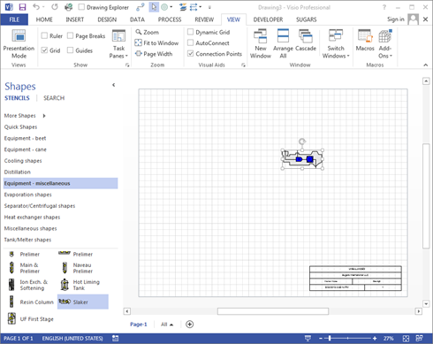
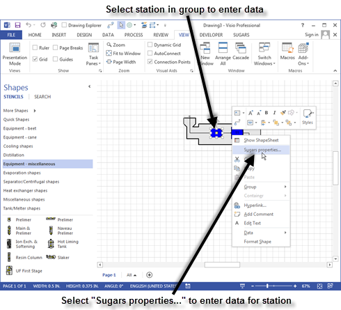

# Grouped Stations

 

Stations can be grouped together to represent an actual station in the
process. Many pre-built groups that represent factory equipment are
included on the stencils provided with Sugars. For example, the
"Equipment - miscellaneous" stencil includes a slaker. The window below
shows the slaker being added to the model.

Sugars will index through each station in the grouping to assign station
numbers to all of the stations in the
group.  The station being numbered will turn
red until the number is assign in the Sugars station Id window box, and
after the station number is assigned, the station will turn
blue.  All stations will be blue following the
numbering of the stations in the group (see window below).

 

 

Performance data for each station in the group is entered by double
clicking on the station in the group, or clicking once on the shape to
give selection handles around the station selected and then clicking the
right mouse button and selecting the **Sugars properties…** menu item
from the drop-down menu (see window below).).

Be sure to select the station in the group and not
the grouping when selecting stations for data
entry.  If the
Sugars properties window does not appear after it is selected from the
right click drop-down menu, then the grouping that makes up the station
shape was selected instead of the station.
