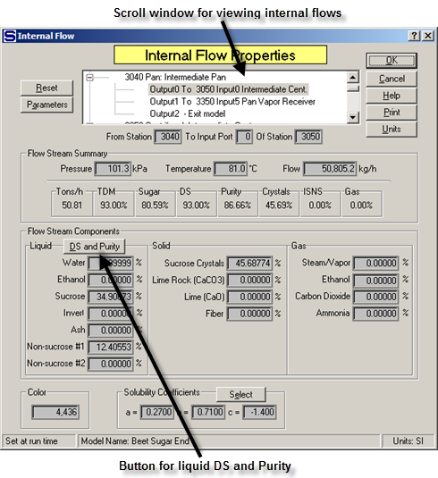
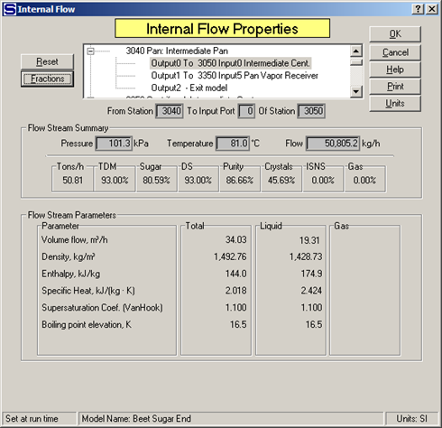

# Internal Flows

 

Internal flows are flows that connect stations, or that go out of the
model. The characteristics of all internal flows are calculated by
Sugars. Double click on any internal flow to get the Internal Flow
Properties window as shown below. All of the internal flows in a model
can be viewed using the scroll window and the data for each one can be
reviewed by simply highlighting the flow in the scroll window.

 

 

Properties for the internal flow include the station number of the
station where the internal flow originates and the input port and
station number of where the flow goes.  Next,
the pressure, temperature and flow rate quantity (weight units per hour)
are given.  The line below the pressure,
temperature and flow values gives the values for: Tons/h = flow rate in
tons per hour, TDM = % total dry matter, Sugar = % sugar (both dissolved
and crystalline), DS = % dry substance (includes sucrose crystals, if
any), Purity = purity including both dissolved and sucrose crystals (if
any), Crystals = % sucrose crystals, ISNS = % insoluble solid non-sugars
and Gas = % gas.  The liquid, solid and gas
phase components are listed next and then the color and solubility
coefficients for the flow are displayed.

 

A **<u>D</u>S and Purity** button in the liquid phase
block can be used to display the % dry substance and purity of the
liquid portion of the
flow.  For example,
if the flow is a massecuite, left clicking the mouse on the button will
cause Sugars to display the % dry substance and purity of the mother
liquor.

 

The **<u>R</u>eset** button is used to reset all
values to 0.0 for the internal flow being
displayed.  This is
helpful if the model has a loop that causes the flow stream quantity to
increase with each iteration until the quantity is out of
range.  The reset
button allows the flow to be set back to 0.0 and then a change can be
made to the model to prevent a reoccurrence of the problem.
 It is not necessary to reset all flows in a
model that are out of range because Sugars will automatically reset out
of range flows during the next iteration; however, the cause of the out
of range problem will need to be corrected before the model will
balance.

 

The **P<u>a</u>rameters** button is used to display other
characteristics of the flow as shown in the diagram below.

 

 

When the parameters are being displayed, the
**<u>F</u>ractions** button is used to change the display back to show
the flow stream component
fractions.  Parameters
and flow stream component fractions are available for every flow stream
in the model.
