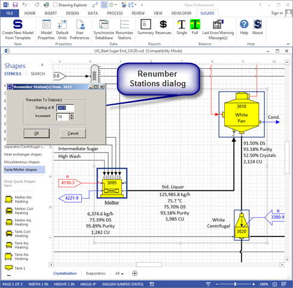

# Program Operation

 

Models are built either by modifying one of the example models, or by
using one of the Sugars blank drawing templates provided with the
program. Modifying one of the example models can make the model building
process much quicker if an example is available that is similar to the
process being modeled. The blank drawing templates are used if an
example is not available. Two templates are provided with Sugars: (1)
"SugarsSI.vst" for building models in the SI (meters, kg, °C) system and
(2) "SugarsUS.vst" for building models in the US (foot, lb, °C, or °F)
system. The Sugars blank drawing templates are located in the
"C:\Program Files\Sugars\Data" directory. The ".vst" files are Visio
template files that set the drawing parameters for making a flow diagram
drawing of a model. Also, the templates load all of the stencils that
contain shapes for making a flow diagram of a Sugars model.

 

Example models provided with Sugars are installed in the "C:\Program
Files\Sugars\Examples" directory. In many cases, starting a new model
with one of these examples will significantly speedup the building of
the model. If an example model is used to create another model, be sure
to save the new model in a directory other than the Examples directory
so that the models in the Examples stay undisturbed. New models can be
saved in the "C:\Users\\Name of User)\Models" directory; however, any
other directory also can be used.

 

Station numbering is important to the efficiency of the balance
calculations. Sugars does its iterations by starting the calculations
with all flows into the lowest numbered station in the model. After it
does the calculations for the lowest numbered station, it goes to the
next lowest numbered station and does the calculations for that station.
It continues with the calculations for each station in numerical order
until it reaches the last station (highest station no. in the model).
Hence, for maximum calculation efficiency, it is best to have the
stations numbered in a manner that results in a smooth flow of material
from one station to the next. For example, suppose juice flows into heat
exchanger station no. 100 and the juice flows out of the heat exchanger
to another heat exchanger station no. 560 and the juice out of the 2nd
heat exchanger flows to an evaporator body station no. 110. Now, when
Sugars does its calculations, the juice flow to station no. 110 will not
be determine until after it does the calculations for station no. 560.
If vapor flows are used to heat the heat exchangers, the correct vapor
flow to station no. 110 will not be determined until the next iteration
cycle. Unorganized station numbering causes instability in the balance
calculations and makes it difficult for Sugars to achieve a balance. The
following is a summary of things to consider when constructing a model.

 

Balance and Stability Considerations

1.  Section the factory into different parts and assign station numbers
    to those stations in the same section. Start with cossettes or cane
    for factories and raw sugar for refineries and move up through the
    factory or refinery. Leave ranges of numbers open so that stations
    can be added later if all of the sections of the factory or refinery
    are not included when first building the model. Try to keep a range
    of numbers on the same page so stations can be easily located later
    when working on the model.

2.  Generally, separate each station number by at least 10 so other
    stations can be added at a later time if necessary without having to
    do a lot of renumbering. An exception to this is for a group of
    stations that represent one station in the factory. Usually, for
    groups, station numbers are separated by one (1) because a group of
    stations will not have other stations added in between at a later
    time. The numbering separation for stations and groups can be set
    from the Sugars ribbon menu by selecting the User
    Preferences icon.

3.  Follow the juice flow through the model to order the station
    numbers. When assigning station numbers, think in terms of how
    Sugars does the balance. That is, Sugars starts at the lowest
    station number to solve the change in flow(s) going through the
    station and then it goes in numerical order to the next station to
    solve its flow(s). When it finishes with the highest number, it
    checks to see if the model is in balance, and if it is not, it then
    redoes the balance. When stations are out of order, the balance is
    more difficult and less stable because the natural progression of
    flows from one station to the next is not followed. This causes
    excessive iterations to reach a balance. The only exception to
    following the juice flow through a factory is the evaporator station
    because for larger models it actually may be more efficient to have
    the evaporator station at the end so that all of the vapor loads are
    determined first before Sugars tries to balance the multiple-effect.
    Also, this allows the model to be separated easily when it is being
    built because the multiple-effect evaporator can be isolated until
    the model is working correctly. After the model is correct, the
    multiple-effect can be connected to the rest of the model using
    cross-page connectors.

4.  Pay attention to required flows in a model when number stations.
    Required flows pass the quantity backwards against the flow so that
    sometimes it is more efficient to number stations in the direction
    of the required flow. However, pressure, temperature, components,
    solubility equation coefficients and color are passed forward, so it
    may be better to number stations in the direction of the flow if
    these change more frequently (due to other stations, or during the
    iterations) than the quantity of flow.

5.  Use pressure feedback flows (see Sugars online help or the User's
    guide) for all flash tanks that are flashing vapor to another vapor
    line, such as flash tanks in evaporation.

6.  Get each section working and verify it with actual factory data
    before adding another section. For example, build diffusion or
    milling and make sure the results from the model match the data from
    the factory before adding clarification or purification.

Appearance Considerations

1.  Use layers for different types of flow streams so that text on the
    flow stream will also be in the same color. Also, layers allow
    selective display and printout to help clarify the flow diagram and
    using different colors for flow types (steam, condensate, product,
    etc) makes it much easier and faster to understand the model.

2.  Do not use dashed lines because they change the text box for
    required and pressure feedback indicators on cross-page connectors.
    Dashed lines can make the flow diagram more difficult to follow.

3.  Try not to put too many stations and flow streams on one page. It
    can be hard to follow a flow diagram when a page is overloaded with
    stations and flow streams. Use on-page connectors for connections on
    the same page if the flow streamlines get too crowded.

4.  Use cross-page connectors for connections that go between pages and
    on-page connectors for connections on the same page. This makes it
    easier to locate the corresponding mate to an on-page or cross-page
    connector when viewing the model at a later time.

5.  Order the pages in the same manner as the station numbering; that
    is, the first page should contain the stations with the lowest
    numbers and the last page should hold the stations with the highest
    numbers. Name the pages by right clicking on the page tab and
    selecting rename. The pages can be reordered by right clicking the
    page tab and selecting "Reorder Pages...".

6.  Do not resize shapes. The Sugars shapes on
    the stencils are designed to fit to the grid so that connections are
    aligned to follow grid lines. This helps to avoid the small
    squiggles that can occur on connecting lines. The alignment is lost
    if the shapes are resized.

7.  Use care when selecting shapes on the drawing, or the station number
    text box will be moved instead of the shape. The cursor will change
    to have a four arrow cross with a white arrow when a shape is
    selected. If the cursor is only a four arrow cross, then the handle
    for the station number text is selected and it will be moved instead
    of the shape. So, be sure the cursor is selecting the shape before
    clicking and holding the left mouse button to move the shape.

 

Most models of a complete factory, or refinery, are multiple page
models. A new page can be created at any time (see Visio help for
details) and cross-page connectors (see [Cross-Page and On-Page
Connectors](Cross-Page_and_On-Page_Connectors.htm)) are used to connect
stations on one page with stations on another page. On-page connectors
are usually used to connect stations on the same page. Partitioning a
factory into sections with a range of numbers for each section makes it
easier to navigate a model and to locate a station that is referenced in
a cross-page connector when a model is composed of several pages. One
technique is to use a range of numbers for each page. For example, page
1 might have station numbers in the range of 1000 to 1999, and page 2
would have numbers that range from 2000 to 2999, etc. Using the same
range of numbers for common sections of a factory makes it easier to
identify stations and different parts of a factory. For example, the
multiple evaporator section of a factory might always have numbers that
are in the 6000's; hence, if multiple effect evaporation is on page 3, a
five effect multiple might be numbered 6100, 6200, 6300, 6400 and 6500
for 1st, 2nd, 3rd, 4th, and 5th effects. Stations between the effects
such as flash tanks, receivers and distributors would have numbers based
on these. That is, the 1st effect vapor receiver would have station
number 6110. This makes it much easier to identify vapor flows in the
model; for example, if vapor to a heat exchanger comes from station no.
6320, it is easy to know that it is 3rd vapor. The example models
section (see [Examples](../Examples/Examples.htm)) show numbering
techniques that result in stable models with efficient iterations and
easy identification of flow streams.

 

Sugars has a renumbering feature if the station
numbers need to be
changed.  The
window below shows three stations highlighted with **Renumber Stations**
selected from the Sugars ribbon menu.

 

 

The **Renumber Stations** dialog has a starting
number and an increment for the numerical separation between
stations.  The
dialog shows the default values that are set in **User
Preferences**  (see [Program Overview
\> User Interface](../Overview/Program_Overview.htm)).

 

A new model can be started at any time by clicking on
the **Create New Model from Template** icon on the Sugars ribbon
menu.  This will
cause the currently displayed model to be closed before the new model
can be active.

 

Only one model can be open at a time within the same instance of Visio;
however, multiple instances of Visio can each have a different model and
the different models can be viewed and balanced by making their window
active.  Shapes and connections can be copied
between different models in different instances of Visio; however,
station data and flow legends will be lost in the destination model and
any cross-page, or on-page connectors in the source model will lose
their connections when they are pasted into the destination
model.  Data between models can be entered
using the source model as the reference by opening the properties screen
for either the station or the flow and then opening the properties
screen in the destination model and duplicating the data.

 

Stations may be copied within the same model and the
data in the stations will be copied to the new copies of the copied
stations.  Just
highlight the stations to be copied and either hold down the control key
at the same time as the left mouse button and drag the stations to
another area of the drawing, or copy the highlighted stations to the
clipboard and paste them back onto the
drawing.  When the
copy is executed, Sugars will ask for new station numbers for each of
the stations being copied.

 

Sometimes a model will lose its synchronization
between the drawing and the
database.  If this
happens, the **Synchronize Database** icon on the Sugars ribbon menu can
be used to fix the
inconsistencies.  The
Synchronize Database option will check every flow stream in the model to
see that there is a corresponding entry in the
database.  Sugars
will fix any missing
entries.  The
drawing is the reference; that is, what is on the drawing controls the
entries in the database.

 

Be sure to save the model periodically as data is being entered so that
all entered data is not lost if a power failure or other problem occurs.
