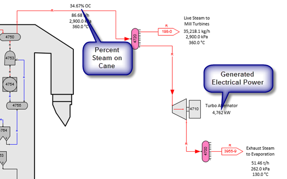
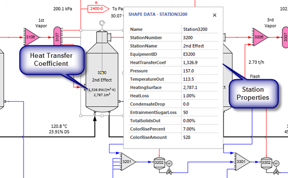
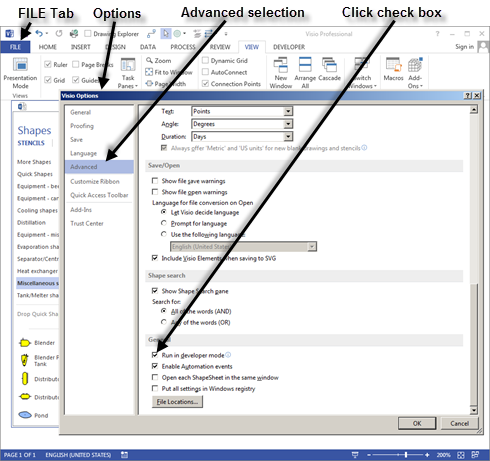

# Shape Data Display

 

Every flow stream and station in a model has a Visio
ShapeSheet.  After every balance calculation,
Sugars writes data to the Shape Data which is in a section of the
ShapeSheet.  Also, some stations contain data
that are a result of the balance calculations and this data is written
to the Shape Data in the ShapeSheet for the station.
 Visio has the ability to display flow stream
and station proper­ties on the drawing using Shape
Data.  Also, calculations can be made using
this data and they can be placed on the drawing in any location.  For
example, percent on cane and generated electrical power are shown on the
drawing snippet shown below.  Steam percent on
cane is from the quan­tity of live steam from the boiler divided by the
quantity of cane into the model.  Each
quantity is from the Shape Data for their respective flow
stream.  Generated electrical power is from
the Shape Data associated with the Turbo Alternator station number 4710.

 

Other values shown on the drawing are from the Flow Legend display (see
[Overview \>
Results](../Overview/Program_Overview.htm#Results)).  For
example, the quantities of steam (t/h), pressures (kPa) and temperatures
(ºC) are displayed using the Sugars right click drop-down menu Flow
Legend selection for displaying balance results.

 

 

The figure above shows the Station Properties (called Shape Data in
Visio) for station no. 3200, 2nd Effect.  Any of these values can be
displayed on the drawing (Heat Transfer Coefficient and Heating Surface
are shown for the 2nd Effect) and they can be used in calculations to
provide other information.  They can even be used in an Excel
spreadsheet that is either embedded in the Visio docu­ment or external to
it (see [Exporting Data to
Excel](Exporting_Data_to_Excel.htm)).  Balance results can be
manipulated and displayed in a variety of ways.  The Shape Data window
is displayed by clicking the box next to the “Shape Data Windows”
selection in the “Show/Hide” group on the Visio **DATA** tab.
 Instructions for displaying Shape Data and
building calculations are given below.

 

**Displaying Visio Shape Data**

 

After each balance, Sugars will update all of the Visio Shape Data;
however, on the Sugars ribbon menu, click the **Users Preferences** icon
to see entries to select either updating all of the Shape Data or only
the ones that changed during a balance.  Selecting "Update Only Changed
Values" will make drawing updates occur faster.  The default is to
"Update All Values" to make sure that the values are always updated, but
if you have not made any changes to any of the values using the Visio
ShapeSheet for a station, then updating only the changed values gives
the best performance and for most users this is the preferred set­ting.

 

Referencing Shape Data values for display on your drawing is done using
the Visio **INSERT** tab and then selecting **Field** from the text
group.  First, create a text block using the
**Text** tool in the Tools group on the **HOME**
tab.  Visio Help gives the details, but as an
example, to display the Electrical Power Output produced by the turbo
alternator station no. 4710 in the Cane Factory (Milling) example can be
displayed by creating a text field on the same page as the station and
then clicking the **INSERT** tab and selecting **Field** from the
**Text** group.  When the Field dialog is
displayed, click on “Custom Formula” and in the "Custom formula:" entry
box enter:

 

=Station4710!Prop.ElectricalPowerOutput.Value

 

The “Value” at the end is optional.  The format for the number displayed
is selected by clicking on the **Data Format…** button and select
“Number” in the category selection box.  To
add units to the displayed number, create another field inside the same
text box and insert another field next to the power output number as
follows.

 

=Station4710!Prop.ElectricalPowerOutput.Prompt

 

This will give the same units for the electrical power output that
Sugars uses in the Turbo Alter­nator Properties dialog.  The same
procedure is used to display flow stream data.  You can quickly see the
label for a station (e.g., Station4710 in the above examples) or flow
stream by using the Shape Data Window to display Shape Data for stations
and flow streams as you click on them.

 

Calculations can be done using Shape Data for creating your own results
using the results from the Sugars balance calculations.
 For example, to display the difference
between two values, in the field from the insert menu you would type:

 

=1st custom property reference - 2nd custom property reference

 

Other math operators are the usually ones (e.g., +, \* and /).

 

To display a Shape Data value of a station that is on another page, the
Sheet ID has to be used instead of the shape
name.  The Sheet ID for a shape is obtained
from the **DEVELOPER** tab.  Visio Developer
Mode is necessary to make the **DEVELOPER** tab active by clicking
**FILE** \> **Options** \> **Advanced** and then click the box for "Run
in developer mode" (see screen below).  Click the **OK** button to
return to the drawing window.

 

 

The Sheet ID is given by the **Shape Name** selection in the Shape
Design group at the top of the window where "ID: XXX" with XXX as the ID
number.

 

For an example, to display the heat transfer coefficient for an
evaporator body on a page that does not contain the evaporator body,
make a text box then click the **INSERT** tab and then **Field** in the
“Text” group.  In the Custom Formula category
enter:

 

=Pages\[Evaporation\]!Sheet.15!Prop.HeatTransferCoef

 

Where, "Evaporation" is the name of the page containing the shape and
Sheet.15 is the sheet ID from the Shape Name dialog box for the
1st effect evaporator body on the "Evaporation" page of the Cane Factory
(Milling) example.

 

The fact that it is necessary to use the sheet ID instead of the shape
name when referring to a shape that is on a different page than the
active page is a programmed characteristic of Visio.  Also, if the shape
is a connection and it is edited later, Visio changes the name “Sheet”
to “Dynamic connector” and this name has to be changed back to “Sheet”
before the field will be accepted in versions of Visio earlier than
2013.

 

Another example is the following to display the % on cane of the
generated boiler steam in the Cane Factory (Milling) example.

 

=(Fr4704_0!Prop.FlowRate/Pages\[Milling\]!Sheet.294!Prop.FlowRate)\*100

 

Where, “Milling” is the page with the flow rate of cane into the model
for flow stream "Sheet.294".

 

The general syntax for property references is:

 

Pages\[\<PageName\>!\]\<SheetID\>!\<PropRef\>

 

For example, to reference the temperature out value of a shape with ID =
83 on the 1-Diffusion page, the following would be entered in the Custom
Formula field of the **INSERT** \> **Field** dialog.

 

Pages\[1-Diffusion\]!Sheet.83!Prop.TemperatureOut.Value

 

**Also, Sheet ID’s need to be used instead of the shape name when
referencing Shape Data for shapes that are in groupings from the Sugars
stencils.  **For example, the following would be used to display the
temperature out of a blender station in a grouping with a sheet ID of
284.

 

Sheet.284!Prop.TemperatureOut

 
