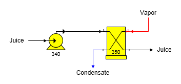

# Pump Examples

 

The diagram below shows a juice pump increasing the pressure of a flow
stream so that flashing will not occur in the subsequent heat exchanger.

 

 

 

[Pump Features](Pump_Features.htm)

[Pump Properties](Pump_Properties.htm)
