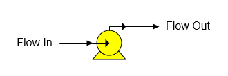

# Pump Features

 

Pump A pump station is used to increase the pressure of a flow stream.

 

 

 

 

General Features  Pump stations are used to increase the pressure of a
flow stream to prevent juice flashing in heat exchangers, to raise the
pressure of condensate into a flash tank, or to condense vapor in a
flow. Water/vapor phase changes can occur in a pump station. For
example, vapor in a liquid flow stream can condense when the pressure of
a flow stream is increase by a pump.

 

 

[Pump Properties](Pump_Properties.htm)

[Pump Examples](Pump_Examples.htm)
