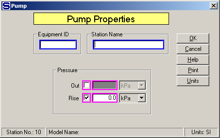

# Pump Properties

 

 

Equipment ID  An equipment ID of up to 11 characters can be used to
identify the station with an actual station in the process. Any
combination of numbers and letters that are used in the factory/refinery
to identify equipment can be entered. For example, Equipment ID =
123.456A. It is not necessary to make an entry in the Equipment ID field
if the station in the model does not have a corresponding station in the
factory/refinery.

 

Station Name  A name of up to 20 characters must be entered for the
station. For example, Station Name = Juice Pump.

 

Pressure  Flow leaving the pump can have a pressure of either the value
of the Pressure Out entry or the input flow pressure plus a rise in
pressure as set by the Rise entry. Magenta colored borders on the entry
fields are used to indicate that only one of the entries can be
selected; that is, when one is selected the other one is not accessible.

 

Out  Enter the pressure of the flow leaving the
pump.  The pressure value entered should be
greater than the pressure of the flow into the pump.
 For example, Discharge = **320** kPa.

 

Rise  Enter the rise in flow pressure for the flow leaving the pump. For
example, Rise = 250 kPa.

 

 

[Pump Features](Pump_Features.htm)

[Pump Examples](Pump_Examples.htm)
