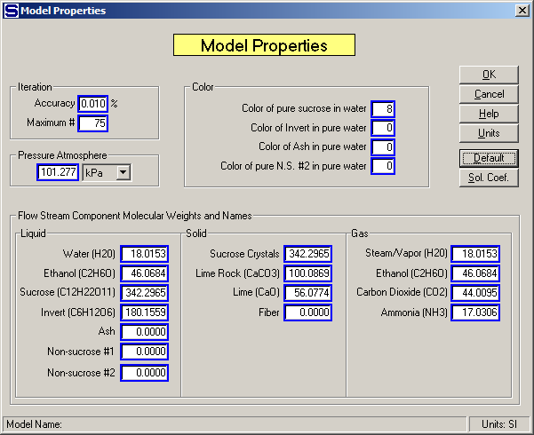

# Reactor Examples

 

New solubility equation coefficients can be specified if the reaction
causes a change in the solubility coefficients for the sucrose
solubility function. If the solubility coefficients are entered as 0.0,
or left blank, no changes will occur in the solubility coefficients
between the input and output flows. A reactor station can be used to
control the sucrose solubility for subsequent portions of the process by
not specifying a reaction, but instead giving new coefficients to the
flow stream.

 

Also, a reactor station can be used to simply change
the color of a flow
stream.  The color
change only applies to the non-sucrose no. 1 component; that is, if the
flow stream doesn’t contain any non-sucrose no. 1 component, then the
color change won’t be applied to the flow
stream.  If a
negative color change causes the non-sucrose no. 1 component to be less
than zero, the non-sucrose no. 1 component will be reduced to zero
(colorless) and the color of the output flow stream will only reflect
the color of the sucrose, invert, ash and non-sucrose no. 2 color
values.  The color
of these four components is defined by the color entries made for the
"Color of pure sucrose in water", “Color of Invert in pure water”, Color
of Ash in pure water” and "Color of pure N.S. \#2 in pure water" on the
Model Properties window (see below). 

 

 

 

[Reactor Features](Reactor_Features.htm)

[Reactor Properties](Reactor_Properties.htm)
