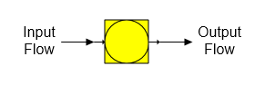

# Reactor Features

 

Reactor  A reactor station is used to model chemical reactions that
occur between different components in a flow stream; for example, lime
rock to quick lime and CO2, CaO and CO2 to
CaCO3, etc.

 

 

 

 

General Features  A reactor station can react up to three components in
the input flow stream to produce up to three different components in the
output flow. Also, a reactor station can be used to change the
solubility coefficients and/or color of a flow stream even if there is
no reaction between any of the components in the flow stream. This
feature is useful for controlling the sucrose solubility, or color in
any flow stream. Phase changes are not considered - other than those
specified by the reaction equations, but the temperature of the output
flow will be a result of: (1) the heat content of the input flow, (2)
the heat of reaction from any component reactions, and (3) the component
fractions of the output flow.

 

 

[Reactor Properties](Reactor_Properties.htm)

[Reactor Examples](Reactor_Examples.htm)
