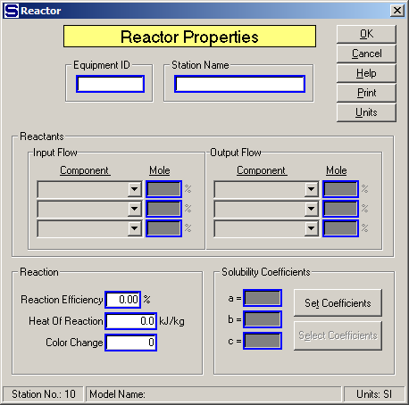

# Reactor Properties

 

 

 

Equipment ID  An equipment ID of up to 11 characters can be used to
identify the station with an actual station in the process. Any
combination of numbers and letters that are used in the factory/refinery
to identify equipment can be entered. For example, Equipment ID =
123.456A. It is not necessary to make an entry in the Equipment ID field
if the station in the model does not have a corresponding station in the
factory/refinery.

 

Station Name  A name of up to 20 characters must be entered for the
station. For example, Station Name = Lime Slaker.

 

Reactants  Components used in reactions must have their molecular weight
defined using the Model Properties window (see [Reactor
Examples](Reactor_Examples.htm) below) before using them in a reaction.

 

Input Flow  Process flow into the reactor with components that can react
with each other to produce different components in the flow out of the
reactor.

 

Component  Click on the arrow to the right of the field to get a
drop-down menu for selecting the component to be used in the reaction.

 

Mole (%)  Enter mole percent (%) of associated components that react
with other components in flow stream to produce the output flow
components. For example, one mole (100%) of CaO plus one mole (100%) of
CO2 reacts to produce one mole (100%) of
CaCO3, or: 100% CaO + 100% CO2
→ 100% CaCO3.

 

Output Flow  Process flow leaving the reactor with new components from
the reaction of components in the input flow

 

Component  Click on the arrow to the right of the field to get a
drop-down menu for selecting the component to be used in the reaction.

 

Mole (%)  Enter mole percent (%) of associated components that react
with other components in flow stream to produce the output flow
components. For example, one mole (100%) of CaO plus one mole (100%) of
CO2 reacts to produce one mole (100%) of CaCO3, or: 100% CaO + 100% CO2
→ 100% CaCO3.

 

Reaction  Characteristics of the reaction include the efficiency, heat
of reaction and any change in color.

 

Reaction Efficiency Enter the Efficiency of the reaction in percent (%).
Typical efficiency for carbonation is approximately 90%, but it is
dependent on the design of the equipment and process conditions. Lime
kilns have efficiencies of about 88% to 90%. For example, Reaction
Efficiency = 89.0%

 

Heat of Reaction Enter Heat of Reaction for
components of input flow that react to produce components in the output
flow.  Enter a
positive value for exothermic reactions (flow temperature increases) and
a negative value for endothermic reactions (flow temperature decreases).
  The Heat of
Reaction is heat per total weight of components reacted
together.  For
example, the reaction of CO2 + CaO → CaCO3 is
exothermic and the Heat of Reaction = **957.9**
kJ/kg.  Or, the
heat of reaction of CaO + H2O → Ca(OH)2 is
exothermic and the Heat of Reaction = **880.7** kJ/kg.

 

Color Change Enter absolute color change for flow leaving reactor. Color
change can be either "+" (color increases), or "-" (color decreases). A
color change will apply only to the N.S. \#1 component in the flow
stream; that is, color can be added or removed from N.S. \#1 only. For
example, Color Change = 500 for color to increase by 500 units.

 

Solubility Coefficients Enter values for 'a', 'b', and 'c' solubility
coefficients for the output flow. It is not necessary to enter values
for the solubility coefficients on the Reactor Properties window unless
the reaction in the reactor changes the solubility. Solubility
Coefficients are coefficients for the Vavrinecz equation:

 

 

Sugars will use the Wagnerowski equation (Sc = a•NSW + b) if the 'a' and
'b' values are entered with 'c' = 0. Examples follow.

 

Beet values (Grut): a = .178, b = .82, c = -2.1

Beet values (Polish): a = .27, b = .71, c = -1.4

Cane sugar (typical): a = .04, b = .71, c = -2.1

 

If no values are entered, or all of the values are zero (0.0), the
output flow will have the same coefficients as the input flow; that is,
no change will occur in the solubility coefficients.

 

 

[Reactor Features](Reactor_Features.htm)

[Reactor Examples](Reactor_Examples.htm)
