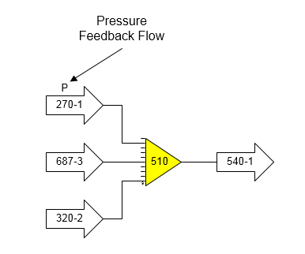
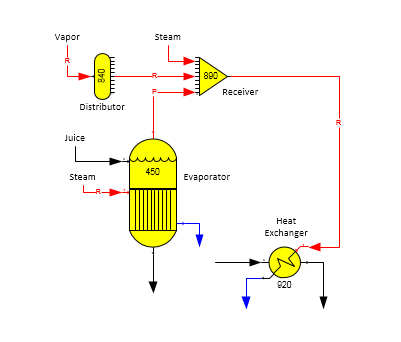
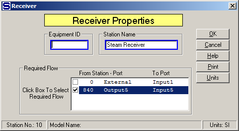

# Receiver Examples

 

The figure below shows a receiver station with a pressure feedback flow
into the receiver from station no. 270. The pressure value given to the
flow from station no. 270 will be the minimum pressure of the other two
flows into the receiver; that is, the minimum flow stream pressure of
the flow from station no. 687, or station no. 320. The output pressure
of the flow from receiver station no. 510 going to station no. 540 will
be the same as the feedback flow pressure; that is, it will be the
minimum of the pressures for the flow streams from station nos. 687 and
320.

 

 

Receiver stations can be used to satisfy a
required flow into
another station when more than one flow is used to satisfy the required
flow.   For example, vapor flow to a heater is
required by the heater and a receiver station is used to combine flash
vapor from a flash tank with vapor flow from a distributor that is used
to make up the difference between the flash vapor and the required flow
into the heater.  Or, instead of a
distributor, the make up vapor flow is supplied from an external source
(i.e., it is an external flow).

 

The figure below shows a receiver station (no. 890) with its output flow
going to the vapor input port of a heat exchanger (station no. 920). The
vapor flow into the heat exchanger is required; hence, the output flow
from the receiver is required. Vapor from an evaporator (station no.
450) goes to the input of the receiver along with vapor from a
distributor and an external steam flow. The vapor from the evaporator is
a pressure feedback flow, but it cannot be made a required flow because
vapor flows out of evaporator stations cannot be required (see
[Evaporator Features](../Evaporator/Evaporator_Features.htm)).  Hence,
only the flow from the distributor (station no. 840), or the external
flow into the receiver can be made required.

 

 

Sugars will select one of the input flows into the receiver to be a
required flow if the output flow from the receiver is a required flow
and the required input flow hasn’t been
specified.  The quan­tity of the required flow
into the receiver will be equal to the difference between the required
flow out of the receiver less the quantity of all other flows into the
receiver.

 

Not all flows can be made required flows.  For
example, vapor and condensate flows from pans, evaporators and dryers
cannot be made required.  Hence, when Sugars
is determining the input flow into the receiver that is to be required,
it will not select any flows that can’t be made required; for example,
the vapor flow from the evaporator station no. 450 in the above figure
cannot be made required (see figure below for Receiver Properties
windows showing the two input flows that can be made required).

 

 

The required input flow into a receiver can be changed if there is more
than one input flow that can be made
required.  In the above figure, either the
internal flow from distributor station no. 840, or the external flow,
can be made required.  Double click on the
receiver (station no. 890) to open the Receiver Properties window and
click on the box of the flow that is to be
required.  The quantity of flow from the other
two flows will be used first to satisfy the required output flow from
the receiver, and the selected required input flow will be adjusted by
Sugars to satisfy the required output flow
quantity.  The vapor flow from the evaporator
(station no. 450) cannot be made required; however, the pressure fed
back to the evaporator from the receiver station will be the minimum
pressure of the other two flows.  If the
quantity of the external flow into the receiver equals zero, its
pressure value won’t be considered and the pressure fed back to the
evaporator will be the pressure of the flow from the vapor distributor.

 

 

<a href="Receiver_Features.htm" class="hcp7">Receiver Features</a>

<a href="Receiver_Properties.htm" class="hcp7">Receiver Properties</a>
