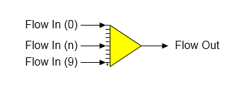

# Receiver Features

 

Receiver  A receiver station is used to combine up to ten (10) input
flow streams into one (1) output flow stream.

 

 

General Features  The composition, temperature and pressure of the
output flow stream is a direct result of the input flows; that is, the
total flow out and flow fractions are sums of the contents of the input
flows, the temperature is a result of the heat contents and the pressure
is the minimum of the input
flows.  Liquid-vapor phase changes are
considered in a receiver station (i.e., condensate to vapor, or vapor to
condensate can occur), but not sucrose (i.e., sucrose crystals melting,
or sucrose crystals growth does not
occur).  If the solubility equation
coefficients for any of the input flows are different, the output flow
solubility coefficients will be a weight-weighted average of the input
flows.  Also, a receiver station can be used
to satisfy required and/or
pressure feedback flows (see the discussion
that follows).

 

A receiver station is used to provide a pressure value for a flash tank,
compressor and/or thermo­compressor station when vapor from these
stations is fed to a receiver and the receiver has another input flow
stream for which the pressure is known.  For
example, condensate flashing into a vapor line, or vapor from a
compressor, or a thermocompressor station being added to exhaust steam
for supply to an evaporator station.

 

The pressure transmitted back to the flash tank,
compressor, thermocompressor, pan, etc by Sugars is the minimum pressure
of all the other flows into the receiver with a pressure value \> 0 that
aren't from another station that needs a pressure value; that is, the
pressure transmitted back is the output pressure from the
receiver.  Any
external flows into the receiver must have a flow quantity \> 0 for
their pressure to be considered in the minimum pressure
determination.  The
flow leaving the receiver will be a pressure feedback flow if all of the
flows into the receiver are pressure feed­back flows and the pressure of
the flow leaving the receiver will be fed back to the receiver by the
destination station; however, if the flow is not connected to another
station but instead leaves the model, the pressure will be set to
atmospheric pressure (see [Program Overview \> User
Interface](../Overview/Program_Overview.htm) ).

 

The receiver will allow selection of one of its input
flows to be a required flow if the output flow from the receiver is
required.  A small
box will appear on the Receiver Properties window that shows all flows
into the receiver that can be made required and a selection can be made
as to which input flow will be used to satisfy the required output
flow.  Only flows
into the receiver that can be made required will be display in this box,
and the box will only appear if more than one input flow into the
receiver can be made
required.  Sugars
will set the quantity of the required flow into the receiver equal to
the difference between the required flow out of the receiver less the
quantity of all other flows into the receiver.

 

 

[Receiver Properties](Receiver_Properties.htm)

[Receiver Examples](Receiver_Examples.htm)
