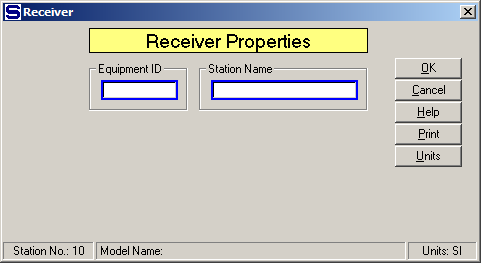
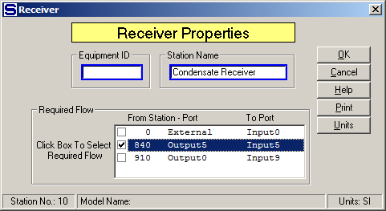

# Receiver Properties

 

 

Equipment ID An equipment ID of up to 11 characters can be used to
identify the station with an actual station in the process. Any
combination of numbers and letters that are used in the factory/refinery
to identify equipment can be entered. For example, Equipment ID =
123.456A. It is not necessary to make an entry in the Equipment ID field
if the station in the model does not have a corresponding station in the
factory/refinery.

 

Station Name A name of up to 20 characters must be entered for the
station. For example, Station Name = 1st Vapor Receiver.

 

No input data is needed for a receiver station if its output flow is not
a required flow. The input window merely allows for changing the name of
the receiver.

 

 

A selection box will appear on the Receiver Properties window if the
quantity of the output flow from the receiver is required by another
station and more than one input flow into the station can be made
required (see the above screen).  Select the
input flow to be required by left clicking the small box next to the
flow.  The selected flow will then be used by
Sugars to satisfy the required output flow by adjusting the quantity of
the input flow.  The quantity of all other
input flows into the receiver will be used first and the selected
required input flow will then be adjusted to make the total quantity of
all input flows equal to the quantity required by the output flow.

 

 

<a href="Receiver_Features.htm" class="hcp7">Receiver Features</a>

<a href="Receiver_Examples.htm" class="hcp7">Receiver Examples</a>
