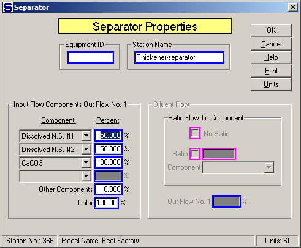
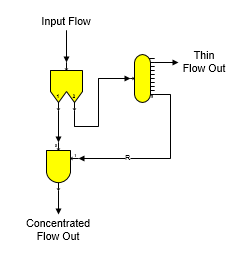
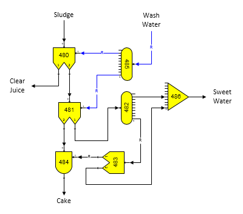

# Separator/Filter Examples

 

The quantity of diluent flow into the separator can
be specified as a ratio of one of the components in the input flow, or
to the total quantity of input flow; for example, the diluent flow can
be added at a ratio of 0.100 times the quantity of total flow into the
separator.  The
percentage of diluent flow that goes out with output flow \#1 is
controlled by the value entered, and the remainder goes out with output
flow \#2.  Entries
are not necessary for the diluent flow, and if none are made, the
diluent flow into the separator will be
zero.  If the
separator doesn't have a diluent input flow, the diluent flow entry
fields will be dimmed. 

 

Up to five component separations can be made in a
separator
station.  The "1st"
thru "4th" components are given individually; the Other Components entry
is for all remaining
components.  For
each separation, a Component must be selected and a Percent value
entered.  For
example, the figure below shows that 50.00% of Dissolved N.S. \#1,
50.00% of Dissolved N.S. \#2, 90.00% of CaCO3, and 0.0% of
all remaining components in the input flow will go out with output flow
no. 1 - all of the remaining input flow components will leave with
output flow no.
2.  If a value is
not given for the Other Components entry, then all remaining components
that haven't been specified by the 1st thru 4th entries will leave the
separator in output flow no. 2.

 

 

Color of the output no. 1 and no. 2 flow streams will
be dependent on the components in the output flows and the value entered
in the Color
field.  A normal
color change due to flow components only is achieved by entering 100.00%
for the Color
entry.  An entry of
100.00% means that all of the agents causing color are equally split
between output flows no. 1 and no. 2 depending on the separation of the
components.  Color
can be shifted from output flow no. 1 to output flow no. 2 by using a
number smaller than
100%.  For example,
an entry of 50% means that 50% of the agents causing color that would
normally go to output flow no. 1 will instead go to output flow no.
2.  Making changes
in the Color entry field will not change the component fractions that
are split due to the entries for Component and Percent; instead, it
simply means that a disproportionate amount of the agents causing color
are sent to output flow no. 2 as the flow stream passes through the
separator
station.  Color
removal in the station is the difference between 100% and the value
entered.  For
example, if 20% is entered in the Color field, it means that the
separator station will cause an 80% removal of the agents causing color
from output flow no.
1.  Color cannot be
removed from pure sucrose, nor from Dissolved N.S. \#2 - all color
shifting between output flows no. 1 and no. 2 occurs in Dissolved N.S.
\#1 which is considered to contain all miscellaneous agents that cause
color.  If output
flow no. 1 does not contain any Dissolved N.S. \#1 component, then color
cannot be shifted from output flow no. 1 to output flow no. 2; hence, no
change will occur in the color of the output flow streams regardless of
the entry in the Color field.

 

Solubility function coefficients
(see [Sucrose
Solubility](../Theory/Theory.htm#Sucrose_Solubility)
section for ‘a’, ‘b’ & ‘c’ values) for each output
flow stream will be the same as the input flow; unless, the diluent flow
has different solubility
coefficients.  If
the diluent and input flows have different coefficients, a weight-
weighted average will be used for each of the output flow
streams.  **If the
flow components of each of the output flows change such that some of the
melassigenic substances are reduced in one of the output flows and
concentrated in the other, then the solubility function coefficients for
each of the output flow streams must be altered to account for the
change in
solubility**.  A
reactor station can be used to adjust the solubility coefficients for
the output flows (see  [Reactor
Properties](../Reactor/Reactor_Properties.htm)).

 

The figure below shows a model of a filter, or press, that uses a
separator (no. 340), distributor (no. 341) and blender (no. 342).

 

 

The separator station separates all insoluble solids
from the input flow to go to its output flow no. 1; hence, all of the
liquid in the input flow goes out of the separator in its output flow
no. 2 to the
distributor.  The
blender parameters are set to blend a portion of the liquid back into
the insoluble solid flow, and the port 1 input flow for the blender is a
required flow.  The
blender input parameters are set to control the % dry substance (%DS) of
the concentrated flow out and all remaining liquid flow leaves the
distributor without any of the insoluble solid material that was
contained in the input
flow.  Hence,
regardless of the input flow quantity, or characteristics, the
concentrated flow out of the blender will have a set %DS.

 

 

The above model shows a vacuum filter that uses three
separators (nos. 480, 481 & 483), two distributors (nos. 482 & 485), one
blender (no. 484) and one receiver (no.
486).  The first
separator (no. 480) is for the first wash in the vacuum filter when
juice is filtered and some wash water is used for the
filtering.  Note
that diluent flow into the separator is a required
flow.  The second
separator station (no. 481) is used for the cake wash with diluent wash
flow from the distributor station no.
485.  All of the
insoluble solids flow out output flow no. 2 of the separator to the
blender station where they are blended with some of the sweet water to
produce cake % moisture that agrees with actual operating
data.  Separator
station no. 483 is used to adjust the amount of sugar in the sweet water
that is blended back into the insoluble solids in the blender to give a
percent sugar content that agrees with actual
data.  Input data
for the separator station no. 483 is adjusted for dissolved sucrose in
the output flow no. 1 of the
separator.  Sweet
water that is  not
used in the blender station no. 484 is combined with sweet water leaving
the separator (no. 481) in the receiver station no. 486 to make up the
total sweet water leaving the vacuum
filter.  Note that
the required blend flow from the blender station no. 484 causes the
input flow to the separator station no. 483 to become a required
flow.  The input
flow to the separator will be a required flow if either one of the
output flows is
required.  Sugars
will give a warning message if both output flows from a separator are
made required - a condition that cannot be
satisfied.  Also,
because both output flows from the distributor station no. 485 are
required, the input flow to the distributor is
required.  Entry
values for the separator stations and the blender are adjusted to give a
performance for the model that agrees with actual process
data.  No input data
(other than their names) is required for the distributor, or receiver
stations.

 

 

[Separator/Filter Features](Separator_Filter_Features.htm)

[Separator/Filter Properties](Separator_Filter_Properties.htm)
