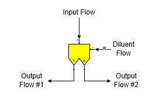
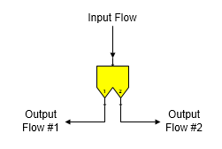

# Separator/Filter Features

 

The separator/filter station is used to split a material flow stream
into two output flow streams with different flow stream components. Two
separator/filter stations are provided with Sugars: (1) with a diluent
or wash flow, and (2) without a diluent or wash flow.

 

Separator/Filter Station with Diluent Flow  Separation of the input flow
into two output flows with different components is done using a diluent
or wash flow to assist the separation.

 

 

Separator/Filter Station without Diluent Flow  Separation of the input
flow into two output flows with different components is done without the
use of a diluent or wash flow.

 

 

General Features  Separator/filter stations are used
to split a process flow stream that goes into port 0 into two output
flow streams that have different weight flow rates and
compositions.  If a
diluent or wash flow is used, it goes into port 1 and it can be either a
required flow (that is, Sugars will calculate the quantity of the
diluent flow based on the input parameters used in the station) or a not
required flow depending on the settings for the
separator.  Whereas,
a distributor station is used to split a flow stream into any number of
different flow streams all having the same composition, a separator
station allows selective separation of the flow
components.  A
diluent flow is allowed for making the separation, but it isn't
necessary.

 

The output flows from a separator without a diluent
flow will have the same temperature as the input flow unless the output
flows have condensable
vapors.  If a
diluent flow is used, then the energy of the output flows will include
the diluent portion that flows to each of the outputs and their
temperatures will reflect the diluent that is in each
flow.  Flows that
have condensable vapors will have their temperatures set to the
saturation temperature corresponding to the pressure of the flow and the
flow components (i.e., water vapor or ethanol-water vapor
mixture).  An
energy balance is done by Sugars with these temperatures and if the
energy content of the flow(s) into the separator is larger than the
energy content of the flows out, then the excess energy is applied to
the output flow with the lowest
temperature.  However,
the excess energy will be apportioned to each output flow in a ratio to
their energy flow rate if the output flows have the same
temperature.  There
may be phase changes that occur in the output flows after the excess
energy is applied to them and the temperatures may then be
different.  Conversely,
if the energy balance of the input and output flows with their initial
temperatures results in insufficient energy from the input flows to
satisfy the output flows energy content, then this energy deficiency is
assumed to come from an external source that is necessary to make the
separation.

 

Separator stations are used to model filters, clarifiers, thickeners,
presses, ion exchange, chromatographic separation,
etc.  See
the
[Separator/Filter
Examples](Separator_Filter_Examples.htm)
section for techniques on using separators to model
different processes and equipment.

 

 

[Separator/Filter Properties](Separator_Filter_Properties.htm)

[Separator/Filter Examples](Separator_Filter_Examples.htm)
