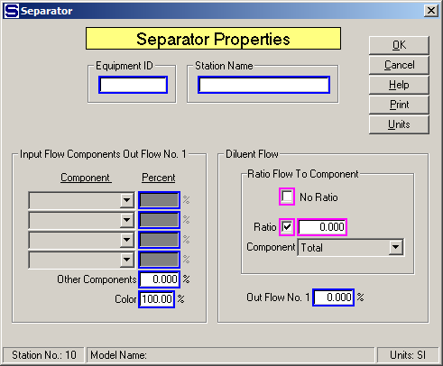

# Separator/Filter Properties

 

 

Equipment ID  An equipment ID of up to 11 characters can be used to
identify the station with an actual station in the process. Any
combination of numbers and letters that are used in the factory/refinery
to identify equipment can be entered. For example, Equipment ID =
123.456A. It is not necessary to make an entry in the Equipment ID field
if the station in the model does not have a corresponding station in the
factory/refinery.

 

Station Name  A name of up to 20 characters must be entered for the
station. For example, Station Name = 1st Mill Pressing.

 

Diluent Flow  The diluent flow entry box is active
only if a diluent flow is connected to the separator/filter’s input port
1.

 

Ratio Flow to Component  The diluent flow can be either a ratio to or
independent of the input flow.  The borders of
the No Ratio box and the Ratio box and field entry are in
magenta color to indicate that only
one of them can be selected.  If No Ratio is
selected, the diluent flow will be independent of the input flow and the
quantity of the diluent flow can be specified either as an external flow
or by another station.  If the Ratio box is
selected, the diluent flow will be a ratio to the input flow and the
ratio can be controlled by either the total quantity of input flow or by
a component in the input flow.

 

 No Ratio  Check the No Ratio box to make the diluent
flow into the separator a not required
flow.  Check this
box if the quantity of diluent flow into the separator is
known.  That is, the
quantity of diluent flow is not a ratio to the input flow to the
separator, but instead is a known quantity from either another station,
or as an external flow.

 

Ratio  Enter the ratio of the diluent flow to the input flow using the
component in the input flow as selected by Component in the drop-down
box below.  For example, Ratio = **0.200**

 

 Component  Select the component to be used with the Ratio
entry.  Click on the down arrow on the right
side of the drop-down box and select a component to be used with the
ratio.  If "Total" is selected the quantity of
the diluent flow will be a ratio of the input flow
quantity.  For example, Component = Total and
Ratio = **1.000** to give equal quantities of diluent and input flows.

 

Out Flow No. 1 (%)  Enter the percent of diluent flow
that goes out output flow number
1.  The remaining
amount will go out output flow number
2.  For example,
Output Flow No. 1 = **30.0**% to have 30% of the diluent flow go out
output flow number 1 and 70% go out output flow number 2.

 

Input Flow Components Out Flow No. 1
 Component fractions in the
input flow can be separated into either one of the output flows from the
separator
station.  Up
to four different components can be separated and a fifth entry is for
all of the Other Components that were not specified.

 

Component  Select the component from the drop-down box that has some or
all of its quantity go out output flow
\#1.  Enter the percentage of the component
quantity in the input flow that goes out output flow
\#1.  Up to four different components can be
separated between output flow \#1 and output flow
\#2.  If none of the component is to go out
output flow \#1, enter 0.0 and all of that component will go out output
flow \#2 instead.

 

Other Components  Enter the percentage for all other components in the
input flow that are to go out output flow
\#1.  Enter 0.00 if all of the other
components are to go out output flow \#2.

 

Color  Components in the input flow contain color
agents and they can be separated to leave in different output flow
streams.  Color
flow through the separator is split by sucrose and non-sucrose
components.  Entry
of 100% will give full color of component Dissolved N.S. \#1 to output
flow no.
1.  Smaller values
than 100% will send more color to output flow no. 2 and less to output
flow no. 1.  This
feature is used to change the color concentration between flow streams
while at the same time not changing the split of components between the
flows.  If output
flow no. 2 does not have any Dissolved N.S. \# 1 component, color cannot
be sent from the input flow to output flow no. 2 and if output flow no.
1 does not have any Dissolved N.S. \#1 component, then only the color of
other components (for example, sucrose, etc) can make up the color of
output flow no.
1.  The color of
components other than Dissolved N.S. \#1 is set in the Model Properties
window from the Sugars menu selection (see  [Program Overview \>
User Interface](../Overview/Program_Overview.htm)).

 

 

[Separator/Filter Features](Separator_Filter_Features.htm)

[Separator/Filter Examples](Separator_Filter_Examples.htm)
