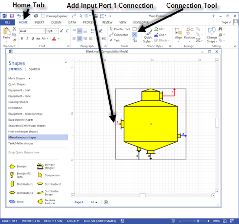
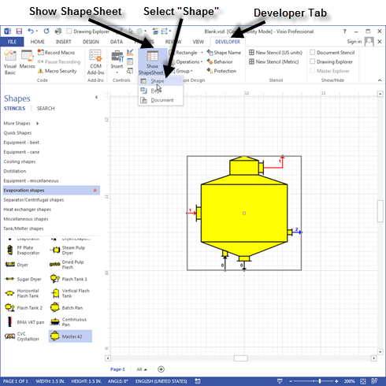
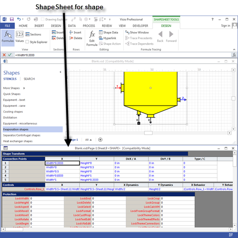
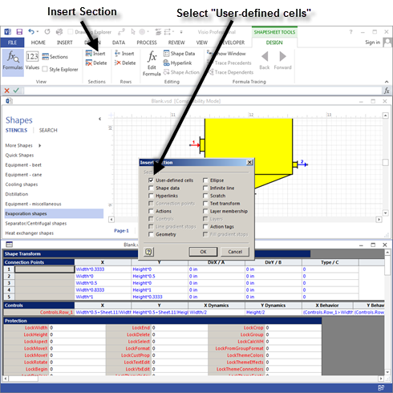
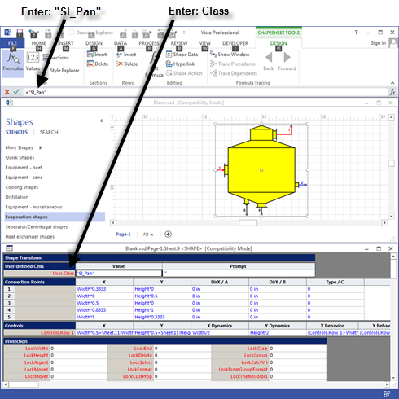
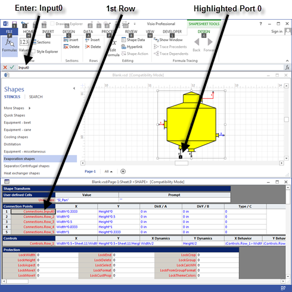
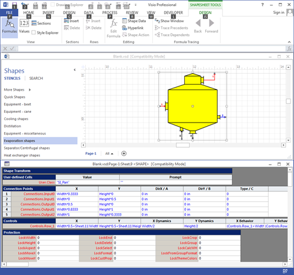

# Designing Your Own Shapes

 

Visio Developer Mode is necessary to design shapes for use with
Sugars.  Activate Developer Mode by clicking
FILE \> Options \>
Advanced and then click the box for "Run in
developer mode" (see screen below).  Click the
OK button to return to the drawing window.

 

 

 

Custom shapes of Sugars stations can be designed using the Visio Drawing
Tools. Open the Blank drawing in the "C:\Program Files\Sugars\Examples"
sub-directory.  Create the shape and use the
Group selection on the **DEVELOPER** tab to group all of the shape's
elements into one grouped assembly.  After the
shape is drawn and grouped, use the Connection Point Tool on the Visio
Drawing Toolbar as shown on the screen below to make the input and
output connections. Make sure the shape is highlighted with a border
around it and click the left mouse button on the connection
tool.  Hold the Control key down and position
the cursor at the points on the shape where the connections are to be
added. Click the left mouse button at each point and a magenta colored
■ should appear as each new
connection point is added.  The connections
should be made in the order of the ports; i.e., for the pan station
shown in the figure below, input port 0 first, input port 1 next, then
output port 0, output port 1, and output port 2 last.

 

 

 

A text field must be added that Sugars can use to assign a station
number to the shape as it is added to a flow diagram. The Visio
SmartShape Wizard can be used to create the text
box.  The SmartShape Wizard is located in the
C:\Program Files\Sugars\Utilities
directory.  Highlight the new shape and then
double click the wizard from Windows Explorer (or make a shortcut to the
wizard on the Desktop).  The wizard options
are self-explanatory, and it will create a text field to be the top most
field in the order of the shapes.

 

A station name must be assigned so Sugars will recognize the new
shape.  Highlight the shape so that there is a
selection border around the shape.  Click
**DEVELOPER \>** **Show ShapeSheet**
\> **<u>S</u>hape** as shown on the screen
below.

 

 

 

This will open the ShapeSheet for the new
shape.  The ShapeSheet has several sections
that are used to control the behavior of the
shape.  The screen below shows the ShapeSheet
in the Visio window.

 

 

 

The ShapeSheet in the screen above shows a **Connection Points**
section, but a **User-defined cells** section is needed to name the
shape.  The **User-defined cells** section can
be added by clicking **Insert** in the Sections group on the Visio
ribbon (see screen below) and then clicking the **User-defined cells**
box.

 

 

Click on the first cell in the first row under User-defined Cells and
type **Class** in the cell editing
area.  Click on the green check next to the
entry field, or press the **Enter** key when
done.  Click on the cell in the first row
under **Value** in the **User-defined Cells**
area.  Enter the name of the shape with
quotation marks around the name in the cell editing space and click the
green check next to the entry field, or press the **Enter** key when
finished.  For example, type **"SI_Pan"** to
name a pan shape (see screen below).  This is
the name Sugars will recognize when the shape is dragged from a stencil
and dropped onto a drawing.

 

 

Next the connection points need to be identified so they can be
recognized by Sugars as the shape is added to a
drawing.  Use the following procedure to
identify the input and output connections.

 

Make sure the shape is highlighted with the green border and the shape
sheet is shown.   On the shape sheet, click on
the first cell in the first row under **Connection Points** and type in
the port number in the entry field next to the green check at the top of
the window.  Input port numbers start with
Input0 and are numbered in sequence.  The
input port numbers must coincide with the flows into the station in the
same relationship as they are for all stations of the same
type.  For example, a Pan station has two
input ports.  Input port 0 (Input0) is for
syrup and Input port 1 (Input1) is for
steam/vapor.  A black box is shown around the
connection point on the shape as each cell (row) of the **Connections
Points** is checked.

 

As shown in the screen below at the top of the window, the name of the
first input connection (syrup) is entered as **Input0** (do not enclose
the entry in quotation marks " ").  Enter
**Input1** on **Row_2** for the second input
connection (steam/vapor) for the pan.  Click
on the green check next to the input box, or press **Enter** when
finished with the entry.  Type **Output0** for
the first output connection (massecuite), **Output1** for the second
output connection (vapor) and **Output2** for the third output
connection (condensate).  Be sure to label
each connection correctly for the type of input and output flow.

 

 

The ShapeSheet should look as shown in the screen below where the shape
name is in the User-defined Cells in the User.Class row and “SI_Pan” is
in the Value column.  Also, each connection
point for the ports into and out of the station are listed and named.

 

 

Close the ShapeSheet.

 

The new shape is now ready to be placed on a stencil for use in building
flow diagrams.  To place the new shape on a
stencil, open the stencil and then right click on the stencil title bar
and select **Edit Stencil** from the drop-down
menu.  Then drag the new shape from the
drawing on to the stencil.  Once the shape is
on the stencil, the shape can be named by selecting the stencil and then
using the **<u>E</u>dit Master** \> **Master
P<u>r</u>operties…**  to name the shape and
enter text for the prompt.

 

Save the stencil with the new shape by right clicking the stencil title
bar and selecting **Save <u>A</u>s…** from the drop-down menu and saving
the new stencil under the same name, or giving it a new
name.  The stencil can be used with any other
drawing by opening it as a stencil from the
drawing.  It is
best to not add custom shapes to the Sugars stencils because these
custom shapes may become lost when Sugars is updated with a new version
at a later time and the Sugars stencils could be overwritten with the
update.
