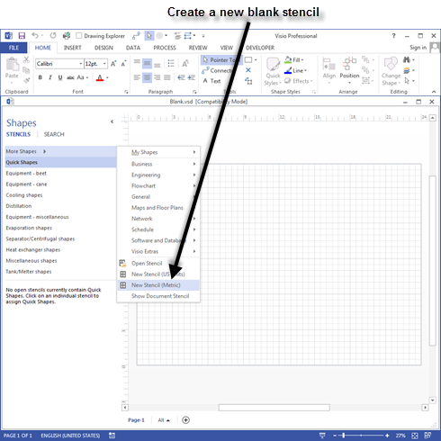
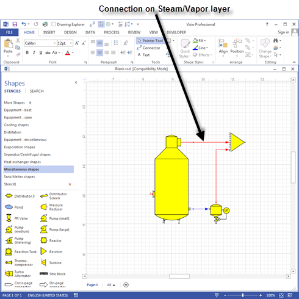
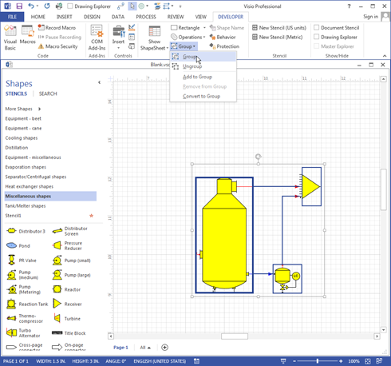
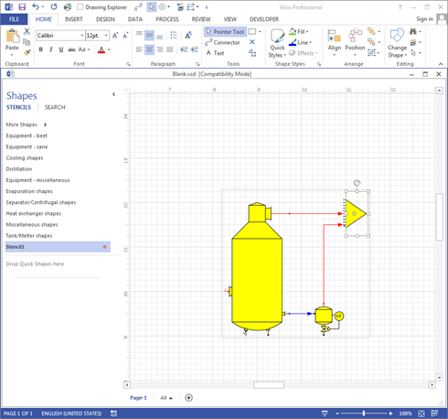
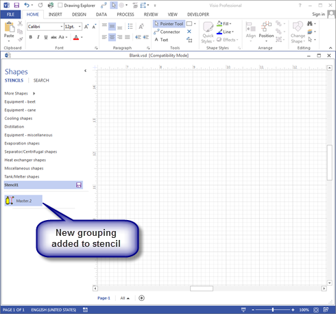
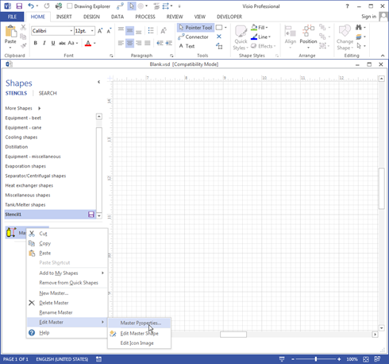
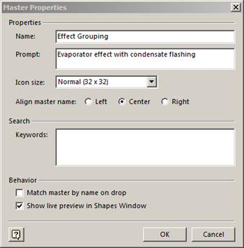

# Grouping Shapes

 

Shapes can be grouped together to add them to a model all at one
time.  For example, all of the shapes
necessary to build a model of a pulp press can be grouped together and
then dropped on a drawing to quickly add a pulp press to a
model.  The procedure for grouping shapes is
given below.

 

Open the “Blank.vsd” drawing in the "C:\Program Files\Sugars"
directory.  The Blank.vsd drawing will load
all of the Sugars stencils so that shapes from the stencils can be used
in the new grouping.  Make a new stencil to
save the grouping that will be created by clicking **More Shapes** \>
**New Stencil (Metric)** or **New Stencil (US Units)** as shown in the
screen below.

 

 

Place the shapes from the Sugars stencils that are to
be used in the grouping on the opened blank drawing and make the
necessary connections between the
shapes.  For
example, place an evaporator, receiver and flash tank on the drawing
surface to build a standard grouping for an effect with flashing (see
screen
below).  Place each
connection on a layer that represents its flow
type.  For example,
all vapor lines should be assigned to the “Steam/Vapor” layer and the
condensate line from the evaporator to the flash tank should be assigned
to the “Condensate/Water”
layer.  Layers are
assigned from the **HOME** tab in the **Editing** group.

 

 

Group the shapes and connections together, as shown below.

 

 

Order the shapes on the drawing so they are first in
order (to the back) when the grouping is dropped on the
drawing.  The shapes
must appear on the drawing before the
connections.  The
furthest back shape is the shape that is numbered first when the group
is dropped on the
drawing.  Position
the shapes to make the numbering in the order that you want when the
grouping is dropped on to the drawing
surface.  For
example, in the drawing below, the receiver should have the highest and
the evaporator should have the lowest station numbers of the three
shapes; hence, send the receiver to the back first, then the flash tank
and finally the evaporator body (drawing below shows receiver being sent
to the back order
first).  The shape
order for shapes in the group are set from the **HOME** tab in the
**Arrange** group.

 

 

Move the grouping onto the new stencil that was
created earlier (see Stencil1 in the screen
above).  To move the
grouping, just left click on the grouping and drag it onto the Stencil1
so that it shows as an entry in the stencil (see the screen
below).

 

 

Name the new grouping on the stencil by right clicking the shape icon on
the stencil and selecting **<u>E</u>dit Master \> Master
P<u>r</u>operties…** from the drop-down menu (see screen below).

 

 

Make an entry in the "Name" field and add text in the "Prompt" field
(see screen below) to display when the cursor is over the icon on the
stencil.

 

 

Save the stencil with the new group by selecting the stencil (right
click on the title bar for the stencil) and select either **Save** or
**Save As** from the drop-down menu.
