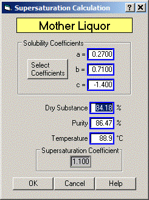
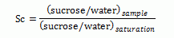

# Supersaturation

 

 

The sucrose supersaturation of a massecuite can be calculated by Sugars
if the mother liquor dry substance (%), purity (%) and temperature are
know for the massecuite. The solubility coefficients for the Vavrinecz
solubility function are shown for reference; however, they can be
changed if the massecuite being evaluated for supersaturation has
coefficient values that are different than the ones shown.
Supersaturation is defined by ICUMSA as the ratio of sucrose/water of
the mother liquor in the massecuite to the ratio of sucrose/water of the
mother liquor when it is saturated.

 

 

Dry Substance Enter a value for the dry substance (%) of the mother
liquor in the massecuite. For example, Dry Substance = 86.19%.

 

Purity Enter a value for the purity (%) of the mother liquor in the
massecuite. For example, Purity = 73.66%.

 

Temperature Enter a value for the temperature of the mother liquor. For
example, Temperature = 81.0°C

 

The Supersaturation Coefficient will be calculated each time there is a
change to any of the entry fields. Also, the non-sucrose/water ratio
will be maintained for the mother liquor if the supersaturation is being
calculated for a massecuite that is defined in the calling window (for
example, from a centrifugal massecuite evaluation). That is, the
non-sucrose/water ratio is the same for the mother liquor and the
massecuite.
