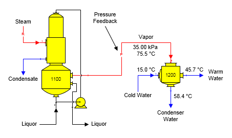
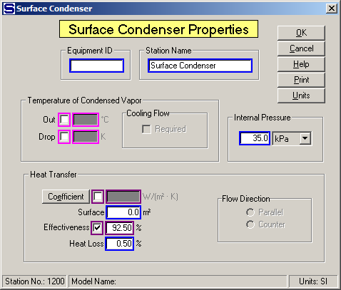
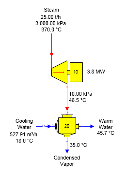
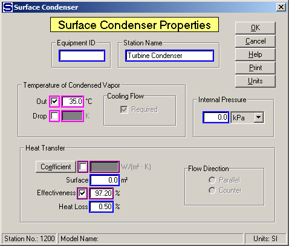

# Surface Condenser Examples

 

The figure below shows a surface condenser condensing vapor from an
evaporator station. Vapor pressure for the evaporator is determined from
the internal pressure of the surface condenser using pressure feedback.

 

 

 

Data for the surface condenser is given below on the
Surface Condenser Properties
dialog.  Effectiveness
is used to control the transfer of heat from the vapor to the cold water
flowing into the
condenser.  The
Internal Pressure value entered (i.e., 35.0 kPa) controls the pressure
of the vapor leaving the evaporator
station.  The cold
water flow into the condenser is a known quantity in this case; that is,
it is not calculated by Sugars because a temperature was not entered for
the condensed vapor out which would make the cold water flow in a
required flow.

 

 

A surface condenser for condensing vapor from a condensing turbo
alternator is shown in the figure below.

 

 

Cooling water flow into the condenser is a required flow and Sugars
calculated the quantity because a temperature value was entered for the
condensed vapor out (see the screen below).

 

 

 

[Surface Condenser Features](Surface_Condenser_Features.htm)

[Surface Condenser Properties](Surface_Condenser_Properties.htm)
