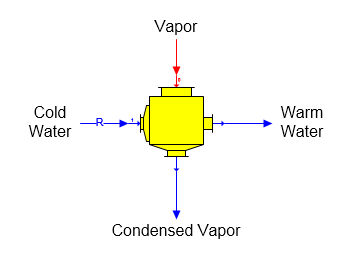

# Surface Condenser Features

 

Surface Condenser  A surface condenser station is used to condense vapor
without any direct contact between the vapor and the cooling water (see
[Contact Condenser
Features](../Contact_Condenser/Contact_Condenser_Features.htm) for
condenser with direct contact between the vapor and cooling water). The
surface condenser shape provided with Sugars is shown below.

 

 

General Features  Cold water enters port 1 (zoom in
to see port numbering) and vapor enters port
0.  Only one vapor
flow into port 0 and one cold water flow into port 1 is
allowed.  The
properties of a surface condenser are similar to a heat
exchanger.  Vapor
flashing can occur in the cold water flow if the flow stream temperature
of the water out is above the vapor saturation temperature for the
pressure of the cold water flow
stream.  The vapor
flow will completely condense if the cold water temperature is low
enough and the quantity of the cold water is sufficient to remove the
latent heat from the
vapor.  If there is
insufficient cold water to condense the vapor, only a portion of the
vapor will be
condensed.  The
quantity of cold water needed to condense the entire vapor can be
calculated by Sugars if the proper data is entered on the Surface
Condenser Properties window to cause the cold water to be a required
flow.

 

A surface condenser can be used for pressure feedback when the vapor
input flow is a pressure feedback flow and the internal pressure of the
surface condenser defines the feedback pressure. The internal pressure
is defined on the Surface Condenser Properties window.

 

The surface condenser can be turned off by not selecting any of the
entry fields with a check box; that is, all fields with a check box are
unchecked.  This will make the cooling water flow into port 1 a required
flow with 0.0 flow rate and the vapor flow into port 0 will pass through
the surface condenser without any change in the flow.

 

 

[Surface Condenser Properties](Surface_Condenser_Properties.htm)

[Surface Condenser Examples](Surface_Condenser_Examples.htm)
