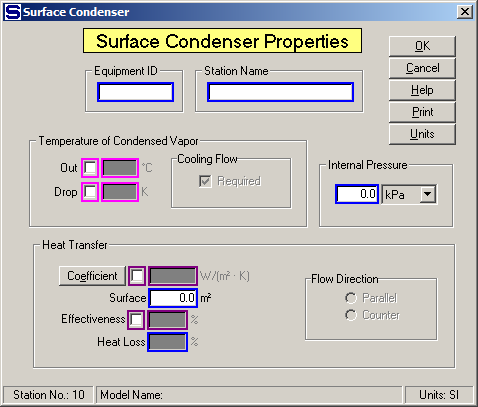

# Surface Condenser Properties

 

 

Equipment ID  An equipment ID of up to 11 characters can be used to
identify the station with an actual station in the process. Any
combination of numbers and letters that are used in the factory/refinery
to identify equipment can be entered. For example, Equipment ID =
123.456A. It is not necessary to make an entry in the Equipment ID field
if the station in the model does not have a corresponding station in the
factory/refinery.

 

Station Name  A name of up to 20 characters must be entered for the
station. For example, Station Name = Vapor condenser.

 

Temperature of Condensed Vapor  Out and Drop entries
control the condensed vapor flow out temperature to the value entered
and cause cooling water flow in to be a required flow unless the Cooling
Flow Required check box is not
checked.  The
borders of the Out and Drop entry fields are in
magenta
color to indicate that only one of them can be
selected.  Or,
neither can be selected if the quantity of the cooling water is known.
 The Cooling Flow
Required check box must be uncheck to use a known cooling water
flow.

 

Out  Temperature of condensed vapor flow out; for example, Out = 65.0°C
(condensed vapor flow out = 65°C).

 

Drop  Temperature decrease in the vapor as it condenses and goes through
the surface condenser; for example, Drop = 10.0°C.

 

Cooling Flow  Select either "Required", or uncheck the box for not
required:

 

Required  This is the normal selection when a temperature value is
entered and Sugars will calculate the quantity of the cooling flow into
port 1.  Uncheck the box for it to be not
required so that the quantity of the cooling flow can be specified if it
is an external flow, or as provided by another station if it is an
internal flow.

 

Internal Pressure  Enter an internal pressure for the
surface condenser if pressure feedback is being used for the vapor flow
into the condenser.  For example, Internal
Pressure = **30** kPa to make the vapor flow line into the surface
condenser have a pressure of 30 kPa if the station supplying the vapor
is using pressure feedback to control the pressure of the vapor leaving
the station.

 

Heat Transfer  Entries for heat transfer are used
when the output flow temperatures are to be calculated and known
cold-water and vapor flows go to the surface
condenser.  If the
Coefficient is entered, a Heating Surface entry must be
made.  Maroon
colored borders on the Coefficient and Effectiveness entry fields
indicate that one of these may be
selected.  For
example, Effectiveness cannot be selected if the Coefficient is
selected.

 

Coefficient  Enter heat transfer coefficient for heat
exchange between the vapor and cold water flow streams across the
Heating
Surface.  Click the
**Coefficient button** to calculate the coefficient if the input flow
rates and temperatures are known from a previous balance.
 For example,

 

Heat Transfer Coefficient = 300.0 Watts / (m2-°C)

Heat Transfer Coefficient = 110.0 BTU / (h-ft2-°F)

 

Surface  Enter the Heating Surface area (in units shown) for the surface
condenser. If a Heat Transfer Coefficient is input, a Heating Surface
entry must be made. For example,

 

Heating Surface = 200.0 m2

Heating Surface = 2000.0 ft2

 

Effectiveness (%)  Enter Effectiveness in percent (%)
for transfer of heat between the vapor and cooling flow
streams.  Effectiveness
equals the ratio of actual heat transfer to the maximum possible heat
transfer between the flow streams, and the actual input temperatures are
used - not vapor saturation temperature if the input flow is superheated
steam.  The amount
of actual heat transferred is the amount of heat given to the cooling
flow.  Heat loss is
considered and it is heat lost from the transfer of heat from the vapor
flow to the cooling
flow.  Use
effectiveness to have Sugars calculate output flow temperatures when
known vapor and cooling flows go to the surface
condenser.  High
values of effectiveness depend on large heat transfer coefficient and
heating surface area and low flow rates to give a large Number of
Transfer Units (NTU). 

 For example, Effectiveness =
**60%.**

 

Heat Loss (%) Enter the Heat Loss in percent (%) for the heat that is
lost in the surface condenser station. The heat loss is the percentage
loss of heat from the total heat that is transferred to the cooling flow
from the vapor flow. For example, Heat Loss = 0.5% to give 1/2% of heat
loss.

 

Flow Direction Select either countercurrent or parallel (co-current)
flow between the vapor and cooling flow streams.

 

 

# [Surface Condenser Features](Surface_Condenser_Features.htm)

[Surface Condenser Examples](Surface_Condenser_Examples.htm)
