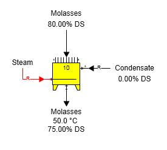
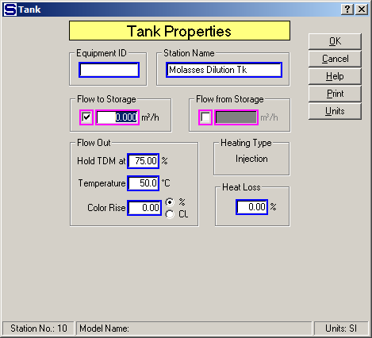

# Tank Examples

 

Output Flow TDM %  The figure below shows a molasses
dilution tank with the output flow held to a total dry matter
(%).  Condensate is
used to dilute the molasses to 75.00% DS and injection steam heats the
combined flow to
50.0°C.  Condensate
goes into port 9 of the tank and the condensate flow is a required flow;
hence, Sugars will calculate the quantity of condensate needed to dilute
the molasses to 75% DS from the 80% DS it has as it flows into the
tank.  Also, the
steam is required because Sugars will calculate the quantity of steam
necessary to heat the combines flow to
50.0°C.  All of the
steam condenses and dilutes the
flow.  Sugars
considers the quantity of condensed steam when it calculates the amount
of condensate into port 9 that is necessary to give a 75.00% DS output
flow.

 

 

The Tank Properties window is shown in the figure below for the single
station model shown in the above figure. No storage flow, color rise or
heat loss is considered in the model.

 

 

 

 

[Tank Features](Tank_Features.htm)

[Tank Properties](Tank_Properties.htm)
