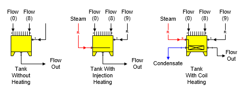

# Tank Features

 

Tank A tank station is used to combine flow streams, melt sucrose
crystals, heat the combined flows and store or remove material. Some of
the different tank shapes provided with Sugars are shown below.

 

 

 

 

General Features Tank stations are used to combine
flows, add or remove material from storage, melt sucrose crystals,
control the output flow to a total dry matter (TDM) and heat the input
flow streams to a specified output flow
temperature.  The
heating can be either by injection heating (heating flow is absorbed
into the process flow stream), or by coil heating (heating flow is not
absorbed into the process flow stream, but leaves the tank after giving
up heat to the process
flow).  Sucrose
crystals, if any, are melted until the output flow stream is saturated
(that is, supersaturation coefficient is 1.0); however, crystal growth
is not allowed, even if the input flow is supersaturated (same as for a
melter- see [Melter
Features](../Melter/Melter_Features.htm)).  Up
to ten process flows (input port 0 thru 9) can flow into a tank, but
only one heating flow (into input port 10) is
allowed.  The
pressure of the process flow out of the tank will always be at
atmospheric pressure, despite the pressures of any of the process or
heating input
flows.  If any input
flows are pressure feedback flows, the pressure fed back will be
atmospheric pressure.

 

The input flow into port 9 will be a required flow if
an entry is made for the dry substance out of the tank (see [Tank
Properties](Tank_Properties.htm) for "Hold TDM at"
entry field).  If a
dry substance is not specified for the output flow, the flow into port 9
will not be required unless the output flow from the tank is required
and the input flow into port 9 is selected to satisfy the required
output flow.

 

If a heating flow is used, it will go into port 10
and it will always be a required
flow.  The heating
flow is calculated to be the quantity necessary to raise all input flows
(any flow from storage is assumed to be at the same temperature as the
flow out of the tank) up to the specified output flow
temperature.  If a
temperature value is not entered, the quantity of the heating flow will
be 0.0 as a required flow.

 

The output (port 0) flow from a tank can be required
by another station, and if it is, one of the input flows into the tank
must be made a required flow that can be adjusted by Sugars to satisfy
the required output
flow.  The quantity
of the required input flow will be calculated by Sugars to equal the
required output flow quantity less the quantities of all other flows
into the tank.  A
small box will appear on the Tank Properties window to select which
input flow is to be required when the output flow is
required.  Input
flows into the tank that cannot be made required will not be displayed
in the box.

 

 

[Tank Properties](Tank_Properties.htm)

[Tank Examples](Tank_Examples.htm)
