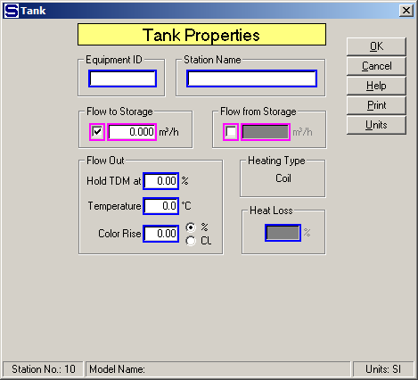
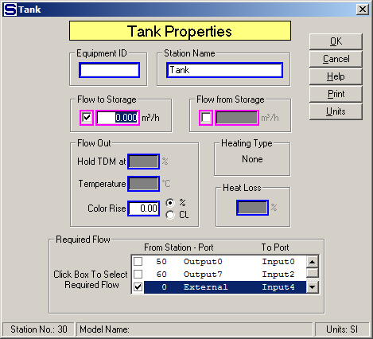

# Tank Properties

 

 

Equipment ID  An equipment ID of up to 11 characters can be used to
identify the station with an actual station in the process. Any
combination of numbers and letters that are used in the factory/refinery
to identify equipment can be entered. For example, Equipment ID =
123.456A. It is not necessary to make an entry in the Equipment ID field
if the station in the model does not have a corresponding station in the
factory/refinery.

 

Station Name  A name of up to 20 characters must be entered for the
station. For example, Station Name = Mixed Juice Tank.

 

Flow to Storage  Enter volume flow of material that goes to storage;
that is, tank level will rise as material is put into storage. For
example,

 

 Flow to Storage (m3/h) = 3.0 (3.0 m3/h to storage)

 Flow to Storage (ft3/h) = 7.8 (7.8 ft3/h to storage)

 

Flow from Storage  Enter volume flow of material that comes from
storage; that is, tank level will fall as material is taken from
storage. For example,

 

 Flow from Storage (m3/h) = 3.0 (3.0 m3/h to storage)

 Flow from Storage (ft3/h) = 7.8 (7.8 ft3/h to storage)

 

The Flow to Storage and Flow from Storage input fields have
magenta colored borders indicating
that only one entry can be made for these fields.

 

Flow Out  Enter values for the flow leaving the
tank.  A dry
substance can be specified for the output flow if an input flow goes
into port 9 and a temperature value can be specified for the output flow
if a heating flow goes into port 10 of the
tank.  The "Hold
TDM at" and "Temperature" entry fields will be dimmed if input flows do
not go to these ports.

 

Hold TDM at (%)  The input flow going to port 9 will be adjusted by
Sugars to give an output flow from the tank that has a total dry matter
(total soluble and insoluble solids) content that is equal to the value
entered.  This field is active only if a flow
stream goes to input port 9 (the input flow located on the side of the
tank).  If a value is not entered, the input
flow into port 9 is handled the same as any other flow into port numbers
0 through 8.  That is, enter **0.00**% if the
flow into port 9 is not being used to control the output flow to a %TDM,
or enter a value \> 0.00 if the flow into port 9 is being used to
control the output flow to a %TDM.  For
example, Hold TDM at = **9.00**%.

 

Temperature Enter the temperature of the output flow from the tank. The
heating flow into the tank will be required and the quantity of flow
will be adjusted to give the specified output flow temperature. For
example, Output Flow Temperature = 92.0°C.

 

Color Rise Enter a color rise that occurs in the tank. The color rise
can be specified as either a % increase, or an absolute increase of a
specified amount of color units. For example, Color Rise = 5.0%, or
Color Rise = 150 CU color units of increase.

 

Heating Type  The heating type will be either
injection, or
coil.  All of the
heating (port 1) flow is added to the process (port 0) flow out of the
tank when an injection-heated tank is
used.  All of the
heating flow leaves as condensate when a coil-heated tank is
used.  The shape
selected from the stencil determines the type of heating.

 

Heat Loss (%)  Enter the Heat Loss in percent (%)
for the heat that is lost in the tank
station.  The heat
loss is the percentage loss of heat from the total heat that is
transferred to the process flow from the heating
flow.  For
example, Heat Loss (%) = **1.5** (to give 1.5% heat loss).

 

 

A box labeled "Required Flow" will appear on the Tank Properties window
if the output flow from the tank is required (see above). All of the
flows into the tank that can be made required will be shown in this box.
In some cases, there may be input flows into the tank that cannot be
made required and these flows will not be shown. The box will not be
shown if there is only one input flow or only one of the input flows can
be made required. Select the input flow that is to be used by Sugars to
satisfy the output flow. That is, Sugars will calculate the total
quantity of all other input flows and then adjust the quantity of the
input flow that was selected to be required to satisfy the quantity of
the output flow.

 

 

[Tank Features](Tank_Features.htm)

[Tank Examples](Tank_Examples.htm)
