# Theory

 

Many equations are used by Sugars to calculate the mass and energy
balances for a flow diagram. All material balance calculations maintain
conservation of the total mass flow into and out of each station.
Conservation of sucrose, non-sucrose, total flow and energy is
maintained for every station and for the total factory by using
iteration techniques to balance the flow of all material and energy from
station-to-station within the flow diagram and for the overall factory.
Iterations are continued until a balance is obtained within a relative
convergence accuracy specified by the user (typically 0.01%).

 

[Crystal Content](Theory.htm#Crystal_Content)

[Heat Content](Theory.htm#Heat_Content)

[Boiling Point
Elevation](Theory.htm#Boiling_Point_Elevation)

[Centrifugal
Calculations](Theory.htm#Centrifugal_Calculations)

 

 

Sucrose
Solubility

 

The solubility of pure sucrose in water is calculated from the Vavrinecz
equation that is the official equation adopted by the ICUMSA:

 

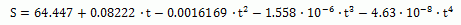

 

 Where: S = weight % of sucrose in solution at saturation

 t = temperature (°C) of solution

 

The saturation coefficient for a solution with impurities is calculated
from the Vavrinecz function:

 

 

Where: NSW = non-sucrose to water ratio, and e = log base 2.71828...

 

And, 'a', 'b', and 'c' are coefficients that depend on the melassigenic
substances in the flow stream being analyzed. Sugars uses the Vavrinecz
saturation coefficient function for all calculations unless c = 0 is
entered; in which case, the Wagnerowski equation is used:

 

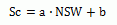

 

The Wagnerowski equation is valid only in the range of 1.6 up to 3.5
non-sucrose-to-water ratio (NSW); hence, for low values of NSW, the
Vavrinecz function is appropriate. As can be seen from the equations,
the saturation coefficient is independent of temperature.

 

Supersaturation is defined by Van Hook's expression that is the official
ICUMSA definition:

 

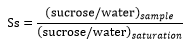

 

Where: 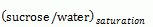 is at the same temperature and with the same
non-sucrose-to-water ratio as the sample being analyzed.

 

The sucrose-to-water ratio for a solution at saturation is:

 

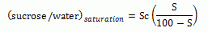

 

And,

 

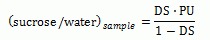

 

Where: DS = dry substance of syrup, PU = purity of syrup

 

For massecuites, DS and PU are the dry substance and purity,
respectively, of the mother liquor in the massecuite (called DSml and
PUml). Thus, from the above:

 

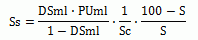

 

The non-sucrose to water ratio for any syrup is:

 

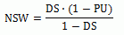

 

If the flow being analyzed is a massecuite containing crystalline
sucrose, then the non-sucrose to water ratio is also:

 

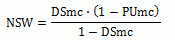

 

Where: DSmc = moisture free solids content of massecuite (i.e., DSmc =
1 - water fraction), and PUmc = purity of massecuite

 

In the above equations, and for all equations used by Sugars, DS (dry
substance) values represent the total weight fraction of solids (sucrose
and non-sucrose; that is, DS = 1 - water fraction), and purity values
represent the true purity (that is, ratio of sucrose to total solids) in
the flow stream.

 

All of the equations given above are used for either beet, or cane
sugar. The only difference is with the Vavrinecz saturation coefficient
function. Beet sugar companies use the Vavrinecz saturation coefficient
function as shown above and many researchers have reported values for
the 'a', 'b' and 'c' coefficients. Many beet sugar factories make an
evaluation of these coefficients during each campaign; however, for cane
sugar, modifying the coefficients to include consideration for the
reducing sugar-to-ash ratio is usually necessary. For example, the
saturation coefficient function for cane sugar is simplified to be the
same as the Wagnerowski relationship for beet; that is,

 

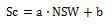

 

To consider the reducing sugar (RS) to ash (Ash) ratio, the 'a' and 'b'
coefficients are modified to be:

 

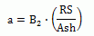

 

And,

 

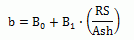

 

Values for B0, B1 and B2 can be found in the literature, or determined
in the laboratory for the cane used in the factory being evaluated.
Using the reactor station in Sugars, the process calculations can be
adjusted for changes in the RS/Ash ratio as they occur in the process.

 

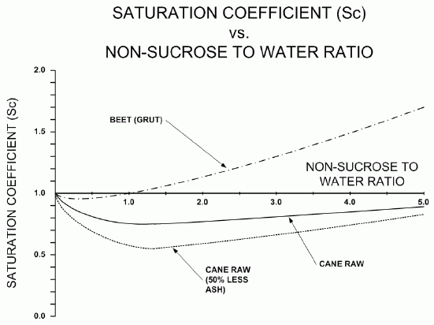

 

The above figure shows saturation coefficient curves that compare Grut
saturation coefficient values for beets and typical cane saturation
coefficients versus the non-sucrose to water ratio. As shown by the
curve, the saturation coefficient for cane is lower than the beet Grut
values at the same non-sugar to water ratio. Cane factories can obtain
much lower molasses purity than beet factories because of this
difference in solubility. The main reason for the lower saturation
coefficient for cane is the higher invert content as compared with beet.

 

Also, as shown in the figure above, if ash is removed from cane juice,
the saturation coefficient drops lower which will further reduce the
molasses purity.

 

 

Crystal
Content

 

The sucrose solubility equations: NSW = f(DSmc, Pumc), S = f(t), Sc =
f(NSW) & Ss = f(DSml, PUml, Sc, S), can be used to find a relationship
between the dry substance and purity of the mother liquor in the
massecuite; however, an additional equation is required to find their
values.

 

From the above equation for supersaturation (Ss), an inverse
relationship can be made between the mother liquor dry substance and
purity that depends on the supersaturation (Ss), solubility coefficient
(Sc) and saturation of a pure sucrose solution (S):

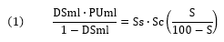

 

A second equation for solution of the DSml and PUml values can be
obtained from the conservation of mass equations for a massecuite:

 

 

Where: W refers to weight flow rate and the subscripts 'mc', 'ml' and
'cs' refer to massecuite, mother liquor and crystalline sucrose,
respectively.

 

From the above equations, it can be shown that:

 

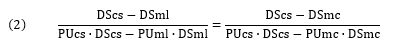

 

Normally, it can be assumed that the dry substance and purity of a
sucrose crystal = 1.00; i.e., it is 100% solid and pure sucrose. From
equations (1) and (2), the mother liquor dry substance and purity can be
calculated for any massecuite in which the dry substance, purity,
temperature and supersaturation are known. After the values for mother
liquor dry substance and purity have been determined, the percent
crystals in the flow may be calculated from the following equation.

 

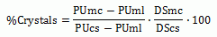

 

Conversely, if for any massecuite, the % Crystals are known, then the
mother liquor dry substance and purity may be calculated from the
following two equations.

 

|                                                                          |      |                                                                          |
|--------------------------------------------------------------------------|------|--------------------------------------------------------------------------|
| 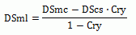                                                            | and, | 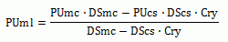                                                            |

 

All of the above equations are used by Sugars to calculate the crystal
content and mother liquor dry substance and purity for each flow stream.

 

 

Heat
Content

 

Conservation of energy is maintained for the factory calculations by
doing a heat balance on each station. The heat content of all flow
streams feeding into a station is determined by calculating the heat
capacities of each component in the liquid, solid and gas phases and
then summing up all of the values to obtain the total heat content of
the flow. A similar calculation is done for all output flows from each
station.

 

Specific heat capacity equations are used by Sugars for each flow
component in the flow stream except the combination of water, sucrose
and non-sugars that are considered in unison to be syrup. The heat
capacity of water vapor includes the latent heat of vaporization.

 

Specific heat capacity (kJ/kg-K) at constant pressure for syrups and
sucrose crystals is calculated from the Sugar Technologists
Manual, 8th edition,
published by Bartens.  For syrups the equation (341/3) is:

 

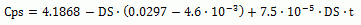

 

And, for sucrose crystals the equation (311/2) is:

 

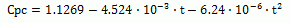

 

Where: for both equations, t = temperature (°C)

 

Curve fits have been made to the data for the specific heats of
limestone and lime, as given in the book Chemistry and Technology of
Lime and Limestone, by Robert S. Boynton.

 

Beet marc specific heat capacity is taken from the book Physics and
Chemistry of Sugar Beet in Sugar Manufacture, by Konstantin Vukov.

 

Specific heat capacity algorithms for CO2 and NH3 gases have been taken
from "Correlation Constants for Chemical Compounds", as published in
Chemical Engineering, August 16, 1976.

 

 

Boiling
Point Elevation

 

Boiling point elevation is calculated for all stations that have a vapor
flow out (pans, evaporators, etc.) so that the heat content of the vapor
may be calculated.  An equation developed by
Kadlec, Bretschneider and Dandor, and presented in the November 1978
paper entitled, "Boiling Point Elevation of Sugar Solutions", is used
for all boiling point elevation
calculations.  This equation was published in
Vol. 97 of La Sucrerie Belge and it takes into consideration the dry
substance, purity and ambient pressure of the solution being boiled.

 

Sugars uses an algorithm to solve for the ambient pressure of a vapor
when its temperature is known. Therefore, if the temperature of the
vapor out is known, the pressure can be calculated; or, if the
temperature, dry substance and purity of the material flow out of the
station is known, then Sugars uses iteration with the boiling point
elevation equation to calculate the temperature and pressure of the
vapor flow out of the station.

 

 

Centrifugal
Calculations

 

Centrifugal stations in the flow diagram are evaluated for: (1) their
ability to purge centrifugal wash water and mother liquor; (2) the
resultant loss of sugar crystals to the green (and wash for batch
centrifugals) output flows; (3) the fraction of the crystal loss that is
due to melting; and (4) the heat lost from each flow stream. Using
procedures given in the previous Crystal Content discussion, Sugars will
first determine the amount of mother liquor and sucrose crystals in the
massecuite flowing to the centrifugal. Then from conservation of mass
principles, the amount of mother liquor, sucrose crystals and wash water
in the green and sugar output flow streams is determined. Next, the
supersaturation of each output flow stream is determined. If the output
flow stream is under saturated (Ss \< 1), the crystals contained in the
flow stream are melted until the flow is saturation with sucrose (Ss =
1), or all of the crystals have been dissolved. If the output flow
stream is supersaturated (Ss \> 1), the crystal content of the flow is
not changed; that is, crystals are not grown in the centrifugal station.
Finally, from the input values for the temperature of each output flow
stream, the heat content is calculated and compared with the heat that
flows to each output flow from the wash water, mother liquor and
crystals purged to the respective output streams. A comparison between
the two heat content values gives the heat loss for each output flow
stream.

 

The resultant performance calculations provide an evaluation of the
centrifugal used during simulations of the factory to predict how the
station will process other massecuite at various flow rates and with
different characteristics (e.g., with a different dry substance, purity,
crystal content and temperature).

 

The evaluation by Sugars and the results for 2-Output centrifugals can
be verified by the following equations for wash flow in as water instead
of syrup (3-Output centrifugals are discussed later in this section).
Definitions of the variables are given first.

 

Definition of variables:

 

|      |     |                                                                                                                                                          |
|------|-----|----------------------------------------------------------------------------------------------------------------------------------------------------------|
| Cry  | =   | fraction of crystals in the massecuite;                                                                                                                  |
| R    | =   | weight ratio of centrifugal wash water to massecuite flow;                                                                                               |
| Pw   | =   | wash purge ratio (wash water purged to total wash water used);                                                                                           |
| Pl   | =   | liquor purge ratio (mother liquor purged to total mother liquor in massecuite);                                                                          |
| Z    | =   | crystal loss ratio (sucrose crystals lost to green to total sucrose crystals in massecuite - crystal loss may be due to both screen and melting losses); |
| DSmc | =   | dry substance of massecuite flowing into centrifugal;                                                                                                    |
| PUmc | =   | purity of massecuite flowing into centrifugal;                                                                                                           |
| DSml | =   | dry substance of mother liquor in massecuite;                                                                                                            |
| PUml | =   | purity of mother liquor in massecuite;                                                                                                                   |
| DSw  | =   | dry substance of wash flowing into centrifugal;                                                                                                          |
| PUw  | =   | purity of wash flowing into centrifugal;                                                                                                                 |
| DSg  | =   | dry substance of green output flow;                                                                                                                      |
| PUg  | =   | purity of green output flow;                                                                                                                             |
| DSs  | =   | dry substance of sugar output flow;                                                                                                                      |
| PUs  | =   | purity of sugar output flow;                                                                                                                             |
| WRg  | =   | weight ratio of green output flow rate to massecuite input flow rate (kg/h);                                                                             |
| WRs  | =   | weight ratio of sugar output flow rate to massecuite input flow rate (kg/h);                                                                             |
| Wmc  | =   | weight flow rate of massecuite to the centrifugal (kg/h);                                                                                                |
| Ww   | =   | weight flow rate of wash to the centrifugal (kg/h);                                                                                                      |
| Qw   | =   | wash water flow rate (m3/h);                                                                                                                             |
| Sgw  | =   | specific weight of wash water (kg/m3).                                                                                                                   |

 

The centrifugal calculations do a material balance for the centrifugal
using the dry substance and purity values that are entered on the
performance evaluation screen. The material balance uses the following
equations.

 

Weight balance:

 

 

Dry substance balance:

 

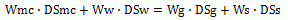

 

Sucrose balance:

 

 

If the wash is only water, then DSw = 0.0, and equations simplify to:

 

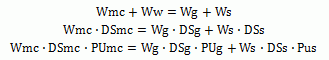

 

Now, dividing each of the above equations by Wmc, you get:

 

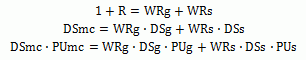

 

Where,

 

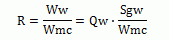

 

Using the centrifugal performance calculation results:

 

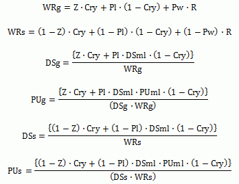

 

For example, consider the performance evaluation shown in the following
three figures for a continuous centrifugal. The figure below shows the
evaluation of massecuite flowing into the centrifugal. The massecuite
characteristics are: supersaturation (Ss) equals 1.100, dry substance
(DSmc) equals 93.00% (or .9300), purity (Pumc) equals 86.44% (or .8644)
and temperature equals 81.0°C.

 

 

Results of the massecuite evaluation as shown above are: crystal content
by weight (Cry) equals 47.44% (or .4744), mother liquor dry substance
(DSml) equals 86.68% (or .8668) and the mother liquor purity (PUml)
equals 72.32% (or .7232).

 

Below is the entry window for entering the process data from the
centrifugal.

 

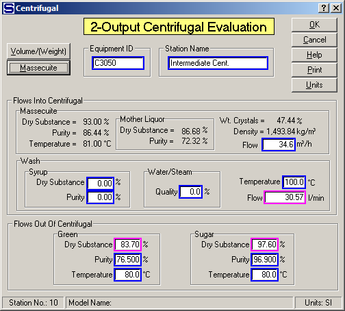

 

Data entry values shown on the window above are: green (or molasses) dry
substance (DSg) equals 83.70% (.8370) and purity (PUg) equals 76.50%
(.7650) and sugar dry substance (DSs) equals 97.60% (.9760) and purity
(PUs) equals 96.90% (.9690). The centrifugal performance calculations
are done from these entries and the temperatures of the green and sugar
and the volume flow of massecuite and wash water into the centrifugal.
The results of the performance calculations are shown below.

 

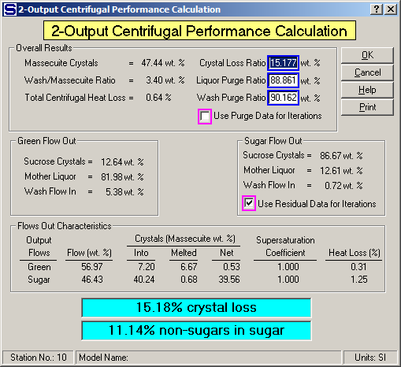

 

Using the input data and results from the evaluation shown on the
previous windows using the appropriate equations, the mother liquor dry
substance and purity can be calculated (assume DScs = PUcs = 1):

 

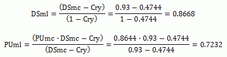

 

Or, the mother liquor % dry substance = 86.68, and % purity = 72.32 that
agrees with the massecuite characteristics as calculated by Sugars.
Thus,

 

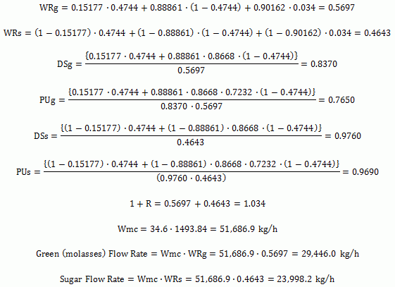

 

All of the above manual calculations check with the results from Sugars;
thus, the results of the performance evaluation are verified.

 

The resultant flows from the centrifugal will be calculated as shown
above if a different massecuite is fed to the same centrifugal having
the above performance values for R, Pw, Pl and Z. The values of Z, Pl
and Pw are not chosen as the values to be held during the balance
calculations for this centrifugal (see the unchecked check box next to
"Use Purge Data for Iterations" on the window above). However, because
the sugar flow out sucrose crystals, mother liquor and wash flow in
values are chosen to be held during the balance calculations, the
crystal loss ratio (Z) will be used to find the crystal content for the
sugar flow out, but the values of Pw and Pl will not be used. Hence, the
sugar flow out will be composed of sucrose crystals, mother liquor and
wash flow in as given by the centrifugal evaluation results shown on the
window above. The percentage of mother liquor and wash in the sugar flow
out will be held for the centrifugal station.

 

As can be seen from the previous example, the relationships between R,
Pw, Pl and Z, for any given centrifugal station, are determined from
actual observed operating results. These results are then used (if the
check next to "Use Purge Data for Iterations" is checked) through the R,
Pw, Pl and Z relationship to find new operating results for a
centrifugal when processing different massecuites. Calculated values of
R, Pw, Pl and Z can be plotted against each other and used as a guide to
evaluate and rate each centrifugal in a factory and to compare them with
other factories. For example, plots of Pl vs. Z at various values of R,
and Pl and Z vs. R, provides very valuable information regarding how
each centrifugal performs. Obviously, the characteristics of a
massecuite will affect the centrifugal performance. Therefore, the best
comparisons are obtained when the same massecuite is being processed by
all centrifugals under evaluation.

 

Operating results for a factory with variable centrifugal wash water
flow rates can be evaluated by Sugars if laboratory data has been taken
and the centrifugal station has been analyzed for more than one wash
water flow rate while the same massecuite is being processed. For
instance, two sets of values for Pw, Pl, Z and R can be easily obtained
by taking laboratory data when the wash water is set to a known value
(Qw \> 0) and then taking a new set of data when the water is reduced to
zero (Qw = 0). The variations of Pw, Pl and Z with R can be assumed as
linear or additional data at various wash water flow rates can be taken
to verify the actual relationships and graphs can be drawn similar to
those shown below.

 

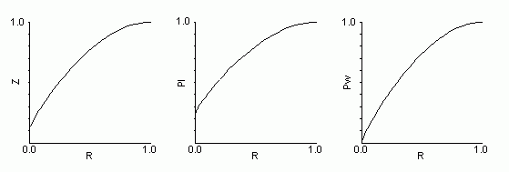

 

Using these graphs, new values can be determined for Pw, Pl and Z when
the wash water flow (R) is varied. The new values are then entered into
Sugars for the centrifugal being evaluated by using the "F3=Edit feature
of the centrifugal performance evaluation. Sugars will then calculate
new values for DSg, PUg, DSs and PUs. Next, enter the new wash water
flow rate on the centrifugal data entry window with the new values of
DSg, PUg, DSs and PUs. Enter 0.0 for either the green %DS, or sugar %DS,
and accept the new values by clicking on the OK button. Sugars will
calculate the %DS value that was not selected. Or, if an error is given
by Sugars, revising the %DS value entered for either the green, or
sugar, may be necessary until Sugars can calculate the other %DS at the
new wash water flow rate. After the green and sugar %DS values are
calculated at the new wash water flow rate, Sugars will calculate and
display the new centrifugal performance. If the calculated centrifugal
performance does not agree with the values from the curves, repeating
the entry of centrifugal performance values and green and sugar %DS
values may be necessary until agreement is reached.

 

The balance calculations can be redone by Sugars after the new
centrifugal performance values are entered for the new wash water flow.
The results from the Sugars calculations can then show the effect on the
process from changing wash water flow rates in any of the centrifugal
stations by using the above technique.

 

Wash flow into the centrifugal can be syrup instead of water and the
same procedures as described above can be used to evaluate the effect of
different syrups on the performance of a centrifugal station. Graphs
similar to those shown above can be created from actual test results at
different syrup flow rates and characteristics and these graphs can then
be used to evaluate how different syrup flows would affect the operation
of the process.

 

3-Output (batch) centrifugals with green, wash and sugar output flows
are evaluated in exactly the same manner as previously discussed for
2-Output (continuous) centrifugals except that an additional evaluation
is made for the split between the green and wash flows. For example,
consider the 3-Output centrifugal input data and performance evaluation
shown below.

 

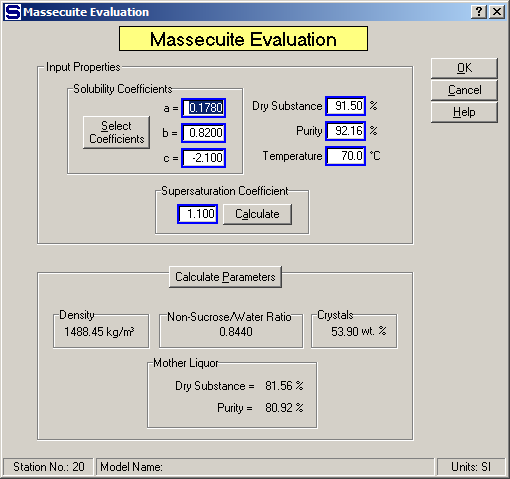

 

The above window shows the massecuite evaluation for a 3-Output (batch)
centrifugal that is the same evaluation as is done for a 2-Output
(continuous) centrifugal. Next, the centrifugal data is input as shown
in the figure below. Data is entered for three output flows are; i.e.,
"green", "wash" and "sugar".

 

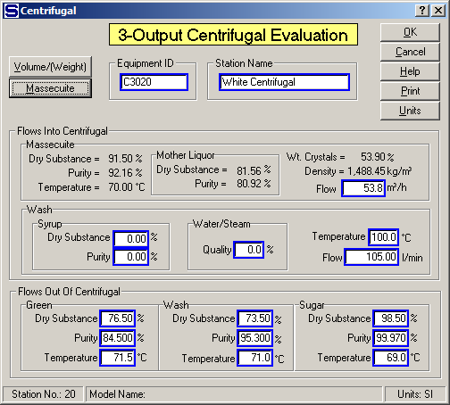

 

Performance calculations are shown for the 3-Output centrifugal in the
figure below. The performance evaluation results for the 3-Output
centrifugal are the same as for the 2-Output centrifugal except for the
additional wash output flow stream and the green/wash split that occurs
between the green and wash flows. The green wash split can be edited as
shown in the 3-Output Centrifugal Evaluation section.

 

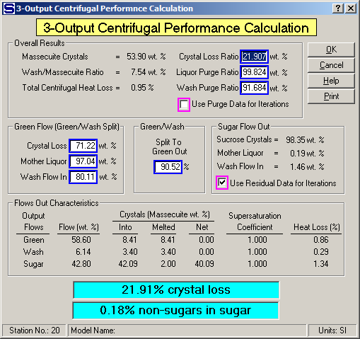

 

Equations for the green and wash flows are:

 

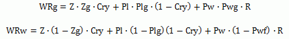

 

The Green/Wash Split, wt. % values are represented by the Zg, Plg and
Pwg values from the centrifugal evaluation as shown on the above window.
Similar equations to those shown above can be developed for the dry
substance and purity of the green and wash flows.

 

 

[Theory](#Theory)

[Sucrose Solubility](Theory.htm#Sucrose_Solubility)

[Crystal Content](Theory.htm#Crystal_Content)

[Heat Content](Theory.htm#Heat_Content)

[Boiling Point Elevation](Theory.htm#Boiling_Point_Elevation)

[Centrifugal Calculations](Theory.htm#Centrifugal_Calculations)
