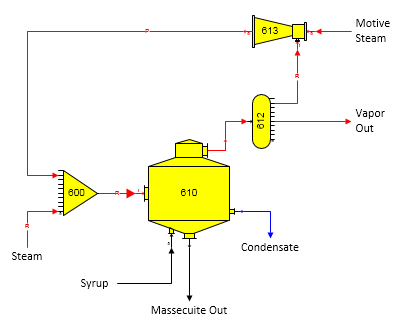
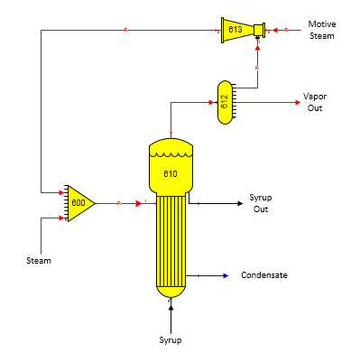

# Thermocompressor Examples

 

A thermocompressor station recompressing pan vapor is shown
below.  Suction vapor into the
thermocompressor (station no. 613) is a required flow (small ‘R’ in flow
line); hence, suction vapor will be taken automatically from the
distributor station (no. 612).  Vapor flow out
of the thermocompressor is a pressure feedback flow (small ‘P’ in flow
line); hence, the pressure out for the thermocompressor will be set
automatically by the receiver station (no. 600) using the pressure of
the external steam flow into the receiver.

 

 

The next figure below shows a thermocompressor station recompressing
vapors from an evaporator station.  The output
flow from the thermocompressor is required (see ‘R’ in flow line from
station no. 613 to 600).  Because the output
flow from the thermocompressor is required, the motive steam into the
thermocompressor is also required.  Also,
because the thermocompressor station specifies the pressure of the
recompressed vapor, the pressure of the output flow from the receiver
station (no. 600) will be the lower value of the steam pressure and
recompressed vapor into the receiver.

 

 

Specifying a known quantity of steam into the receiver station and
specifying percent total solids for syrup leaving the evaporator will
result in Sugars calculating the quantity of motive steam into the
thermocompressor.

 

 

[Thermocompressor Features](Thermocompressor_Features.htm)

[Thermocompressor
Properties](Thermocompressor_Properties.htm)
