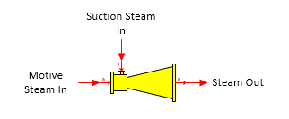

# Thermocompressor Features

 

Thermocompressor A
thermocompressor station is used to recompress a low pressure suction
steam using a higher pressure motive steam.

 

 

 

 

General Features The suction steam pressure is boosted using motive
steam. The amount of suction steam entrained by the motive steam is
dependent on the efficiency, entrainment ratio, or temperature and
pressure out entered for the performance of the thermocompressor.
Pressure feedback can be used to define the pressure out. Water/vapor
phase changes can occur in a thermocompressor station.

 

 

[Thermocompressor
Properties](Thermocompressor_Properties.htm)

[Thermocompressor
Examples](Thermocompressor_Examples.htm)
