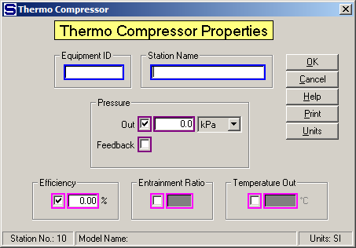

# Thermocompressor Properties

 

 

Equipment ID  An equipment ID of up to 11 characters can be used to
identify the station with an actual station in the process. Any
combination of numbers and letters that are used in the factory/refinery
to identify equipment can be entered. For example,
Equipment ID = 123.456A. It
is not necessary to make an entry in the Equipment ID field if the
station in the model does not have a corresponding station in the
factory/refinery.

 

Station Name  A name of up to 20 characters must be entered for the
station. For example, Station Name = Pan thermocomp.

 

Pressure  The pressure of the flow out of the thermocompressor can be
defined by either entering a value for the Pressure
Out or selecting Feedback for the feedback pressure. Maroon
colored borders are used to indicate that only one of
these two fields can be selected.

 

Out  Enter a value for the pressure out of the thermocompressor that
will be held during the simulation.  For
example, Out = **145** kPa.

 

Feedback  Left click the check box to use pressure feedback to define
the pressure of the vapor leaving the thermocompressor. For example, if
the flow out goes to a receiver that has another input flow that has a
pressure value, the pressure value will be passed back to the
thermocompressor as the flow out pressure.

 

Only one of the Efficiency, Entrainment Ratio and Temperature Out values
can be entered (magenta border). Click on the box next to the entry
field to select the one for entry.

 

Efficiency  Enter a value for the Efficiency (%) of
the entrainment of suction vapor by the motive steam instead of the
Entrainment Ratio, or Temperature
Out.  The amount of
entrained suction vapor will be calculated using the formula of
Truffault, which is dependent upon the: temperature and pressure of the
output flow, temperature of the suction vapor, and pressure of the
motive steam.  An
allowance of 5% for nozzle wear is considered in the Truffault
formula.

 

Entrainment Ratio  Enter a value for the Entrainment Ratio instead of
the Efficiency, or Temperature Out. Entrainment Ratio is the ratio of
the vapor into the suction port 1 to the motive steam flow into port 0.
The value entered for the Entrainment Ratio can be
from the thermocompressor manufacturer, or from actual operating
data.

 

Discharge Temperature  Enter a value for the temperature of the vapor
leaving the thermocompressor.

 

 

[Thermocompressor
Features](Thermocompressor_Features.htm)

[Thermocompressor
Examples](Thermocompressor_Examples.htm)
