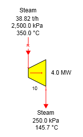
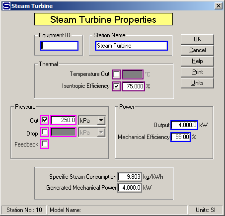
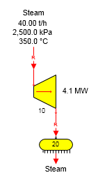
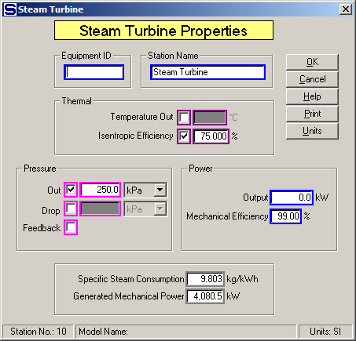

# Turbine Examples

 

The figure below shows a steam turbine producing 4.0 megawatts of power
using 25 bar steam at 350°C temperature (126.1°C of superheat).

 

 

The input steam flow is a required flow because the power to be produced
is specified on the Steam Turbine Properties windows (see below). The
input flow will not be required if the Power Output entry is made 0.0
(no entry) and the exhaust steam out is not required. A known quantity
of steam can be entered in this case and Sugars will calculate the power
and display it in the "Generated Mechanical Power" field.

 

 

If the output steam flow is required and an entry is made for the Power
Output, Sugars will give an error message that there is a conflict in
the model and either the Power Output entry must be set to 0.0 or the
station causing the steam output to be required must be changed to
remove the required flow constraint. For example, see the figure below
where both the input and output steam flows to the turbine are required
flows.

 

 

 

The Steam Turbine Properties window is shown
below.  As shown,
the Power Output entry is 0.0 and the Generated Mechanical Power is
calculated and display by
Sugars.  The input
flow to the distributor 20 is required because 40.00 t/h of steam flow
is specified to leave the
distributor.  This
makes the output flow from the turbine a required flow; and hence, the
input flow is required.

 

 

 

 

[Turbine Features](Turbine_Features.htm)

[Turbine Properties](Turbine_Properties.htm)
