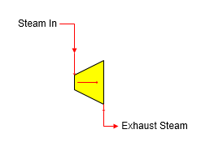

# Turbine Features

 

Turbine  A turbine station is used to simulate the power produced by the
loss of pressure and temperature that occurs in a steam flow as it
passes through a turbine.

 

 

General Features  The drop in steam pressure and
temperature is representative of the energy removed from the steam and
the mechanical power produced from the steam passing through the
turbine.  Water/vapor
phase changes can
occur.  The steam
input flow will be required if a power output is specified, or if the
output flow is required by another
station.  Pressure
feedback can be passed through the station if pressure drop is
specified.

 

 

[Turbine Properties](Turbine_Properties.htm)

[Turbine Examples](Turbine_Examples.htm)
