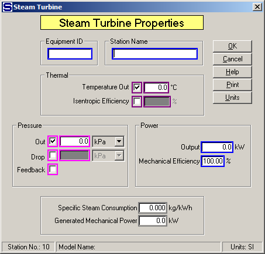

# Turbine Properties

 

 

Equipment ID An equipment ID of up to 11 characters can be used to
identify the station with an actual station in the process. Any
combination of numbers and letters that are used in the factory/refinery
to identify equipment can be entered. For example, Equipment ID =
123.456A. It is not necessary to make an entry in the Equipment ID field
if the station in the model does not have a corresponding station in the
factory/refinery.

 

Station Name A name of up to 20 characters must be entered for the
station. For example, Station Name = Turbine Drive.

 

Sugars will calculate values for the Thermal and
Pressure entry fields during the balance calcula­tions based on the
values entered.  For
example, if Temperature Out is entered along with a value for either the
Pressure Out or Drop or the Feedback box is checked, Sugars will
calculate the Isentropic Efficiency for the
turbine.  Conversely,
if the Isentropic Efficiency is entered, the Temperature Out will be
calculated.  The
calculate values will be displayed if the activation boxes for these
fields are clicked after the balance calculations are completed.

 

Thermal Select either Temperature Out or Isentropic
Efficiency along with a Pressure selection to define the energy removed
from the steam flow by the
turbine.  Maroon
colored borders are used to indicate that only one of these two fields
can be selected.

 

**Temperature
Out**  Enter
the temperature of the vapor leaving the
turbine.  The
temperature and pressure of the steam flow out of the turbine will
determine the amount of energy transferred to the turbine from the
steam.  For
example, Temperature Out =
**145.8**°C.

 

Isentropic Efficiency Enter the isentropic efficiency for the turbine.
The isentropic efficiency is the percentage of the actual enthalpy
change to the enthalpy change with no change in entropy. Sometimes this
is called the "Internal Turbine Efficiency". For example, Isentropic
Efficiency = 68.3%

 

Pressure The Out, Drop or Feedback pressure can be selected to define
the pressure change of the steam flow as it passes through the turbine.
Just click on the small box next to the selected entry field to activate
the field. Magenta colored borders are used to indicate that only one of
the entries can be selected.

 

Discharge Enter the Discharge pressure for the flow out of the turbine.
The value entered for the Discharge Pressure will be held during the
balance calculations. For example, Discharge = 320 kPa.

 

Drop  Enter the drop in pressure of the steam as it
passes through the
turbine.  The
output pressure of the steam will then be based on the pressure of the
steam into the station less the value entered for the
Drop.  For
example, Drop = 1,800.0 kPa.

 

Feedback Left click the check box to use pressure feedback to define the
pressure of the flow leaving the turbine. For example, if the flow out
goes to a receiver that has another input flow with a pressure value,
the pressure value will be passed back to the turbine as the pressure
out.

 

Power  An Output power with Mechanical Efficiency can
be specified for the
turbine.  Entering a
value for the Output will make the steam flow into the turbine a
required flow and the steam flow to the turbine must be supplied to the
turbine from a source that can supply a required flow; for example, an
external flow or a flow from a distributor station (even if the flow
goes through other stations before it gets to the turbine station, the
flow must originate from either a distributor or be an external
flow).

 

Output Enter the Output power to be produced by the turbine. If an entry
is made for the Output power, the steam flow into the turbine will be a
required flow; that is, the quantity of steam into the turbine necessary
to produce the specified power will be calculated by Sugars. For
example, Power Output = 3,000.0 kW. However, if the quantity of steam
into the turbine is known, or the exhaust steam from the turbine is
required by another station (that is, the exhaust steam is a required
flow), then enter 0.0 for the Power Output and Sugars will calculate the
power produced by the turbine for the quantity of steam passing through
it.

 

Mechanical Efficiency Enter the Mechanical Efficiency of the turbine to
allow for the loss of power in the mechanical drive to convert the
thermal energy from the turbine to shaft power. For example, Mechanical
Efficiency = 99.0%.

 

Specific Steam Consumption The Specific Steam Consumption of the turbine
will be calculated by Sugars during the balance calculations. No entry
can be made in this field, but the calculated value will be displayed
after the balance calculations are completed.

 

Generated Mechanical Power The output power from the turbine will be
calculated by Sugars during the balance calculations. No entry can be
made in this field, but the calculated value will be displayed after the
balance calculations are completed.

 

 

[Turbine Features](Turbine_Features.htm)

[Turbine Examples](Turbine_Examples.htm)
