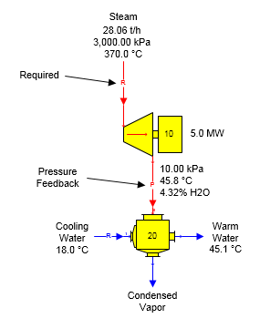
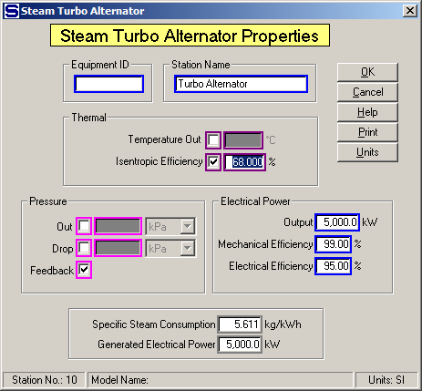
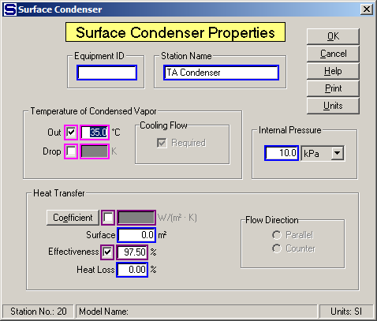

# Turbo Alternator Examples

 

The figure below shows a turbo alternator producing 5.0 megawatts of
power using 30 bar steam at 370°C temperature (136.1°C of superheat).
The exhaust steam goes to a surface condenser where all of the exhaust
is condensed using 18°C cooling water. The steam into the turbo
alternator is a required flow because the electrical power output was
specified and the exhaust steam uses pressure feedback because the
internal pressure of the surface condenser is used to set the exhaust
steam pressure.

 

 

Data values for the turbo alternator are shown on the Steam Turbo
Alternator Properties window below. Pressure feedback is selected so
that the internal pressure of the surface condenser is used for the
exhaust steam pressure leaving the turbo alternator. Entering 5,000.0 kW
for the Electrical Power Output causes the steam flow in to be required.

 

 

The figure below shows the Surface Condenser Properties windows with the
Internal Pressure entry for the surface condenser to provide a pressure
feedback for the turbo alternator's exhaust steam.

 

 

 

[Turbo Alternator Features](Turbo_Alternator_Features.htm)

[Turbo Alternator Properties](Turbo_Alternator_Properties.htm)
