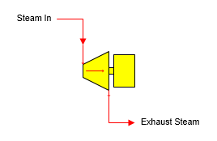

# Turbo Alternator Features

 

Turbo Alternator A turbo alternator station is used to simulate the
generation of electrical power from the loss of pressure and temperature
that occurs in a steam flow as it passes through a turbo alternator.

 

 

 

General Features The drop in steam pressure and temperature is
representative of the energy removed from the steam as it passes through
the turbo alternator. Water/vapor phase changes can occur in the turbo
alternator station. The steam input flow will be required if a power
output is specified, or if the output flow is required by another
station. Pressure feedback can be passed through the station if pressure
drop is specified.

 

 

[Turbo Alternator Properties](Turbo_Alternator_Properties.htm)

[Turbo Alternator Examples](Turbo_Alternator_Examples.htm)
