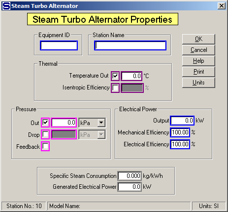

# Turbo Alternator Properties

 

 

Equipment ID  An equipment ID of up to 11 characters can be used to
identify the station with an actual station in the process. Any
combination of numbers and letters that are used in the factory/refinery
to identify equipment can be entered. For example, Equipment ID =
123.456A. It is not necessary to make an entry in the Equipment ID field
if the station in the model does not have a corresponding station in the
factory/refinery.

 

Station Name  A name of up to 20 characters must be entered for the
station. For example, Station Name = Turbo Generator.

 

Sugars will calculate values for the Thermal and Pressure entry fields
during the balance calculations based on the values entered. For
example, if Discharge Temperature is entered along with a value for
either the Pressure Discharge or Drop or the Feedback box is checked,
Sugars will calculate the Isentropic Efficiency for the turbo
alternator. Conversely, if the Isentropic Efficiency is entered, the
Discharge Temperature will be calculated. The calculate values will be
displayed if the activation boxes for these fields are clicked after the
balance calculations are completed.

 

Thermal  Select either Temperature Out or Isentropic Efficiency along
with a Pressure selection to define the energy removed from the steam
flow by the turbo alternator. Maroon colored borders are used to
indicate that only one of these two fields can be selected.

 

Temperature Out  Enter the temperature of the vapor leaving the turbo
alternator.  The
 Temperature Out and the pressure of the steam
flow leaving the turbo alternator will determine the amount of energy
transferred to the turbo alternator.  For
example, Discharge Temperature = **145.8**°C.

 

Isentropic Efficiency  Enter the isentropic efficiency for the turbo
alternator. The isentropic efficiency is the percentage of the actual
enthalpy change to the enthalpy change with no change in entropy.
Sometimes this is called the "Internal Turbine Efficiency". For example,
Isentropic Efficiency = 68.3%

 

Pressure  The Out, Drop or Feedback pressure can be selected to define
the pressure change of the steam flow as it passes through the turbo
alternator. Just click on the small box next to the selected entry field
to activate the field. Magenta colored borders are used to indicate that
only one of the entries can be selected.

 

Out  Enter the pressure of the flow leaving the turbo
alternator.  The value entered for the
Pressure Out will be held during the balance
calculations.  For example, Out = **320** kPa.

 

Drop  Enter the drop in pressure of the steam as it passes through the
turbo alternator. The output pressure of the steam will then based on
the pressure of the steam into the station less the value entered for
the Drop. For example, Drop = 1,800.0 kPa.

 

Feedback  Left click the check box to use pressure feedback to define
the pressure of the flow leaving the turbo alternator. For example, if
the flow out goes to a receiver that has another input flow with a
pressure value, the pressure value will be passed back to the turbo
alternator as the flow out pressure.

 

Electrical Power  An Output power with Mechanical and Electrical
Efficiency can be specified for the turbo alternator. Entering a value
for the Output will make the steam flow into the turbo alternator a
required flow and the steam flow to the turbo alternator must be
supplied to the station from a source that can supply a required flow;
for example, an external flow or a flow from a distributor station (even
if the flow goes through other stations before it gets to the turbo
alternator station, the flow must originate from either a distributor or
be an external flow).

 

Output  Enter the electrical Output power to be produced by the turbo
alternator. If an Electrical Power Output entry is made, the steam flow
into the station will be a required flow; that is, the quantity of steam
into the turbo alternator necessary to produce the specified electrical
power will be calculated by Sugars. For example, Output = 3,000.0 kW

 

Mechanical Efficiency  Enter the Mechanical Efficiency of the turbo
alternator to allow for the loss of power in the mechanical drive to
convert the thermal energy from the turbine to shaft power. For example,
Mechanical Efficiency = 99.0%.

 

Electrical Efficiency  Enter the Electrical Efficiency of the turbo
alternator to allow for the loss of power in the mechanical drive to
convert the mechanical energy from the turbine to electrical power. For
example, Electrical Efficiency = 95.0%.

 

 

Specific Steam Consumption  The Specific Steam Consumption of the turbo
alternator will be calculated by Sugars during the balance calculations.
No entry can be made in this field, but the calculated value will be
displayed after the balance calculations are completed.

 

Generated Electrical Power  The output power from the turbo alternator
will be calculated by Sugars during the balance calculations. No entry
can be made in this field, but the calculated value will be displayed
after the balance calculations are completed.

 

 

[Turbo Alternator Features](Turbo_Alternator_Features.htm)

[Turbo Alternator Examples](Turbo_Alternator_Examples.htm)
